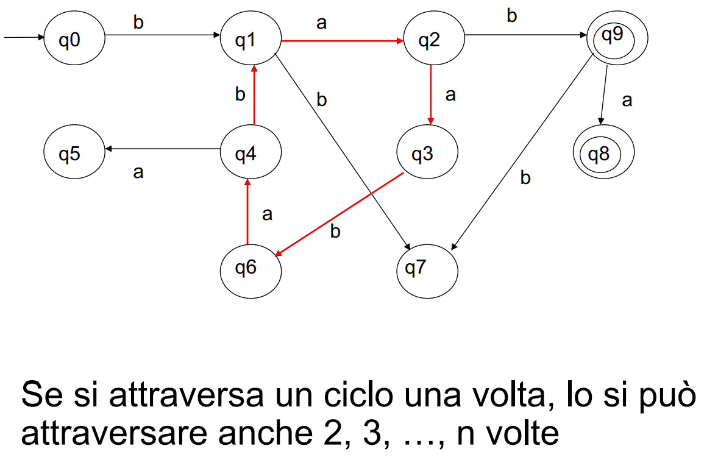

# Automi a stati finiti

## FSA o ASF
Astrazione del calcolo, che opera su un certo linguaggio e le sue stringhe. 
Tempo discreto, cioè quantizzato a passi.
Passi che ci permettono di spostarci in un sistema finito di stati. 
Qualsiasi problema/comportamento scrivibile come una sequenza finita di stati può essere modellizzato da un FSA (Finite State Automaton).
Un FSA è una tupla $<Q,I,\delta,q_0,F>$: 

- Q , un insieme di stati finito
- I , un alfabeto d'ingresso
- $\delta$ , una funzione $\delta (Q,I) \rightarrow Q$
- $q_0$ , stato iniziale (unico)
- F, l'insieme di stati finali

**Formalmente** le stringhe appartenenti al linguaggio sono $$\forall x (x \in L \leftrightarrow \delta (q_0,x) \in F)$$
Se l'FSA è un traduttore/trasduttore di linguaggi avrà anche una funzione $\gamma (Q,I) \rightarrow O^*$  dove O è un linguaggio di uscita. 
> Ricordati che l'automa si ferma solo quando la stringa è finita. Dopo di che controllerà se si trova in uno stato di accettazione. 

### Automa a stati finiti che riconosce numeri divisibili per 3 in base 10

Si basa sul concetto di tenere il conto delle cifre modulo 3. Ragionamento applicabile per qualsiasi altro ASF in cui bisogna valutare la divisibilità per un certo numero. 

{width=75%}

### Pumping Lemma

Importante teorema che ci dice che se digerisco una stringa S, la quale $|S| > |Q|$ (dove |Q| è la cardinalità/numero degli stati della FSA) , allora posso digerire digerire un linguaggio infinito (fatto cioè di infinite stringhe di lunghezza finita). 

{width=60%}

Se $x \in  L \wedge |x| \ge |Q|$, allora esistono uno stato $q \in Q$ e una stringa $w \in I$  tali che: 
$$x = ywz$$ con $\delta(q,w) = q$ Perciò vale anche quanto segue: 
$$\forall n \ge 0 \space yw^nz \in L$$Cioé si può “pompare” w. 
Con il Pumping Lemma si puó ad esempio dimostrare che il linguaggio $L = {a^nb^n | n > 0}$ non è riconosciuto da nessun FSA. 
Ma ci permette anche di sapere se un FSA riconosce un linguaggio infinito con questa condizione: 
$$\exists x \in L |Q| \le |x| < 2|Q|$$
O se un FSA riconosce un linguaggio non vuoto tramite questa condizione: 
$$\exists x \in L \leftrightarrow \exists y \in L |y| < |Q|$$

### Operazioni insiemistiche su FSA 
Possiamo fare complemento (negazione), unione,  intersezione di automi a stati finiti.
**Complemento:**
Riconoscere tutte le stringhe che non appartengono al linguaggio, e quindi non riconoscere neanche una stringa che apparteniene al linguaggio.
- scrivere la FSA completa (totale), cioè esplicitare tutti gli stati pozzo (cioè di errore)
- invertire gli stati finali con quelli di non accettazione della stringa

**Intersezione:**
Riconoscere le stringhe che appartengono ad entrambi i linguaggi.
- Si fa il prodotto cartesiano degli stati dei due automi.
 - Lo stato iniziale è quello deteterminato dal prodotto cartesiano dei due stati iniziali.
    Sono invece stati finali tutti quegli stati prodotti dagli stati finali. 

**Unione**:
Riconoscere le stringhe che appartengono o ad uno o all'altro linguaggio. 
- Si realizza sfruttando de Morgan: $A \cup B = \neg (\neg A \cap \neg B)$
 ovvero: due complementi, la loro intersezione e un altro complemento in serie.

### FSA belli fino a quando non bisogna riconoscere $a^nb^n$

Linguaggi dove viene richiesta 'una memoria' creano problemi. 

