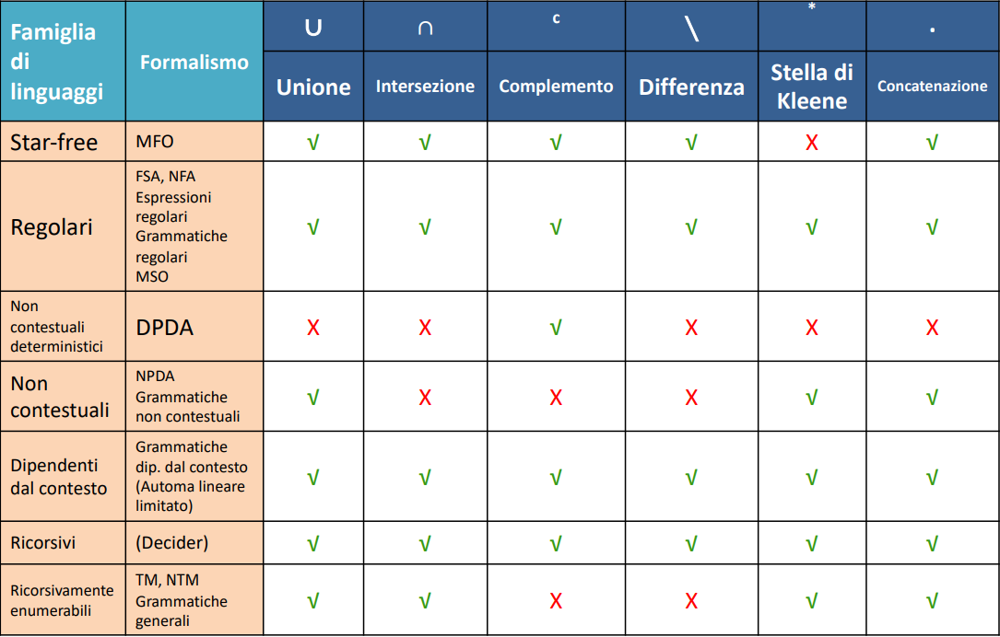

# Macchina di Touring
## Un modello per elaborarli tutti
Una MT è una tupla $<Q,I,\Gamma,\delta,q_0,Z_0,F>$:

- OC, Organo di Controllo analogo a FSA e AP che mi permette di spostarmi tra i vari stati
- Q , un insieme di stati **finito**
- I , solito alfabeto d'ingresso, in realtà ce ne potrebbe essere uno per ciascun nastro
- $\Gamma$ alfabeto dei nastri
- $\delta$ , una funzione $\delta (Q,I) \rightarrow Q$
- $q_0$ , stato iniziale (unico)
- $Z_0$ simbolo iniziale della memoria 
- F, l'insieme di stati finali

Per convenzione nelle MT, negli stati finali non ci sono archi uscenti.
Sostituisco la pila con 3 nastri (input, memoria, output). Non sono 3 pile distruttive, sono 3 nastri su cui posso 'navigare'. 
Le mosse della MT diventano quindi più articolate poichè leggo un carattere in input, posso sostituire un carattere nei vari nastri e posso spostare la testina (sx, dx, stop).

Per convenzione gli stati finali sono tutti pozzo, cioè non ci sono transizioni che ci fanno uscire dagli stati finali. 

Un bel esempio di MT, oltre a poter risolvere problemi quali $a^nb^nc^n$  è 'l'incrementatore decimale' . La unione, intersezione e il complemento per MT ci sono e sono chiuse eccetto l'ultima. Il complemento infatti può essere fatto solo se non ci sono cicli. Nel caso non ci fossero faccio il solito scambio: iniziali $\leftrightarrow$ finali.

L'unione la posso vedere come 'il parallelo' di due macchine di Touring, l'intersezione come 'la serie'. 

La MT è **completa**, non ci sono problemi non esprimibili e modellizzabili con una MT. Inoltre una MT a singolo nastro è potente tanto quanto la MT con 3 nastri ... di base suddivido il mio nastro infinito in 3 zone, delimitate da un carattere a piacere non presente nell'alfabeto su cui sto operando. La complicanza sta solo nella gestione dei movimenti della testina, la quale tutte le volte si deve 'orientare'.
Di fatto una la macchina di Von Neumann , scritta come macchina che si serve di una RAM è completamente equivalente a una MT a singolo nastro. 
[video MT costruita](https://www.youtube.com/watch?v=E3keLeMwfHY)
[video di Computerphile su MT](https://www.youtube.com/watch?v=DILF8usqp7M)

esempi di linguaggi eseguibili su MT:

- $a^nb^nc^n$
- $a^{2n}b^{2n}c^nd^n$
- $a^n b^{n^2}$ , idea: scorrere tutte le a ad ogni b in input. 

## Determinismo e non determinismo.

Una sequenza di mosse non deterministiche, implica che non sappiamo stabilire l'ordine in cui vengono fatte. Ci sono MT non deterministiche, e sono utili per risolvere tutti i problemi nel quale non ha importanza 'l'ordine' delle mosse. 
Il Non Determinismo è quindi il pilastro fondamentale per il **parallelismo**.
Ci sono anche FSA non deterministiche. Formalmente la differenza sta che la funzione $\delta (Q,I)$ non  mappa  uno stato ma un  insieme $\{ q_0,q_1,q_2...\}$, cioè una mossa ci manda in un insieme di stati possibili, i quali eventualmente possono essere percorsi parallelamente. 

### Una FSA D è potente tanto quanto una FSA ND

### Una AP D è meno potente rispetto a una AP ND

Esatto! Un automa a pila non deterministico ha più espressività.. è come se aumentassi le pile. Ma non diventa potente tanto quanto una MT. 

### Una MT ND è potente tanto quanto una MT D

## Operazioni su linguaggi 

