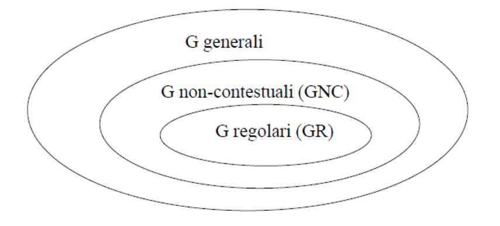

# Grammatiche Formali

Le grammatiche formali sono un insieme di regole. Hanno 2 alfabeti, un assioma (o simbolo iniziale) e un insieme di regole dette **produzioni sintattiche**.

## Relazione di derivazione

Produzione sintattica che produce da una stringa un'altra. Posso anche eseguirle in sequenza ottenendo quindi un linguaggio. Da L(G) ottengono il linguaggio L1.

Ci sono 4 tipi di grammatiche: 

*(stringa a è di partenza, stringa b è di arrivo a->b)*

- Tipo 0 = nessuna limitazione
- Tipo 1 = |a|<|b| 
- Tipo 2 = |a| = 1 (**Context Free**)
- Tipo 3 = **regolari**

Regole delle **Grammatiche Regolari**:

- |a| = 1
- b $\in V_t . V_n \cup V_t$  *(nota che $.$ intende la concatenzazione di stringhe)*
- b = $\epsilon$ sono nel caso in cui la stringa vuota è presente nel linguaggio

Le grammatiche sono modelli generativi di linguaggi, possiamo associare ciascuna grammatica al rispettivo automa riconoscitore del linguaggio generato:

- Tipo 0 $\rightarrow$ nessuna limitazione $\rightarrow$ MT
- Tipo 1 $\rightarrow$ limitazione cardinalità $\rightarrow$ MT
- Tipo 2 $\rightarrow$ context free $\rightarrow$ **AP ND**!
- Tipo 3 $\rightarrow$ grammatiche regolari $\rightarrow$ FSA

Una roba utile negli esercizi è proprio ricordarsi di queste relazioni per generare i linguaggi. Infatti il tipico esercizio 'trova la grammatica a potenza minima per generare questo linguaggio' può essere affrontato come *'che tipo di automa è in grado di riconoscere questo linguaggio? A questo tipo di automa che grammatica corrisponde?'*. 

Possiamo emulare una MT con una grammatica. Come? Ogni mossa è una derivazione, la derivazione ''finale'' verrà effettuata solo se la MT riconosce la stringa. 
Utilizzeremo la 'losanga' $\diamond$ per separare la stringa input con quella output:
input $\diamond$ output

> Non è obbligatorio che la regola di derivazione $A \rightarrow B$  sia applicata a tutte le ‘A’ contemporaneamente. Si può applicare la regola $A \rightarrow B$  a tutte le ‘A’, ma si può anche non farlo.  L’idea delle grammatiche è che sono un formalismo non-deterministico: tutte le possibili combinazioni di produzioni vengono provate, se si arriva ad una stringa formata da soli caratteri terminali, allora quella stringa viene detta generata dalla grammatica. 

### Palindromi
E' possibile dimostrare che se un linguaggio è palindromo, allora esiste una grammatica che lo genera.