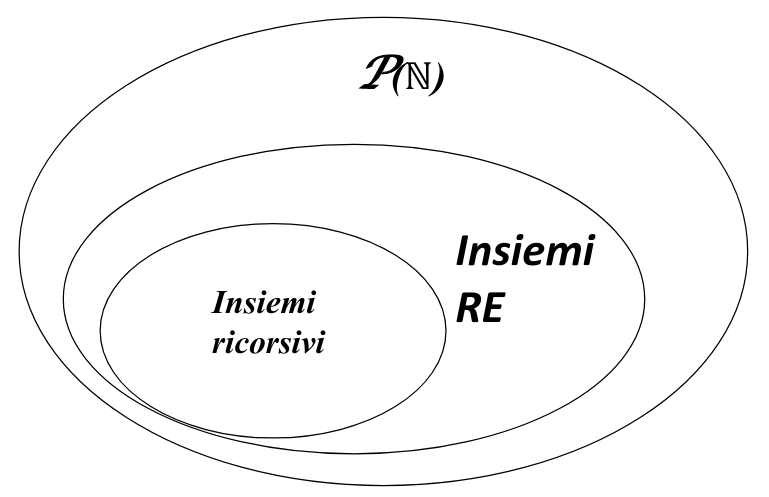
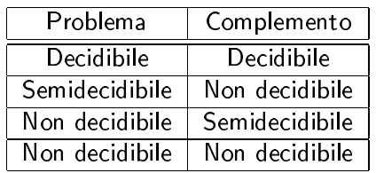
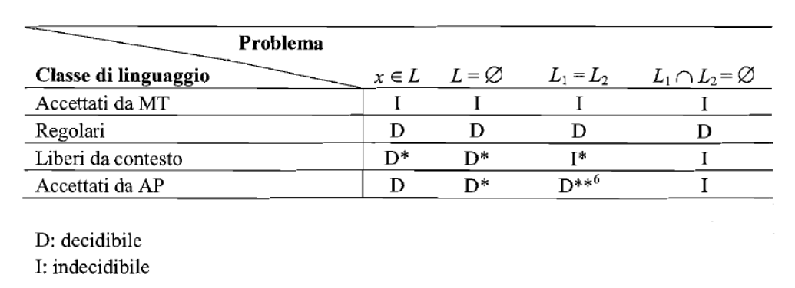

# Computabilità

## Enumerazione di Gödel per MT

*$f_y$ vuol dire funzione **calcolabile** y-esima, cioè la funzione calcolata dalla y-esima MT secondo l’enumerazione di Gödel.* 

## Cosa significa essere computabile/calcolabile 

Una funzione $f$ è calcolabile/computabile se e solo se esiste una MT che la calcola. Nel momento in cui ti chiedi se una funzione $f$ sia calcolabile o meno non sai ancora se esiste o meno la $MT$ relativa ad $f$. Ci sono funzioni per cui NON esiste una $MT$ corrispondente. Se esiste, vuol dire che, per qualsiasi input $x$, l’output della $MT$ è esattamente $f(x)$.
Questo NON implica la totalità, perché le funzioni di cui studiamo la calcolabilità non sono necessariamente totali.

Esempio funzione **computabile** ma **non** **totale**: 
$$ g(x, y) = \begin{cases} 1 \space f_y(x) \ne \bot \\ \bot \space f_y(x) = \bot \end{cases}$$
Molti problemi, pur matematicamente ben definiti non possono essere risolti mediante procedimenti algoritmici, cioè non sono computabili (vedi l'Halting Problem). Per trovare una soluzione occorrerà **caso per caso** fare ricorso ad altre tecniche, tipicamente umane, senza per altro nessuna garanzia di poterla trovare. 

### Funzione caratteristica
$c_s(x)$ è la funzione caratteristica di un insieme. Restituisce 1 se l'elemento x appartiene all'insieme, restituisce 0 altrimenti.

## Ricorsività degli insiemi: 
- **Ricorsivo** (**decidibile**) se e solo se $c_s(x)$ è computabile, cioè può essere verificata da una macchina di Turing in un periodo di tempo finito.
- **Ricorsivamente Enumerabile** (**semidecidibile**) se e solo se $c_s(x)$ è computabile quando vale 1. Quando la $c_s(x)$ è 0, cioè l'elemento non appartiene all'insieme, non è necessario che la procedura si interrompa; può andare in loop per alcuni casi "non appartiene". 



**Piccolo recap:**
Se insieme è finito $\rightarrow$ ricorsivo.
Se un insieme è ricorsivo $\rightarrow$ $c_s(x)$ computabile e totale.
Se un algoritmo termina sempre $\rightarrow$ decidibile. 
Se un algoritmo termina sempre quando la risposta è SI, ma non necessariamente quando la risposta è NO $\rightarrow$ semidecidibile. 

## Halting Problem 

Nessuna MT può calcolare la funzione totale seguente:
$$ g(x, y) = \begin{cases} 1 \space f_y(x) \ne \bot \\ 0 \space f_y(x) = \bot \end{cases}$$

Nessuna MT può decidere a priori se una MT (leggasi programma) si fermerà (non entrerà “in loop”) per un dato valore di ingresso.
Dimostrazione: Supponiamo che g sia computabile. Allora la funzione h definita come:

$$h(x) = \begin{cases} 1 \space f_x(x) = 0 \\ \bot \space otherwise \end{cases}$$

è anch'essa computabile. Allora esiste $x$ $\in$ N t.c. $f_x = h$. Ma allora se calcoliamo $h(x)$ abbiamo due casi:
$h(x) = f_x(x) = 1$, ma allora $f_x( x) = 0$, che porta a $f_x(x) =\bot$ che è assurdo
$h(x) = f_x(x) = \bot$, ma allora $f_x(x) = 1$, che porta a $f_x(x) \ne \bot$ che è ancora assurdo
Quindi h non può essere computabile e di conseguenza non può essere computabile nemmeno f.

````C
bool halting(int i){
	if(halting(42)) while(1);
	else return true;
}
````

## Problemi **indecidibili**:

> No sense in putting any effort to solve an undecidable problem.

- stabilire se MT riconosce $L_1$ (indecidibile per Rice)
- Problema totalità funzione 
- Problema di determinare se una generica funzione computabile è definita per almeno un valore del suo dominio. La proprietà che si vuole decidere è sicuramente posseduta da alcune funzioni calcolabili definite sull’insieme delle funzioni ma non da tutte. In base al teorema di Rice allora non è possibile stabilire se un generico algoritmo (comunque codificato) calcoli una funzione dotata della proprietà suddetta.
- Problema di determinare se una funzione ha un minimo globale 
- Problema correttezza di un programma
- Problema equivalenza di due programmi
- Problema di decidere se il linguaggio accettato da una generica MT (e quindi grammatice non ristrette) è vuoto o no. Il problema non è decidibile, lo si può mostrate per riduzione dal problema della terminazione del calcolo. 
- Sapere se due programmi computano la stessa funzione sapendo che terminano per ogni input (non decidibile perchè non sai se il dominio di partenza è finito)
- Un problema è irrisolvibile quando bisogna prendere in considerazione infiniti casi possibili (una funzione costante è sempre decidibile).
-  Determinare se l’intersezione dei linguaggi generati da due grammatiche è vuoto
-  Determinare, data una grammatica $G$ ed un insieme di grammatiche $\Gamma$ se $G \in \gamma$
-  Determinare data una grammatica $G$ ed un insieme di linguaggi $\mathbb{L}$ se $L(G) \in \mathbb{L}$
- **l'Alacre Castoro** : determinare la MT in un insieme di MT con lo stesso numero di stati che effettua il maggior numero di passi di computazioni, alla fine terminando.
- Verificare se una MT accetta una stringa vuota
- Condizione **necessaria** finché $P$ sia indecidibile è che esso sia formalizzabile come il problema del calcolo di una funzione $f_P$ il cui dominio sia **infinito**. Non sufficiente!: *ad esempio la funzione $f(x) = x+2$ definta sui numeri naturali ha dominio infinito ma è ovviamente calcolabile*.

## Problemi **decidibili**:

- domande con risposta chiusa si/no che non dipende da alcun input (RISPOSTA CHIUSA)
- Problema di stabilire se il linguaggio accettato da un FSA(e quindi grammatica regolare) è vuoto o no, usando il Pumping Lemma. Questo è equivalente di verificare la 'emptyness di un linguaggio regolare'.
- equivalenza tra automi a stati finiti (e quindi grammatiche regolari)
- equivalenza di due polinomi
-  Sapere se due programmi computano la stessa funzione sapendo che terminano per ogni input e che il dominio di input è finito.
-  funzione costante
-  Il problema di verificare se una formula di FOL è soddisfacibile è un problema sicuramente decidibile anche se la formula è aperta. Inoltre, se fattibile, si può provare a vedere se esiste un assegnamento per cui è vera e quindi la si può rendere effettivamente decisa.
-   Ogni grammatica genera un linguaggio ricorsivamente enumerabile: questo è ovvio se si prende in considerazione la MT che da quella grammatica genera stringhe del linguaggio. La funzione che è calcolata dalla MT ha come immagine l’insieme di tutte le stringhe del linguaggio, quindi per definizione è ricorsivamente enumerabile.
- Una formula logica **chiusa** (formula in cui o non compaiono variabili o tutte le variabili presenti sono vincolate a un quantificatore) è sempre o vera o falsa, quindi decidibile, anche se non è detto che si sappia il suo valore di verità.
- Una funzione definita su un dominio finito è sempre calcolabile e decidibile essendo descrivibile mediante una tabella finita. Esiste ovviamente sempre una Macchina di Turing che “calcola” una tabella finita di valori.


## Problemi **semidecidibili**:

- Sapere se due programmi che terminano per ogni input computano funzioni differenti
- Sapere se due funzioni definite sullo stesso dominio sono differenti







# Metodi per determinare decidibilitá

## Teorema di Rice


Sia $\mathbb F$ un insieme di funzioni computabili. Per ogni funzione di $\mathbb F$  possiamo trovare una MT. L'insieme $\mathbb S$ di tutti e soli indici delle MT che calcolano le funzioni di $\mathbb F$ è:
 
- **decidibile** se solo se $\mathbb F$ è banale (cioè vuoto o totale). 
- **indecidibile** altrimenti.

**Spiegato a mo' di spaghettata:**
dire se un certo insieme di funzioni condividono o meno una stessa proprietà è indecidibile, tranne nei casi in cui tale insieme è banale.

**Conseguenza peso del Teorema di Rice**: 

- Non possiamo stabilire l'equivalenza di due programmi. 

NB: *Tutte le proprietà che riguardano una caratteristica strutturale (numero di stati, sullo spazio occupato, sul numero di righe di codice) e non **comportamentale** di una MT, NON sono proprietà della funzione calcolata dalla MT e quindi **non si può usare Rice.***

## Riduzione 
**come ricordarsi come funziona la Riduzione di A $\rightarrow$ B
````C
int problemA(){
	//operations
	problemB();
	//operations
}
````
Dati A e B. Riduco A in B e dico che:

- se B non è decidibile, allora neanche A lo è
- se A è decidibile, anche B è decidibile
Cioé:
- Conosco un problema indecidibile che è un caso particolare del mio problema: il mio problema è indecidibile 
- Conosco un problema decidibile di cui il mio problema è un caso particolare: il mio problema è decidibile

## Diagonalizzazione 
Si basa sulla diagonalizzazione di Cantor. Tosta.

