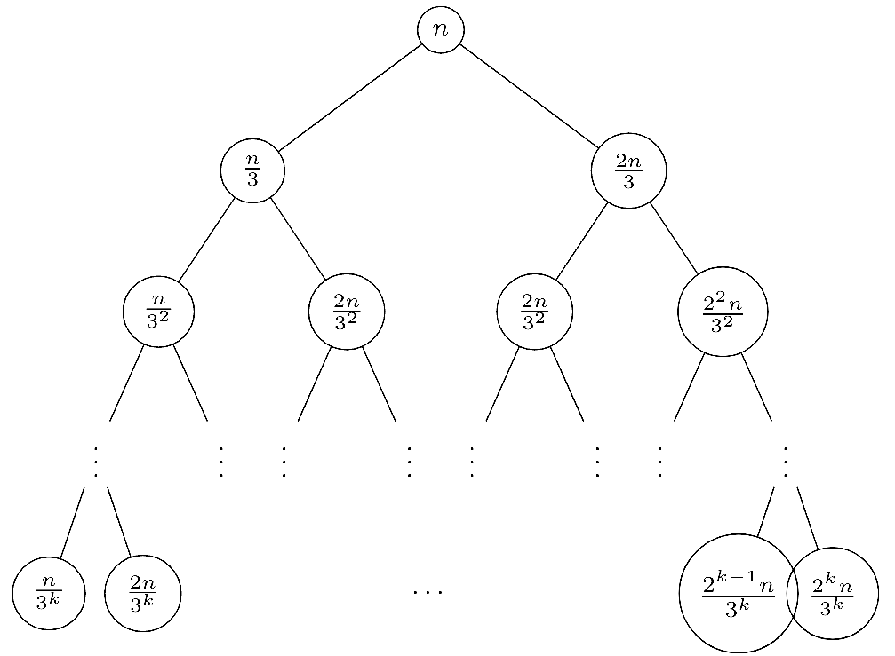

# Analisi complessità 

Per l'analisi delle complessità ci baseremo sempre sulla lunghezza dell'input $n$.
La **complessità spaziale** sono in gergo molto tecnico le celle sporcate DURANTE l'esecuzione di un algoritmo (non alla fine). Quindi nota bene che DURANTE significa che noi consideriamo solo lo spazio che ci serve per eseguire l'algoritmo, non lo spazio che eventualmente è già stato allocato. Ad esempio: se ci danno una matrice come input, la complessità del nostro algoritmo non deve tener conto di questa matrice. La consideriamo come 'pre-allocata'.

*Calcoliamo le complessità vengono valutate nei casi pessimi, per i casi medi è troppo sbatti calcolarsi le probabilità.*

## Richiami di analisi 

### Gerarchia delle complessità
$$1(costante) < log(log(n)) < log(n) < log^2(n) < \sqrt{n} < n$$ $$n < log(n!) < nlog(n) < n^2 < n^4 < 2^n < 4^n < n! < n^{2^n}$$

### Relazioni utili

- logaritmi: 
	$log(x^y)=ylog(x)$
	$log(xy)=log(x)+log(y)$
	$log(\frac{x}{y})=log(x)-log(y)$
	$\Theta(log(log(x))) = \Theta(log(x))$
	$\Theta(log(x!))=\Theta(xlog(x))$
	
- serie aritmetiche: 
	$\sum_{i=1}^{n}log(i)=\Theta(nlog(n))$
	$\sum ^n _{K=1} k = \frac{n(n+1)}{2}=O(n^2)$
	$\sum ^{log(n)} _{K=1} k =O(log^2(n))$
	$\sum ^n _{K=0} x^k = \frac{x^{n+1}-1}{x-1}$
	$\sum ^n _{K=1} \frac{1}{k} \simeq log(n)$
	$\sum^{log(n)}_{i=1}2^i \simeq n$

**Disclamer:** *abuso di notazione. Nelle precedenti righe, e nel resto del corso, vengono utilizzati i simboli $=$ piuttosto che i simboli $\in$ (più corretti)*.*
Piccolo extra: *l'asintotico (di Analisi 1 per intenderci) è un caso particolare del $\Theta$. Quest'ultimo simbolo infatti ci dice che una funzione è comprimibile tra due coefficienti moltiplicativi di un'altra*.

> Nella crescita esponenziale, la base conta un sacco. 

>I casi ottimi li sanno fare tutti, siete ad ingegneria considerate sempre i casi pessimi.

## Metodi per risolvere ricorrenze:

*nota che ci sono diverse versioni del MT che differiscono in base alla 'garanzia che danno' soprattutto nel caso 2*

### Master Theorem 
Utile teorema per valutare complessità del tipo:
$$T(n)=aT(\frac{n}{b})+f(n)$$
Il teorema ha tre casi e si tratta sempre di confrontare $n^{log_b(a)}$ con $f(n)$. Si tratta di applicare una formula e stabilire se la ricorsività delle chiamate pesa più della singola chiamata $f(n$) . 

I 3 casi, con K = $log_b(a)$: 

- se $f(n) = O(n^{K})$ allora $T(n) = O(n^{K})$
- se $f(n) = \Theta((nlog(n))^k)$ allora $T(n) = \Theta(n^{k}(log(n))^{k+1})$. La versione *alternativa* è che se $f(n)=\Theta(n^k)$ allora $T(n) = \Theta(n^{K}\log(n))$
- se $f(n) = \Omega(n^K)$ allora controllo che $af(\frac{n}{b}) \le cf(n)$ sia valida per qualche $c<1$ e per tutti gli $n$ grandi a sufficienza. In caso affermativo $T(n)=\Theta(f(n))$

Il Master Theorem non si può applicare nel caso in cui $a<1$ .  Inoltre il MT copre solo i casi in cui le funzioni differiscono **polinomialmente**. Questo significa che non posso confrontare $n^2$ con $n^2log(n)$ ma posso confrontare $n^{2.3}$ e $n^2log(n)$ . 
Inoltre il MT non copre casi in cui la funzione delle ricorrenze è negativa! $T(n) = 64T(\frac{T}{8}) - n^2 log(n)$ non è quindi risolvibile con il MT poichè negativa. 

### Metodo di *guessing and confirming* 

Nel caso in cui $T(n)$ è ricorsiva e non è risolvibile con il Master Theorem, la situazione si fa più difficile.

Tre fasi:
0) Faccio a mano un paio di iterazioni di $T(n)$ e intuire un possibile andamento
1) Intuisco sbattendo la testa sul foglio una possibile soluzione 
2) Maggioro la $T(n)$ con la **mia ipotesi** $f(n)$ :  $T(\frac{n}{2}) \le cf(n)$ 
3) Dimostro la veridicità della disequazione sostituendo la presunta soluzione nella l’equazione/disequazione alle ricorrenze: $cf(\frac{n}{2}) \le cf(n)$ 

*esempio:*

- $T(n) = 2T(\frac{n}{2})  + n$
-  intuisco $T(n) \le c(nlog(n))$
-  maggioro $2T(\frac{n}{2}) +n \le c(nlog(n))$
-  sostituisco (la mia ipotesi induttiva) e verifico $2c(\frac{n}{2}log(\frac{n}{2})) +n \le c(nlog(n))$

per una $n$ abbastanza grande e una qualsiasi $c$ (non importa quanto piccola) se la disuguaglianza è corretta, ho trovato una soluzione. 

### Albero di ricorsione

L’albero di ricorsione fornisce un aiuto per avere una congettura da verificare con il metodo di sostituzione. E' una rappresentazione delle chiamate ricorsive, indicando per ognuna la complessità. Ogni chiamata costituisce un nodo in un albero, i chiamati appaiono come figli del chiamante.
$T(n) =T(\frac{n}{3}) +T(\frac{2n}{3}) +n$

## Teoremi di accelerazione lineare per MT
- Se $L$ è accettato da una $MT_A$ a $k$ nastri con complessità $S_A(n)$, per ogni $c > 0(c \in R)$ si può costruire una $MT_B$ a $k$ nastri con complessità $S_B(n) < cS_A(n)$
- Se L è accettato da una MT A a $k$ nastri con complessità $S_A(n)$, si può costruire una $MT_B$ a 1 nastro (non a
nastro singolo) con complessità $S_B(n)$ = $S_A(n)$
- Se $L$  è accettato da una $MT_A$ a $k$ nastri con complessità $S_A(n)$, per ogni $c > 0(c \in R)$ si può costruire una $MT_B$ a $1$ nastro con complessità $S_B(n) < cS_A(n)$
- Se $L$ è accettato da una $MT_A$ a $k$ nastri con complessità $T_A(n)$, per ogni $c > 0(c \in R)$ si può costruire una $MT_B$ (a $k+1$ nastri) con complessità $T_B(n) = max \{n + 1, cT_A (n)\}$

Conseguenze:

- Lo schema di dimostrazione è valido per qualsiasi tipo di modello di calcolo, quindi anche per calcolatori reali (es.: aumentare il parallelismo fisico (16bit → 32bit → . . . )).

- Aumentando la potenza di calcolo in termini di risorse disponibili si può aumentare la velocità di esecuzione, ma il miglioramento è al più **lineare.

- Miglioramenti di grandezza superiore al lineare possono essere ottenuti solo cambiando algoritmo e non in modo automatico.