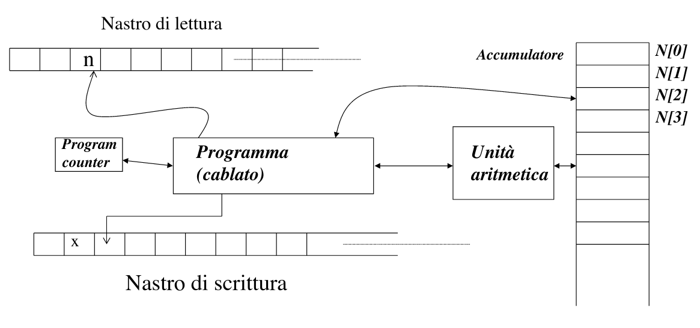
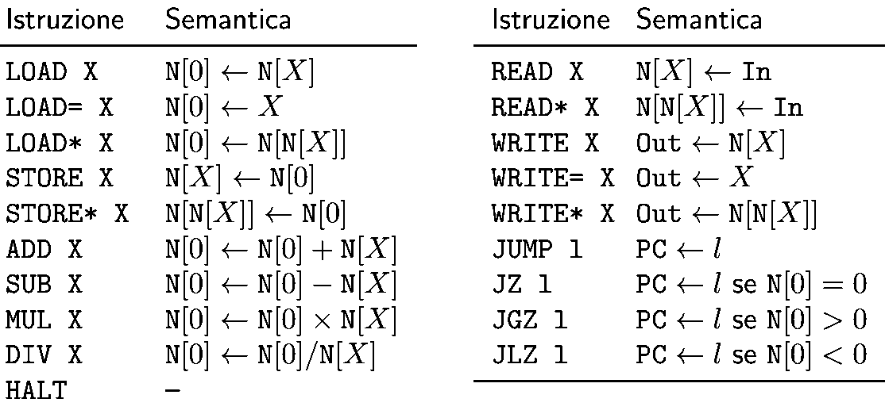

# RAM

Un modello più vicino ai calcolatori reali rispetto alle MT. 

La RAM è dotata di una memoria con accesso a indirizzamento diretto. **L’accesso non necessita quindi di scorrimento delle celle**. Le istruzioni di un programma usano normalmente come sorgente il primo operando e come destinazione $N[0]$. Ogni cella contiene un intero. 
Istruzioni della RAM:

NB: *SUB= 1* decrementa N[0] di 1

Nota che se nella ram non usa $*$ allora è garantito che la memoria necessaria all'esecuzione del programma è finita. In caso di $*$ l'indirizzo di memoria su cui la RAM lavora può dipendere dall'input.
La complessità spaziale di una $MT$ a nastro singolo include sempre l'input (si tratta di una convenzione). 

## Due tipi di costo per le RAM

### Costo costante
Il criterio a costo costante presuppone che ogni operazione necessita una 'singola unità' di tempo.

### Costo logaritmico
Il criterio a costo logaritmico invece presuppone che l'operazione non sia a costo costante ma abbia un costo proporzionale ai 'bit'. Con il criterio a costo costante una somma tra due numeri di 8 bit diremo che occupa circa 1 unità di tempo. A costo logaritmico invece $T(n)=lg_2(n)$  dove n è il numero più alto memorizzabile negli 8 bit (caso pessimo). Quindi a costo logaritmico la somma la consideremo di peso 8 (e non 1).

Costo log per principali operazioni:

- read, load $\rightarrow$ $log(n)$
- add, sum $\rightarrow$ $log(n)$
- mul, div $\rightarrow$ $log^2(n)$ 

### Teorema correlazione polinomiale

>Se un problema è risolvibile mediante il modello $M_1$ con complessità (spaziale o temporale) $C_1(n)$, allora è risolvibile da un qualsiasi altro modello (Turing-completo) $M_2$ con complessità $C_2(n)\le \pi(C_1(n))$, dove $\pi (\dot \space)$ un opportuno polinomio.

Ad esempio $n^2$ e $n^{1000}$ sono correlate polinomialmente poichè a 'separarle' c'è un polinomio. $n^{1000}$ e $e^n$ no.

#### Correlazione temporale tra TM e RAM

La $TM$ impiega al più $\Theta(T_{RAM}(n))$ per simulare **una** mossa della RAM. Se la RAM ha complessità $\Theta(T_{RAM}(n))$ essa effettua al più $T_{RAM}(n)$ mosse (*ogni mossa costa almeno 1*), le quali a costo costante sono esattamente $T_{RAM}(n)$, a costo logaritmico sono di meno. La simulazione completa della $RAM$ da parte della $TM$ costa al più $\Theta((T_{RAM}(n^2))$; il legame tra $T_{RAM}(n)$ e $T_{MT}(n))$ è polinomiale.

#### Nota su TM, RAM e linguaggi regolari 

Quando un linguaggio è regolare ognuna dei modelli di calcolo (MT o RAM) possono simulare un automa a stati finiti con il proprio organo di controllo: questo ci spiega che qualsiasi problema formulato con un linguaggio regolare è risolvibile da un algoritmo in $\Theta(n)$ .