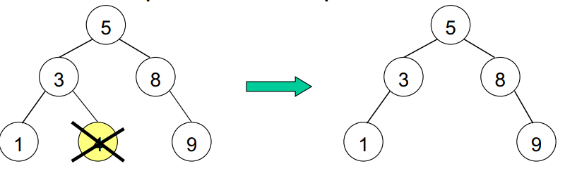
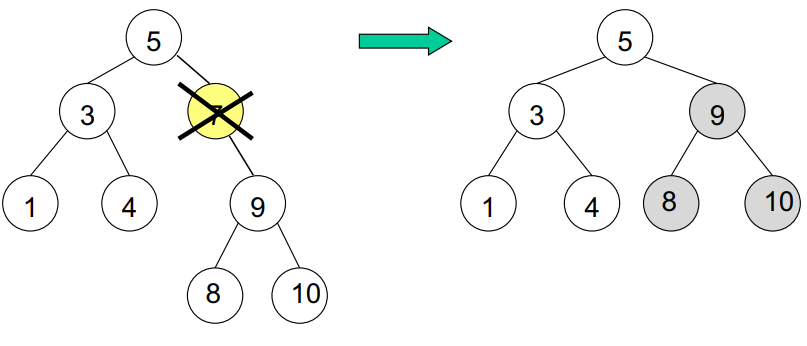
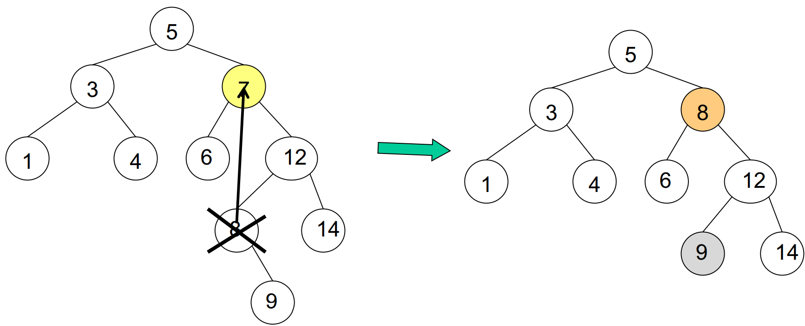
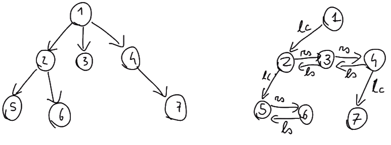
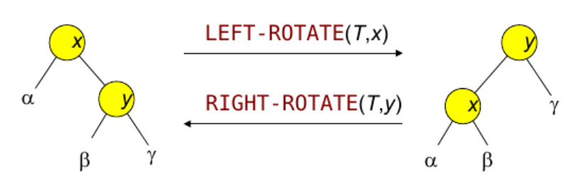
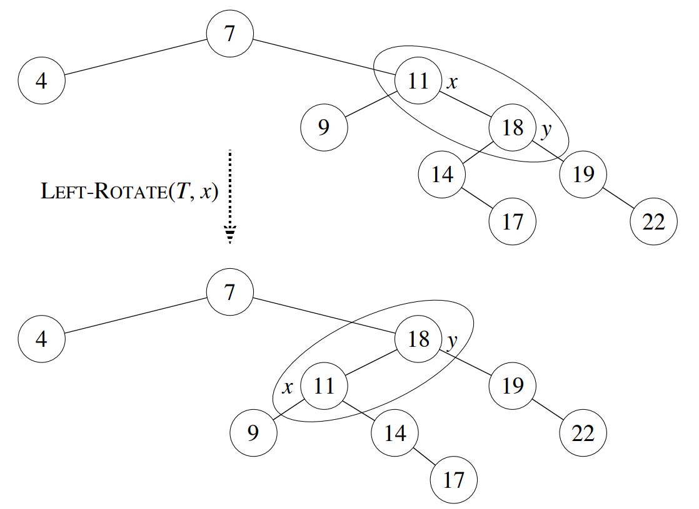
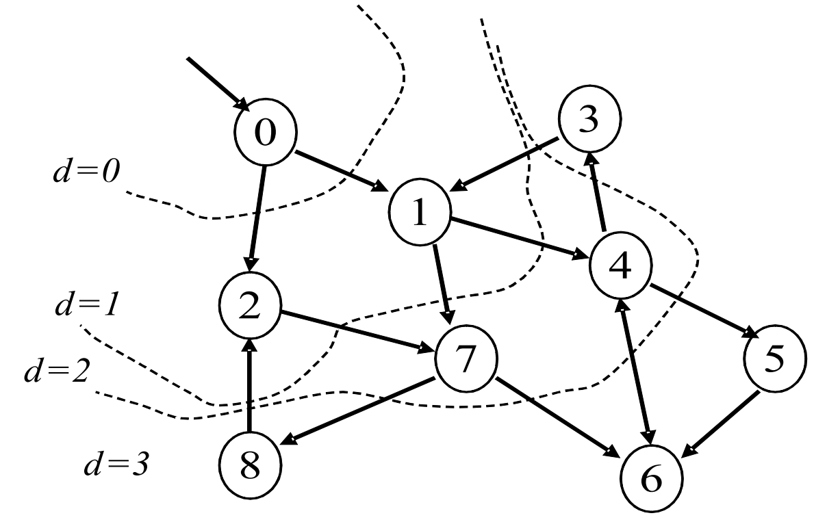
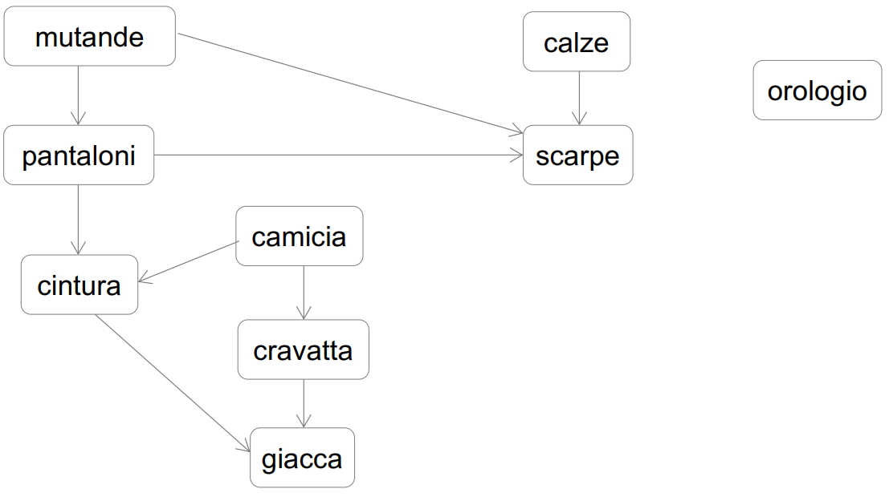
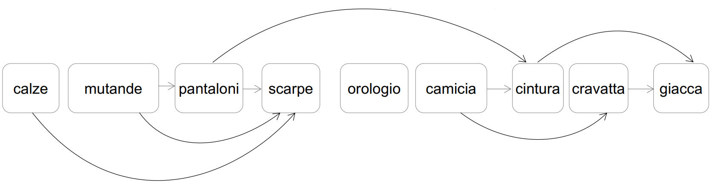

# Alberi e grafi
Gli alberi sono grafi, in cui individuiamo una radice, dei figli e dei padri.

## Heap
Un albero che soddisfa la "proprietà di heap": 

- **max heap** se X è un genitore di Y, allora X.key $\ge$ Y.key 
-  **min heap** se X è un genitore di Y, allora X.ky $\le$ Y.key

Gli heap vengono utilizzati in situazioni tipo: 

- code con priorità 
- ordinare vettori 

#### Implementazione Heap Binari
Heap implementati come vettori. Figlio sx del n-esimo nodo $2n$, figlio dx del n-esimo nodo $2n +1$ . 

#### Max Heapify e complessità

Funzione che trasforma un array in un heap. 
Idea: spingo elementi in fondo al vettore scambiandoli con i padri. 
NB: negli Heap il massimo/minimo (a seconda del tipo di Heap) lo si ottiene sempre con $O(1)$ . 

- Cancellazione/inserimento in $O(log(n))$ 
- Accodamento/estrazione in $O(log(n))$
- creazione =$O(n)$


````C
BUILD-MAX-HEAP(A){
	A.heapSize := A.length 
	for i := A.length/2 downto 1 
		MAX-HEAPIFY(A, i)
}
````

che costa $O(n)$; è *"lunghina" la dimostrazione che costa questo e non $O(n log(n))$*. 

````C
MAX-HEAPIFY(A, max){
	(A, i) 
	l := LEFT(i) 
	r := RIGHT(i) 
	
	if l <= A.heapSize and A[l] > A[i] 
		max := l 
	else 
		max := i 
	
	if r <= A.heapSize and A[r] > A[max] 
		max := r 
		
	if max != i then 
	swap(A[i],A[max]) 
	
	MAX-HEAPIFY(A, max)
}
````

che costa $O(log(n))$ .

Operazioni:

````C
INSERISCI(A,k){
	A.heapSize := A.heapSize+1;
	A[A.heapSize] = k;
	i = A.heapSize;
	while(i>1 && A[parent(i)] < A[i]){
		swap(A[parent(i)],A[i]);
		i <- parent[A];
	}
}
````


````C
CANCELLA-MAX(A){
	if(A.heapSize < 1) return ;
	max := A[1];
	swap(A[1],A[A.heapSize]);
	A.heapSize := A.heapSize-1;
	MAX-HEAPIFY(A, 1)
	return max;
}
````


## BT - Binary Tree

### BST - Binary Search Tree

Degli alberi di ricerca sono alberi binari in cui sussiste una certa relazione tra i padri e i figli. Questa relazione, se sensata, ci permette di navigare e quindi cercare meglio nell'albero. Gli alberi possono essere binari o non binari a seconda del numero della prole di ciascun nodo. In questo corso ci concentreremo principalemente su quelli binari.
Un albero binario di ricerca è un albero binario nel quale: la key di ogni nodo $X$, se $Y$ è un nodo del sottoalbero sinistro di $X$, vale che $X.key$ $\ge$ $Y.key$ . Mentre se $Z$ è un nodo del suo sottoalbero destro vale $Z.key \ge  X.key$ .

{width=50%} 

I BST sono la concretizzazione in struttura della ricerca binaria. Molto efficienti, ma devono essere correttamente bilanciati! Se ad esempio un nodo finisce per diventare una lista (caso pessimo) non abbiamo alcun tipo di vantaggio!
Ricordati che c'è differenza tra BT e BST ! 

#### Complessità BST 
- $O(h)$(altezza albero) = $\Theta(log(n))$ (se completo/bilanciato) o $\Theta(n)$ (un ramo solo è ovviamente lineare).
- Tutte le operazioni sui BST (SEARCH, MINIMUM, MAXIMUM, SUCCESSOR, PREDECESSOR, INSERT, DELETE) hanno tempo di esecuzione che è $O(h)$

Quando usare BST:

- il BST ad esempio mi permette di accedere all’elemento più vicino se quello cercato non è in lista

- Non sono interessato all’accesso diretto. Mi interessa poter ricavare il minimo/massimo e/o predecessore successore, e se non presente l’elemento più vicino.

- Il vantaggio principale è quello di combinare ordine e efficienza in ricerca/inserimento/eliminazione,usando solo la memoria necessaria.

- La ricerca del max/min su un BST è meno efficiente di quella su uno HeapTree ($O(1)$) , **ma io posso implementare un puntatore che punta sempre al max/min**, facendo diventare max/min $O(1)$. Se però una voltra trovato il max/min devo eliminarlo dall’albero, dovrò comunque performare un’operazione di costo $log(n)$. 


#### Attraversamento simmetrico
Restituisce i nodi ordinati se l’albero è un BST:

- Prima si visita il sottoalbero sinistro e si restituiscono i suoi nodi
- Si restituisce la radice
-  Si visita il sottoalbero destro e si restituiscono i suoi
nodi. (ricorsivamente)

````C
INORDER-TREE-WALK(x)
	if x != NIL
		INORDER-TREE-WALK(x.left)
		print x.key
		INORDER-TREE-WALK(x.right)
````

Anticipato (preorder tree walk)
• in preorder, la radice è restituita prima dei sottoalberi
• Posticipato (postorder tree walk)
• in postorder, la radice è restituita dopo i sottoalberi


### Ricerche

````C
TREE-SEARCH(x, k)
	if x = NIL or k = x.key
		return x
	if k < x.key
		return TREE-SEARCH(x.left, k)
	else return TREE-SEARCH(x.right, k)
````


#### Minimo (foglia più a sinistra)

````C
TREE-MINIMUM(x)
	while x.left != NIL
		x := x.left
	return x
````

#### Massimo (foglia più a destra)

````C
TREE-MAXIMUM(x)
	while x.right != NIL
		x:= x.right
	return x
````

#### Successore e Predecessore
Il successore di un oggetto $x$ in un BST è l’elemento $y$ tale che $y$.key è la più piccola tra le chiavi che sono più grandi di $x$.key, cioè è il **minimo del sottoalbero destro di $x$**. 
Se il sottoalbero di $x$ è vuoto, il successore di $x$ è il primo elemento $y$ che si incontra risalendo nell’albero da $x$ tale che $x$ è nel sottoalbero sinistro di $y$: **salgo dai “right” finchè non risalgo da un “left”**.

````C
TREE-SUCCESSOR(x)
	if x.right != NIL
		return TREE-MINIMUM(x.right)
	y := x.p
	while y != NIL and x = y.right
		x := y
		y := y.p
	return y
````

Il predecessore di un oggetto $x$ in un BST è l’elemento $y$ tale che  $y.key$ è la più grande tra le chiavi che sono più piccole di $x.key$, cioè è il massimo del sottoalbero sinistro di $x$. Se il sottoalbero di $x$ è vuoto, il predecessore di $x$ è il primo elemento $y$ che si incontra risalendo nell’albero da $x$ tale che $x$ è nel sottoalbero destro di $y$: **salgo dai “left” finchè non risalgo da un “right”**.
Codice analogo al SUCCESSORE. 

### Operazioni su BST

#### Inserimento

L'inserimento è molto semplice: scendere nell'albero fino a che non si raggiunge il posto in cui il nuovo elemento deve essere inserito, ed aggiungere questo come **foglia**.

````C
TREE-INSERT(T, z)
	y := NIL
	x := T.root
	while x != NIL
		y := x
		if z.key < x.key
			x := x.left
		else x := x.right
	
	z.p := y
	if y = NIL //l'albero T e' vuoto
		T.root := z
	else if z.key < y.key
		y.left := z
	else y.right := z
````

#### Eliminazione 

Quando cancelliamo un oggetto $z$ da un albero, abbiamo 3 possibili casi. Il nodo $z$ da cancellare:

- non ha sottoalberi 

	
- ha 1 sottoalbero:
	ysy, si sposta l'intero sotto albero
	
	

- ha 2 sottoalberi:
	sbattella, dobbiamo trovare il successore del nodo da cancellare $z$. Copiare la chiave del successore in $z$ e quindi cancellare il successore. Cancellare il successore potrebbe richiedere di spostare in sù il sottoalbero destro ma ysy. (notare che il successore è il minimo del sottoalbero, quindi al più avrà un sottoalbero destro).
	
	

````C
TREE-DELETE(T, z)
	if z.left = NIL or z.right = NIL
		y := z
	else y := TREE-SUCCESSOR(z)
	
	if y.left != NIL
		x := y.left
	else x := y.right

	if x != NIL
		x.p := y.p
	if y.p = NIL
		T.root := x
	else if y = y.p.left
		y.p.left := x
	else y.p.right := x
	
	if y != z
		z.key := y.key
	
	return y
````


### Possibile implementazione di Binary Trees 

Un albero generale può essere rappresentato con una struttura a puntatori in cui ogni nodo $x$ ha 4 attributi: $x.key$ è la chiave, $x.p$ è il puntatore al padre, $x.fst$ è il puntatore al figlio più a sinistra, e $x.sibling$ è il puntatore al fratello a destra.



### Fusione di due alberi binari di ricerca in uno bilanciato

Un algoritmo per costruire un albero bilanciato: 
1)  Si effettua visita "in ordine" dei due alberi $T_1$ e $T_2$, ottenendo due liste ordinate $L_1$ e $L_2$ .
2) Si fondono le due liste in un array ordinato.
3) Si crea un BST partendo dall'elemento centrale dell'array, poi ricorrendo sui due sottoarray rimanenti.

Quindi le complessità risultanti sono entrambe lineari nel numero dei nodi presenti nei sottoalberi: $S(n) = T(n) = (n)$, dove $n = n_1+n_2$ . 

## Alberi rosso-neri

**Complessità** $\rightarrow$ come un BST **completo** . 

Quando usare i RB trees:

- Il BST è molto vulnerabile a un caso comune: creare un albero troppo lungo a destra e a sinistra. Il modo per risolverlo è usare un RB (red and black tree) o simil alberi tipo gli alberi AVL (di Adelson-Velskii e Landis) . Questi alberi sono esattamente equivalenti ai BST ma sono bilanciati: nessun ramo è più lungo del doppio dell’altro. Conviene quasi sempre aggiungere questa nota nei temi.

Gli RB sono BST che si 'bilanciano' più facilmente.
Proprietà degli alberi rosso-neri:

1) Ogni nodo è rosso o nero
2) la radice è nera
3) le foglie (NIL) sono tutte nere, 
4) I nodi rossi hanno solo figli neri, quindi i nodi rossi possono avere come padri solo nodi neri. 
5) Per ogni nodo $X$, tutti i cammini da $X$ alle sue foglie discendenti contengono lo stesso numero di nodi neri. (è la condizione più stringente).

Viene impiegato un tag rosso e uno nero sui nodi e vengono utilizzate rotazioni di nodi per mantenere la completezza.  

### Operazioni su RB trees

All’inserimento ogni nodo è rosso. Quindi, se anche il padre del nodo appena inserito è rosso, sistemo l’albero in modo che rispetti le regole dei colori. 

Rotazioni: 



````C
LEFT-ROTATE(T,x)
	y := x.right
	x.right := y.left 
	if y.left != T.nil
		y.left.p := x
	y.p := x.p //attacca il padre di x a y
	if x.p = T.nil
		T.root := y
	else if x = x.p.left
		x.p.left := y
	else x.p.right := y
	y.left := x //mette x a sinistra di y
	x.p := y
````




#### Inserimento 

Quasi sempre problemi con $2$ rossi consecutivi e in pratica ricoloro propagando la nuova colorazione. 

- caso1: zio del nodo appena inserito è rosso. Ricoloro di nero padre, zio e nonno (quest'ultimo solo se radice). 
- caso2 e caso3: lo zio del nodo è inserito si effettua una rotazione (o sinistra o destra). La riparazione va sempre effettuata sul nodo appena inserito. 

Ad ogni modo la riparazione del RB tree è sempre $O(log(n))$ , così come quella di cancellazione. 

````C
RB-INSERT(T, z)
	y := T.nil // y padre del nodo considerato
	x := T.root // nodo considerato
	while x != T.nil
		y := x
		if z.key < x.key
			x := x.left
		else x := x.right
	z.p := y
	if y = T.nil
		T.root := z //l'albero T e' vuoto
	else if z.key < y.key
		y.left := z
	else y.right := z
	z.left := T.nil
	z.right := T.nil
	z.color := RED
	RB-INSERT-FIXUP(T, z)

RB-INSERT-FIXUP(T, z)
	if z = T.root
		T.root.color = BLACK
	else x := z.p // x e' il padre di z
		if x.color = RED
			if x = x.p.left // se x e' figlio sin.
				y := x.p.right // y e' fratello di x
				if y.color = RED
					x.color := BLACK // Caso 1
					y.color := BLACK // Caso 1
					x.p.color := RED // Caso 1
					RB-INSERT-FIXUP(T,x.p) // Caso 1
				else if z = x.right
					z := x // Caso 2
					LEFT-ROTATE(T, z) // Caso 2
					x := z.p // Caso 2
					x.color := BLACK // Caso 3
					x.p.color := RED // Caso 3
					RIGHT-ROTATE(T, x.p) // Caso 3
				else 
					y := x.p.left
					LEFT-ROTATE(T, y)
````


#### Eliminazione

````C
RB-DELETE(T, z) 
	if z.left = T.nil or z.right = T.nil 
		y := z 
	else y := TREE-SUCCESSOR(z) 
	if y.left != T.nil 
		x := y.left 
	else x := y.right 
	x.p := y.p 
	if y.p = T.nil 
		T.root := x 
	else if y = y.p.left 
		y.p.left := x 
	else y.p.right := x 
	if y != z 
		z.key := y.key 
	if y.color = BLACK
		RB-DELETE-FIXUP(T,x)
	return y
````

````C
RB-DELETE-FIXUP(T, x)
	if x.color = RED or x.p = T.nil 
		x.color := BLACK // Caso 0 
	else if x = x.p.left // x e' figlio sinistro 
		w := x.p.right // w e' fratello di x 
		if w.color = RED 
			w.color := BLACK // Caso 1 
			x.p.color := RED // Caso 1 
			LEFT-ROTATE(T,x.p) // Caso 1 
			w := x.p.right // Caso 1 
		
		if w.left.color = BLACK and w.right.color = BLACK
			w.color := RED // Caso 2 
			RB-DELETE-FIXUP(T,x.p) // Caso 2 
			
		else if w.right.color = BLACK 
			w.left.color := BLACK // Caso 3 
			w.color := RED // Caso 3 
			ROTATE-RIGHT(T,w) // Caso 3 
			w := x.p.right // Caso 3 
			
			w.color := x.p.color // Caso 4 
			x.p.color := BLACK // Caso 4 
			w.right.color := BLACK // Caso 4 
			ROTATE-LEFT(T,x.p) // Caso 4 
	
	else (/*come precedente else scambiando right/left*/)
````

La cancellazione è ancora più complicata: 

- caso 0: $x$ è rosso, quindi si cancella! 
- caso 1: $x$ è nero, con fratello $w$ rosso. Scambi i colori $w.p$ e $w$, e fai una leftRotate su $x.p$ . Ora $x$ ha un fratello $w$ nero: diventa uno tra i casi 2,3,4 . 
- caso 2: $x$ è nero, $x.p$ qualsiasi colore, $x$ ha un fratello $w$ nero e nipoti neri. Colori fratello $w$ di rosso e chiami la riparazione con cancellazione su $x.p$ .
- caso 3: $x$ è nero, con fratello $w$ nero, e nipote destro nero ($x.p$ può essere qualsiasi colore) , scambi di colore $w$ e $w.left$ , RightRotate su $w$ -> caso 4 . 
- caso 4: $x$ è nero, $w$ nero, e nipote destro rosso ($x.p$ e $w.left$ possono essere qualsiasi colore). $w$ prende il colore di $w.p$ , $w.right$ diventa nero. Invoco LeftRotate su $w.p$ . 

Gli RB sono strutture molto utilizzate per la gestione di alberi binari di ricerca e corrispondono ad alcune classiche implementazioni che si possono trovare nelle librerie dei linguaggi più usati tipo $Java$ o implementazione standard di $C++$. 


#### Colorazione albero in RB

Una condizione necessaria e sufficiente perché un BST possa essere colorato in modo da diventare un albero rosso-nero è che, nell’intero albero e in ogni suo sottoalbero il rapporto tra le lunghezze minime e massime dei cammini che dalla radice raggiungono le foglie non superi mai 2 (che è anche la definizione di albero bilanciato).


## Grafi, loro rappresentazione e gestione (visita in ampiezza, visita in profondità)

Struttura dati più flessibile. Elementi legati da una generica relazione. 
Grafi come generalizzazione di BST, RB trees, heaps, liste.

Se un grafo ha $|V|$ nodi ha al più $|V^2|$  vertici. 
- Grafo connesso $\rightarrow$ se esiste almeno un arco tra ogni coppia di nodi.
- Grafo aciclico $\rightarrow$ grafo privo di cicli.

Possibili implementazioni:
- **Liste** : $\Theta(|V|+|E|)$  
	Una lista per ogni nodo, la quale contiene tutti i nodi adiacenti al primo nodo. 

- **Matrice** $\Theta(|V|)^2$   
	La più semplice da implementare. Una matrice quadrata di dimensione $V$ in cui ogni elemento è 1 o 0 a seconda ci sia il rispettivo arco tra i vertici.  

#### Confronto implementazioni: 
Le liste di adiacenza sono in generale migliori quando $|E| \ne \Theta(|V|^2)$, cioè quando il grafo è sparso. 
Se il grafo è completo (o quasi), tanto vale usare una matrice di adiacenza... infatti usando le liste per un grafo quasi completo ($E$ dell'ordine di $V^2$) la rappresentazione diventa nell'ordine di $V^2log_2(V)$, contro $V^2$ della rappresentazione in matrice.

### Visita in ampiezza (Breadth-First Search)
Complessità: $O(|V|+|E|)$
1) Politica FIFO (coda)
2) Visito tutti i nodi a distanza 1 da s (sorgente)
3) Quando visito un nodo u, salvo la sua distanza da s in un attributo u.dist
4) 'Coloro' i nodi che visito (bianco se è da visitare, grigio se è già stato visitato, ma bisogna completare la visita dei nodi adiacenti, nero dopo che abbiamo visitato tutti i suoi nodi adiacenti)

I nodi da visitare sono in una coda (inizialmente solo s) e ad ogni iterazione, cancello dalla coda un elemento u e ne visito i nodi adiacenti che sono ancora bianchi (la cui distanza da s sarà u.dist+1).



L'algoritmo per poter essere eseguito necessita di array/liste di appoggio:

-   Lista di adiacenza, che contiene la lista dei nodi adiacenti al generico nodo.
-   Array stato che contiene lo stato ("visitato", "non visitato", "in corso di visita") del generico nodo.
-   Distanza che contiene la distanza del generico nodo dal nodo "sorgente".
-   Array che contiene il predecessore del nodo 'u' nell'albero BFS.
-   Coda che contiene i nodi "in corso di visita".


Visita in ampiezza $\rightarrow$  diventa un **algoritmo di ricerca**, inserendo un controllo ad ogni nuovo nodo. 
E’ possibile risolvere il problema di trovare il **percorso più breve** che conduce un nodo ad un altro. Può essere calcolato tramite una visita in ampiezza del grafo che inizia dal nodo sorgente e termina quando il nodo incontrato è quello di destinazione. La distanza si ricava tenendo traccia di quante volte si è espanso l’ orizzonte di visita nella ricerca in ampiezza.

````C
BFS(G, s) 
	for each u in G.V – {s} 
		u.color := WHITE 
		u.dist := infinity 
		s.color := GREY 
		s.dist := 0 
		Q := empty  
		ENQUEUE(Q, s) 
	
	while Q != empty 
		u := DEQUEUE(Q) 
		for each v in u.Adj 
			if v.color = WHITE 
				v.color := GRAY 
				v.dist := u.dist +1 
				ENQUEUE(Q, v) 
		u.color := BLACK
````

L'algoritmo in breve:

- all'inizio tutti i nodi sono bianchi, tranne la sorgente ````s````, che è grigio
- manteniamo i nodi di cui dobbiamo ancora visitare i nodi adiacenti in una coda che è gestita con politica FIFO
- all'inizio la coda contiene solo s
- a ogni iterazione del ciclo, eliminiamo dalla coda un elemento u, e ne visitiamo i nodi adiacenti che sono ancora bianchi (cioè che devono essere ancora visitati)
- Si noti che, se u.dist è la distanza del nodo u da s, la distanza dei nodi bianchi adiacenti ad u è u.dist+1

### Visita in profondità (Depth-First Search)
Complessità: $\Theta(|V | + |E|)$ (occhio al $\Theta$)

- Usa una politica LIFO (stack)
- Tiene traccia di quando un nodo è aggiunto alla pila ($u.d$) e di quando viene tolto ($u.f$)

La visita di un grafo in profondità corrisponde a visitare i nodi incontrati percorrendo un cammino (il più lungo possibile) che a partire da un nodo di partenza arriva in un nodo avente tutti i nodi ad esso adiacenti già visitati. A questo punto si risale il cammino fino al primo nodo che possiede un vertice adiacente non visitato e si ricomincia il processo di visita con lo stesso criterio. Una implementazione **ricorsiva** di tale metodo è diretta.

````C
DFS(G) 
	for each u in G.V 
		u.color := WHITE 
		time := 0 
	
	for each u in G.V 
		if u.color = WHITE 
			DFS-VISIT(u)
````

````C
DFS-VISIT(u) 
	u.color := GRAY 
	time := time + 1 
	u.d := time 
	for each v in u.Adj 
		if v.color = WHITE 
			DFS-VISIT(v) 
	
	u.color := BLACK 
	time := time + 1 
	u.f := time
````


#### Ordinamento Topologico 

Dato in input un DAG (directed acyclic graph) un ordinamento topologico è una lista che rappresenta l'ordine delle connessioni. In particolare, l'ordinamento lineare dei nodi del grafo è tale che se nel DAG c’è un arco $(u, v)$, allora il nodo $u$ precede $v$ nell’ordinamento. L’ordinamento ottenuto rispetta la precedenza tra nodi. C'è stato un tema d'esame un anno nel quale si richiedeva l'ordinamento topologico di un grafo che rappresentava dipendenze di programmi tra loro: un programma C poteva essere eseguito solo dopo la fine del programma C ... e così via. 

{width=50%} 

{width=50%} 

L'idea per l'algoritmo si basa su DFS:
1) Visito il DAG con un algoritmo DFS
2) Quando coloro un nodo $u$ di nero, inserisco $u$ in testa alla lista
3) Una volta visitati tutti i nodi, ottengo un ordinamento topologico

Ha la stessa complessità di DFS, cioè $$TTS = O(|V | + |E|)$$
````C
TOPOLOGICAL-SORT(G): 
	L := NIL 
	for u in G.V 
		u.color := WHITE 
	for u in G.V 
		if u.color = WHITE 
			TOPSORT-VISIT(L, u) 
	return L
````

````C
TOPSORT-VISIT(L, u) 
	u.color := GRAY 
	for v in u.Adj 
		if v.color = WHITE 
		TOPSORT-VISIT(L, v) 
	crea l'elemento di lista x 
	x.key := u 
	LIST-INSERT(L, x) 
	u.color := BLACK
````
### Rilassamento di un lato

Se $d[v] > d[u]+w(u,v)$ allora $d[v] := d[u]+w(u,v)$ e $Predecessore[v] := u$ .  Cioè ci accorgiamo che il costo per raggiungere $v$ è minore se lo raggiungiamo attraverso $u$ . 

### Bellman-Ford

- Rilasso un passo alla volta partendo da s
- Ad ogni passo avanzo nei cammini
- Al $|V|-1$-esimo passo sicuramente avrò toccato tutti i nodi raggiungibili
- non converge se ci sono cicli negativi

````C
BELLMAN-FORD(adj, s) { 
	V := vettore dei nodi di adj 
	// dopo allocazione d e Pi si inizializza
	for i:=0 to adj.length-1 
		d[i]:= infinity; 
		Pi[i]:=NIL  //predecessore/parent
	d[s]:=0 
	
	for i:=1 to adj.length-1 // ripete |V|-1 volte
		for each u in V 
			for each v in adj[u] 
				RELAX(u, v, adj, d, Pi) 
	
	return (d, Pi) }
````

dove RELAX è proprio il rilassamento di un lato. 

````C
RELAX(u, v, adj, d, Pi) 
if d[v] > d[u] + adj[u][v] 
	d[v] := d[u] + adj[u][v] 
	Pi[v] := u
````

### Algoritmo di Floyd

Dato un grafo orientato, per cui ogni **nodo ha un solo successore** dato un nodo di partenza si determina se esiste un ciclo. 
Idea: usiamo due riferimenti $t$ e $l$  (*tartarughina* e *leprotto*) che spostiamo a ogni passo, il leprotto ciclando incontrerà la tartarughina che va più lenta. 
Chiamiamo $C$ la lunghezza del ciclo e $T$ quella della “pista” che lo precede. 

````C
FloydLT(G,x)
t <- x.succ
l <- x.succ.succ 

while l != t
	t <- t.succ
	l <- l.succ.succ

T <- 0 
t <- x 

while l != t
	t <- t.succ
	l <- l.succ
	T++

C <- 0 
l <- t  //forse dovrebbe essere t.succ ? 

while l != t 
	l <- l.succ
	C++

return T,C
````

La complessità temporale: $\Theta(T + C - r + T + C) = \Theta(2(T + C) - r)$ mentre la spaziale: $\Theta(1)$ . 


