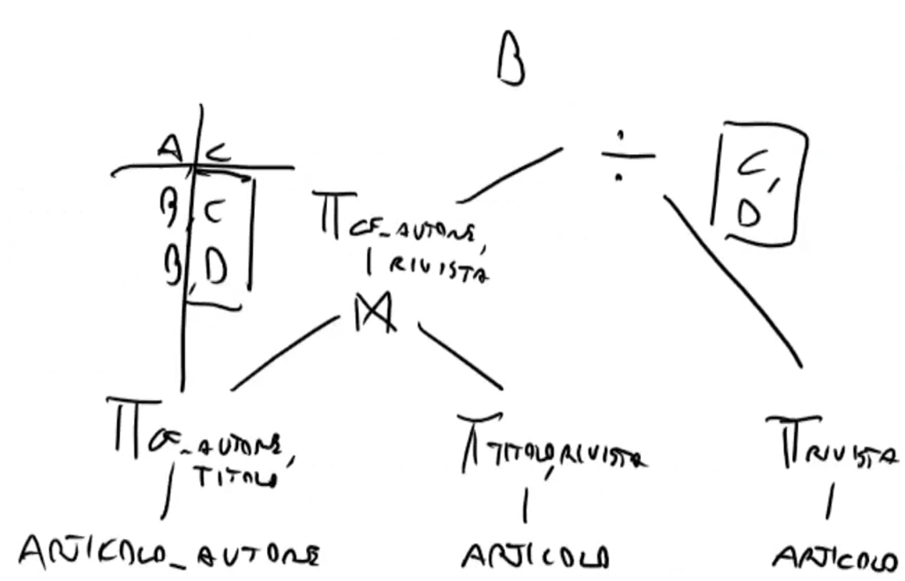

# Algebra Relazionale
Linguaggio procedurale, cioè un linguaggio in cui specifichi le procedure da svolgere per 'filtrare i dati'. 
Operatori:

- $\sigma$ operatore di selezione
- $\pi$ operatore di proiezione .. fondamentalmente elimina i dublicati 
- classiche operazioni .. unione, differenza, intersezione, prodotto cartesiano. Ques'ultimo consiste in tutte le possibili combinazioni delle righe. 
- $\rho$ operatore di ridenominazione .. cambia i nomi di uno o più attributi 
- $\bowtie$ join... è un prodotto cartesiano in cui vengono eliminate le colonne no sense. 
- $\ltimes$ semijoin. è un join in cui vengono tenute solo le colonne della tabella sinistra (o dx a seconda dove disegni la stanghetta aperta del simbolo). In pratica te lo puoi ricordare come il join nel quale usi le righe di una tabella per 'selezionare' le stesse righe in un'altra. 
- operatore di divisione. Complicato da capire, sostituibile con le altre operazioni. 

{width=80%}

Algebra relazionale è un linguaggio procedurale, cioè l'ordine delle operazioni è molto importante. Or dunque usi le parentesi. 
*join e semi-join naturale usano gli attributi uguali tra le due tabelle*. 

*alcune casistiche un po' tricky: ad esempio ''selezionare righe con x che è sempre stato < 30: non posso selezionare le righe che hanno <30 altrimenti selezionarei tutte quelle entries che almeno una volta hanno avuto l'attributo x < 30. Invece devo selezionare le righe con x >= 30 .. così trovo chi è stato almeno una volta >=30 e poi fare una differenza *. 

oppure 

*trovare l'ultimo esame di uno studente avendo l'attributo data. Devo selezionare tutto le righe le quali sono minori di un'altra riga. A questo punto ho trovato tutte le possibile righe che non sono ultime. Poi faccio una differenza con la tabella originale come nel punto precedente. La logica è quindi sempre la stessa .. quando devo selezionare un insieme potrei dover selezionare il suo complementare.*

Devo anche ottimizzare. Come minchia si ottimizza? 
Rappresenti in modo gerarchico le parentesi/operazioni e poi cerchi di 'pushare' le proiezioni/selezioni verso il basso. Il senso è di fare la proiezione/selezione (operazioni che **riducono** la dimensione delle tabelle) PRIMA di ogni prodotto cartesiano/join/semijoin. 
L'idea generale è quella anche più logica .. devi puntare a scremare la dimensione delle tabelle prima di fare grosse operazioni come ad esempio un prodotto cartesiano che calcola tutte le possibile combinazioni. 
Abbiamo elencato una decina di best practices da seguire ma basta seguire il buon senso. (cit.)
*PS:vedi il join come un doppio for ... stra peso*.
*PS:vedi l'unione/la differenza come operazioni che richiedono l'ordinamento della tabella.*