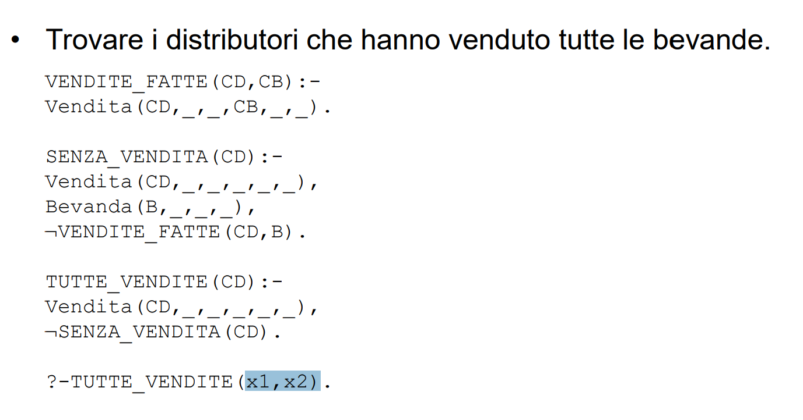

# Datalog
Datalog è un linguaggio di programmazione logica basato su formule che prendono il nome di **regole** . è un linguaggio dichiarativo senza alcuna introduzione procedurale come ad esempio SQL. Sintatticamente derivato dal Prolog. 

Ogni regola ha una **testa** e un **corpo** . 

- Fatto: corrisponde alla tupla del database. 
- Goal: corrisponde alla query ed è sostanzialmente una regola in cui in testa piazziamo *?-* e che viene valutata cercando tutte le variabile che soddisfano il corpo di tale regola. Alcuni goal però restituiscono solo *True* o *False*. 

Il Datalog è più espressivo dell'algebra e il calcolo relazionale (i quali sono equivalenti) delle basi di dati, grazie all'uso della negazione. 
Maggiore espressività si traduce anche in questo modo si introduce possibilità di definire insiemi infiniti e quindi fare errori. La maggiore espressività è anche dovuta alla possibilità di scrivere regole ricorsive in grado cioè di richiamare il medesimo atomo della testa anche nel corpo della regola. L'introduzione di ricorsione e negazione porta facilmente alla scrittura di regole indecidibili. 
Alcune best practice da seguire per evitare ricorsioni infinite o insiemi indecidibili sono ad esempio che tutte le variabili che appaiono nella testa debbano apparire anche nel corpo della regola e che se una variabile compare in un atomo di confronto debba allora comparire in un atomo del corpo della stessa regola. 
Queste ultime hanno lo scopo di garantire che il processo di deduzione che viene effettuato dal compilatore Datalog abbia un tempo di fine. L'operatore di negazione inoltre deve essere usato con la clausola di safe che tutte le variabili in un letterale negato debbano apparire anche in uno non negato all'interno del corpo;
Inoltre non ci devono essere dipendenze circolari.