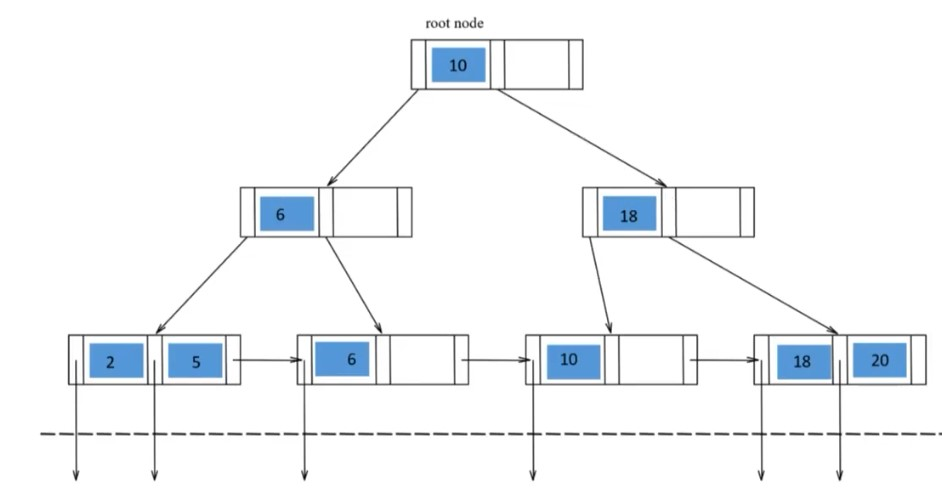

# Progettazione 

## Progettazione fisica
Da un punto di vista logico vediamo solo tabelle, ma come sono organizzati i dati fisicamente? 
L'approccio più comune è tenere le tuple distribuite in modo sequenziale in memoria. In genere le tuple sono in ordine cronologico d'inserimento. Sopra questo blocco di memoria vengono poi costruiti degli indici. Questi indici sono nella maggior parte dei casi implementati con hash e albero B+ .



Simile a un BST ma con più chiavi, infatti ogni nodo può avere n puntatori. 
Inoltre un albero B+ è costruito in modo tale che si possono attraversare le foglie in modo sequenziale. 

Può accadere che questi indici in SQL vengano creati automaticamente, ad esempio durante un SELECT o un JOIN. 
Puoi però esplicitarli manualmente. 

````Sql
create [unique] index IndexName 
on TableName(AttributeList)
````

Good practices per gli indici in SQL:

- non usare per tabelle piccole 
- molti DBMS li fanno in automatico
- può essere necessario usare indici per attributi in select/join o che richiedono l'ordinamento 
- evitare se sono tabelle che vengono aggiornate frequentemente 
- evitare di creare indici su attributi composti da stringhe molto lunghe


## Dipendenza funzionale e normalizzazione 

I vincoli d'integrità che siano di chiave (cioè i vincoli che specificano qual è la chiave), di dominio (il dominio di valori disponibile per l'attributo) o di .. sono fondamentali per la consistenza del database. 
Le dipendenze funzionali  sono particolari tipi di vincoli d'integrità. In particolare la Dipendenza Funzionale $X \implies Y$ ci dice che ogni coppia di tupla la quale ha stesso valore negli attributi X, ha anche stesso valore negli attributi Y.
Esempio di dipendenza funzionale in un database d'esempio:
$${\{}ID,ESAME{}\} \rightarrow VOTO$$
Una dipendenza funzionale è banale $X \implies Y$ quando in X compaiono attributi di Y. 


### Rindondanze
Possono capitare rindondanze nei DBs. Le rindondanze sono dovute ad anomalie di inserimento, aggiornamento o cancellazione. Cioè quando c'è una cancellazione/inserimento/modifica si creano conflitti con alcune key. Ad esempio dopo una cancellazione ci potrebbe essere una key ad essere null. 
Le anomalie possono capitare quando non si parte dal modello di entità-relazione. 
Le anomalie corrispondono a **dipendenze funzionali** che sussistono tra attributi. 
L'idea è di __normalizzare__. Cioè trasformare una tabella composta in una normalizzata per eliminare le dipendenze funzionali tra gli attributi, ed eliminare quindi anomalie e rindondanze. 

### Forme Normali
Forme normali (dalla più debole alla più forte):

- **Prima Forma Normale**: non ci devono essere attributi composti, ma solo atomici.
- **Seconda Forma Normale**: Deve essere 1FN e tutti gli attributi non chiave devono dipendere dall'intera chiave primaria, non da un sottoinsieme di essa (dipendenza completa). 
- **Terza Forma Normale**: Deve essere 2FN e non devono esserci dipendenze transitive. Cioè ogni attributo _non-chiave_ deve dipendere **direttamente** dalla chiave. Cioè gli attributi non si determinano a vicenda, ma hanno una **dipendenza funzionale** $X \implies Y$ solo con la chiave $X$ OPPURE (ed è questo che la rende diversa dalla FN di BC) gli attributi hanno una dipendenza del tipo $X \implies Y$, dove Y **fa parte della chiave**. Più debole di Boyce Codd proprio per la seconda condizione. Quindi non garantisce la scomparsa di tutte le anomalie. (Sempre ottenibile, così come le precedenti).


Il ModelloAuto dipende funzionalmente dalla TargaAuto, duqnue ci sono attributi  che si determinano a vicenda. 

- **Forma di Boyce Codd**: non sempre raggiungibile. Ogni attributo deve dipendere **solo** dalla chiave. Cioè in " $X \implies Y$ " X deve essere sempre chiave. 


All'esame, ogni tabella che facciamo, deve soddisfare almeno la terza forma normale. Normalmente quando faccio un progetto basato sul modello ER riusciremo a soddisfare tranqui Terza Forma Normale. 

[Extra](08.Extra.md)

