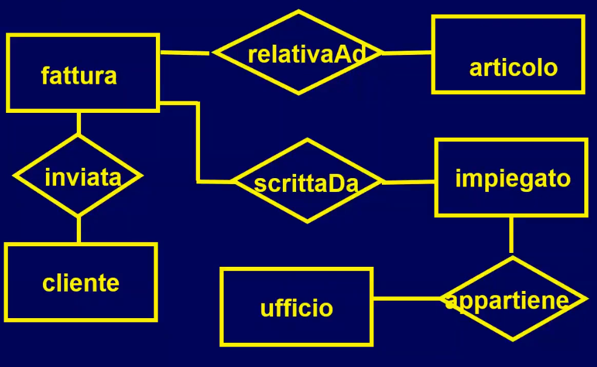
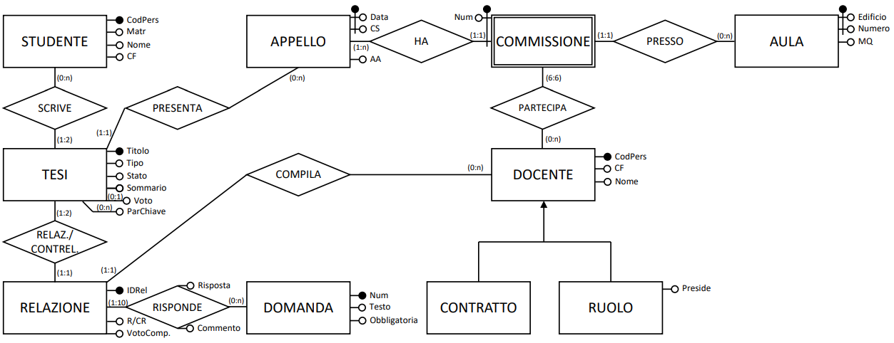
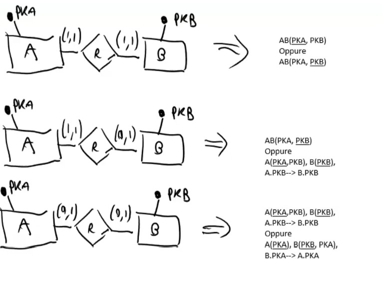

# Progetto concettuale e logico 

IL **modello entità-relazione** (**modello ER**) è un modello teorico per la rappresentazione concettuale e grafica dei dati, formalizzato da Peter Chen nel 1976
Il modello entità-relazione viene spesso utilizzato nella prima fase della progettazione di una base di dati, nella quale è necessario tradurre le informazioni analizzate in uno schema concettuale, detto **diagramma entità-relazione** (o **diagramma ER**).
Si tratta di una fase con una astrazione molto elevata. Seguito dal progetto logico. 

Particolare attenzione quando ci si sposta dal progetto concettuale a quello logico. L'idea è che in ogni tupla ci deve essere il riferimento a 0 o al massimo 1 tupla esterna. Quindi le relazioni 0:1 e 1:1 sono le più semplici. I riferimenti tra A e B 1:n non posso stare in A, bisogna fare il riferimento nell'altra tabella solo se B e A ha 0:1 o 1:1. Se l'altra tabella B ha anch'essa 1:n allora serve una tabella ponte AB. 

### Errori gravissimi in uno schema concettuale:

- usare una entità debole al posto di una sottoclasse
- vicevera usare una sottoclasse al posto di una entità con relazione
- considerare come entità nel DB la persona/società/gruppo di persone proprietarie del DB