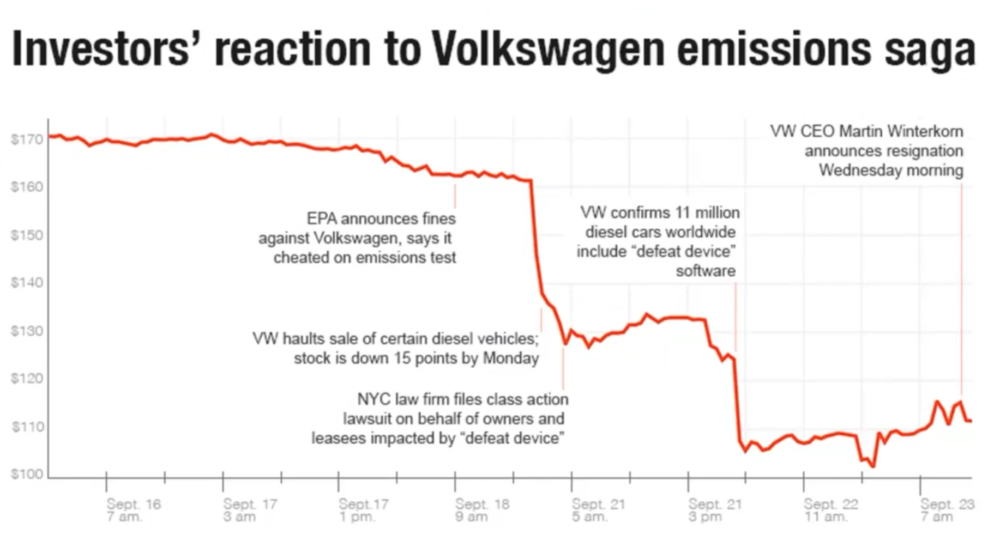
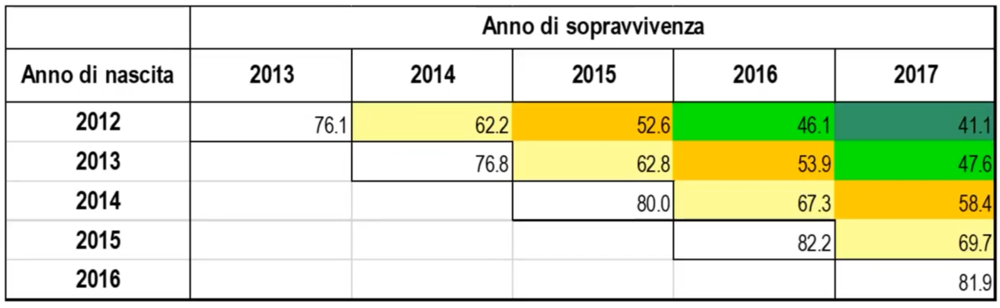
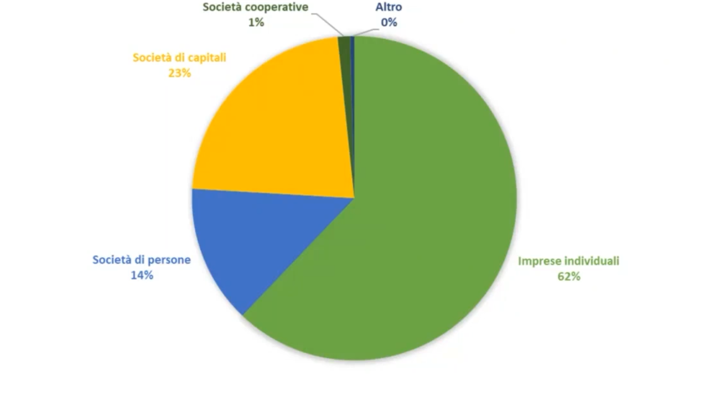
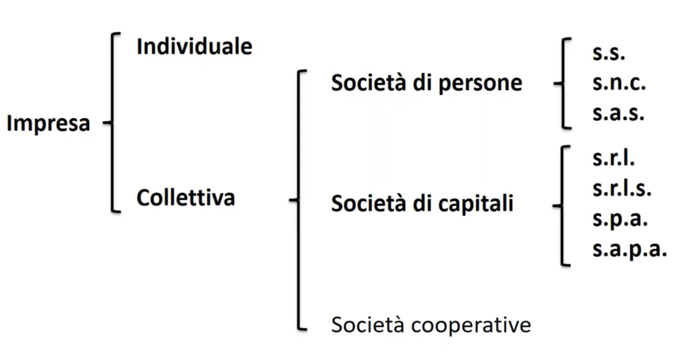

# L'impresa: obiettivi, tipologie e forme giuridiche 

Un paio di definizioni per iniziare: 

- Imprenditore: chi esercita professionalmente un'attivitá economica organizzata al fine della produzione o dello scambio di beni o di servizi. 

- Impresa: attivitá economica organizzata, svolta professionalmente, al fine della produzione o dello scambio di beni o di servizi. 

- Lavoratore subordinato: chi si obbliga mediante retribuzione a collaborare nell'impresa, prestando il proprio lavoro intellettuale o manuale al imprenditore. 

- Societá: contratto con cui due o piú persone conferiscono beni o servizi per l'esercizio in comune di un'attivitá economica all scopo di dividerne gli utili.

- Azienda: complesso dei beni organizzati dall'imprenditore per l'esercizio dell'impresa. 

- Ditta: nome commerciale (la legge ne garantisce un uso esclusivo, dunque non posso chiamare con lo stesso nome due ditte nello stesso settore).

- Shareholder: azionista 

## Shareholder theory
L'obiettivo principale dell'azienda é generare valore per la shareholder

$$Utile = Ricavi \space Totali - Costi \space Totali$$

Ovviamente l'impresa deve massimizzare l'utile anche pensando alle normative e all'ambiente, cioé con una **certa etica**. 
o. 
Rischio: impossibilitá di prevedere con certezza gli esiti futuri delle decisioni. Indipendentemente dallo sforzo che un imprenditore ci mette, l'impresa potrebbe essere sfortunata. 

> Gli imprevisti capitano  

Fattori di rischio: 

- tempo
- rigidezza dell'azienda 
- contesto dinamico e mutevole 

Il rischio colpisce tutti. Il contesto dinamico e mutevole ha cancellato Nokia, leader del settore. 

## Forma giuridica dell'impresa

Due tipi di responsabilità: 

- responsabilitá illimitata (personale): l'imprenditore rispondono con tutto il patrimonio personale.
- responsabilitá limitata: l'imprenditore risponde con i soli capitali conferiti.

Come nasce l'impresa? 

In linea di principio non é necessario accollarsi il capitale. Tuttavia la presenza di capitale proprio dei fondatori spesso garantisce capitali. 
Per partire si costruisce il cosiddetto business plan: documento che espone le previsioni degli esiti di business, per convincere l'investitore esterno. 

Come muore? Ormai l'impresa é dissociata con la vita dell'imprenditore, ma puó rischiare di morire in assenza di profitto. In Italia le imprese vivono in media 12 anni. 

Può morire per:

- Fallimento 
- Liquidazione 
- Acquisizione/Fusione (caso piú positivo)

E può essere classificata per: 

- Proprietá: pubblica - privata 

- Obiettivo: profit - non profit 

- Dimensione(in base ad addetti e fatturato): grandi - medie - piccole  

- Differenze tra beni e servizi. 

- In base al numero di output: 
	- monoprodotto 
	- diversificate 
	- conglomerati 

- Distinzione qualitative:
	- Whoresale
	- Retail
 - Localizzazione delle attivitá produttive:
	 - Nazionali 
	 - Multinazionali 

*L'[Italia](../../../../../kb/Italia.md) é fatta di Piccole-Medie imprese. Si parla di una dimensione media di 4 addetti!*

(*Fonti Istat 2019*)

### Diritti e doveri dell'impresa

L'impresa ha quindi diritti:

- diritto di proprietá sui bene, sui servizi 
- diritto di affittare 
- diritto di difendersi in tribunale 

Ma anche doveri:

- rispettare leggi (redigere bilancio, rispettare normativa ambientale ecc. )

> La forma giuridica stabilisce in che modalitá l'azienda deve adempiere ai propri doveri 

Le grandi aziende internazionali devono fare per redigere il bilancio per ogni paese in cui operano, e poi anche il bilancio del capogruppo delle aziende dei vari paesi il quale deve essere coerente con tutti gli altri bilanci chiaramente.

## Forma giuridica

### Tipi di forme giuridiche: 

### Impresa individuale 
Caratterizzate da una responsabilitá illimitata. 
(ingegnere, architetto ecc. ecc.): chiaramente di semplice gestione, (tassazione IRPEF, la quale va a privilegiare i redditi bassi) . 

### Impresa collettiva: 

- ###### Societá di persone: 
	- **Societá semplice(s.s)**: attivitá agricole, gestione di patrimoni immobiliari
	- **Societá in modo collettivo (s.n.c)**
	- **Societá in accomandita semplice (s.a.s)**:
		- Soci accomandatari: responsabilitá illimitata
		- Soci accomandanti: responsabilità limitata

- ###### Societá di capitale
Adempimenti burocratici e fiscali molto dettagliate e maggiori obblighi di trasparenza a fronte di responsabilitá limitata. 
	- **Societá a responsabilitá limitata (s.r.l)**: non quotabili, con capitale minimo di 10k euro. 
	- **Societá a responsanilitá limitata semplificata(s.r.l.s)**: capitale minimo di 1 euro.
	- **Societá per azioni (s.p.a)**: il patrimonio sociale é costituito da azioni. Cap. Min: 50k euro. 
	- **Societá in accomandita per azioni (s.a.p.a)**: i soci si distinguono in accomandatari e accomandanti. 

- ###### Societá cooperative 
Simili alle societá di capitale ma tutti **gli utili** vengono reinvestiti nella societá. 

