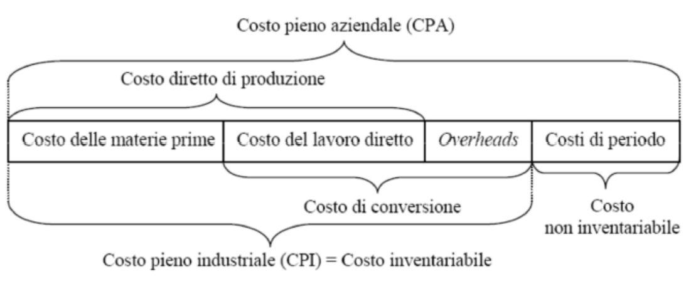
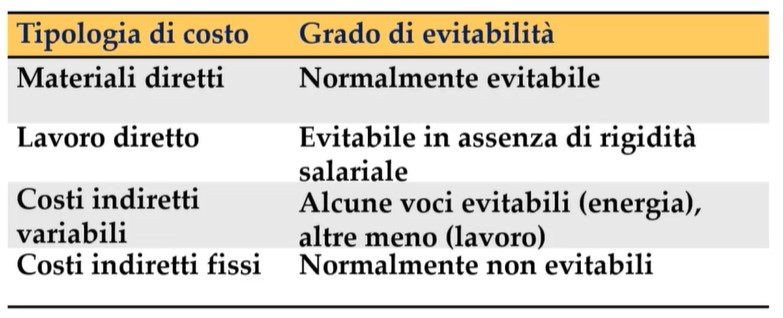
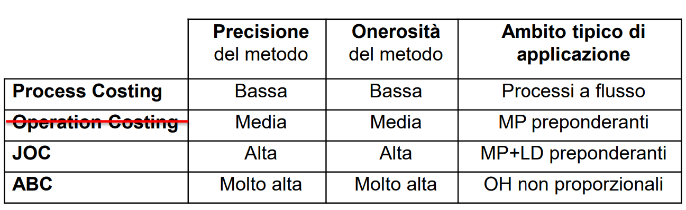
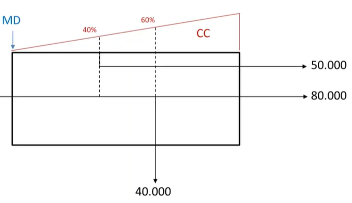

# Contabilitá interna 

## Tassonomia costi:

La contabilitá interna si concentra sui costi di una determinata impresa in un certo periodo di tempo. 
Possiamo classificare diversi tipi di costi: 

- fissi/variabili
- di produzione/di periodo 
- diretti/indiretti
- evitabili/inevitabili
- inventariabili/non inventariabili 

*immagine più importante di questo capitolo, importantissimo sapere la tassonomia dei costi* . 

### Costi fissi/variabili: 

I costi fissi sono i costi che nel breve periodo rimangono invariati. I costi variabili invece dipendeno direttamente (in modo proporzionale) alle variazioni del volume operativo. 
Da notare che i costi variabili non dipendono solo dal volume di produzione ma anche ad esempio dall'ampiezza della gamma, dal tempo di consegna e dalla qualità del prodotto.

### Costi di produzione/di periodo: 

I costi di produzione sono i costi per la trasformazione fisica dell'input in output . 
I costi di produzione si possono dividere in:

- diretti: associabili direttamente alla prod del singolo prodotto
	- materiali diretti
	- lavoro diretto 

- indiretti (overhead): 
	non imputabili ai singoli prodotti 

Costi di conversione: lavoro diretto + overhead (cioè costi di produzione senza i MD) .
Costi di periodo non associabili alla trasformazione input/output dei prodotti ma associabili invece aò sostentamento dell'azienda. 
Nota che i costi amministrativi non sono costi di produzione ma costi di periodo

### Costi diretti/indiretti 

Sebbene spesso i costi di prod diretti sono anche costi variabili non bisogna considerare i due concetti come lo stesso. 

i costi variabili sono infatti costi direttamente dipendenti dal volume prodotto. 

mentre i costi di prod. sono i costi direttamente attribuibili in modo oggettivo a un determinato prodotto. 

lo stesso vale per i costi indiretti/fissi .

Il concetto principale è che i costi diretti e il lavoro diretto sono facili da determinare per ciascun prodotto. La complessità principale è determinare come i costi **indiretti** vengono spartiti tra i prodotti.  

## Rilevazione dei costi

In questo corso guarderemo principalmente i seguenti modi per calcolare i costi: 

- JOC: si basa sul concetto di Job (lotto, in questo contesto). Adatto ad attivitá di tipo manufattiero in ambito aereonautico, navale o comunque tutti quel genere di attivitá in cui si consegna un prodotto , o pochi prodotti , spesso ciascuno che caratteristiche differenti dagli altri. (pensa ad esempio alla produzione di uno yacht).  

- PC: concetto opposto di JOC, indicato per quelle imprese caratterizzate da flussi continui .

- ABC : Activity Based Cost, il piú avanzato. Un 'JOC 2.0' in cui viene introdotto il concetto di attività come 'ponte' tra le risorse utilizzate e i prodotti. 

Quando faccio i calcoli per la rilevazione dei costi, utilizzeremo principalmente questi 3 concetti: 

- MD: materie dirette
- LD: lavoro diretto
- OVH: overheads dovuti alla produzione del prodotto 

I costi servono ovviamente per analizzare il profitto dell'impresa e l'efficienza di produzione.  In caso di profitto negativo, al produttore nel breve periodo conviene offrire una quantità minima di Break-Even per ricoprire parte dei costi fissi (anche operando in perdita), per poi, nel lungo periodo o quando è possibile modificare i CF, aumentare l’efficienza della produzione o uscire dal mercato.

### JOC 

Per i costi diretti sarà semplice .. (per ogni lavoro MD e LD) sono i costi indiretti il problema.. 
Si crea la cosiddetta 'base di allocazione' che viene fatta in base

Costi indiretti del $j-esimo$ prodotto: 
$$CI_j = \frac{OVH_{totali}}{BA_{totale}}BA_j$$

dove la base di allocazione è un 'indicatore del consumo delle risorse': ad esempio la base di allocazione per gli overhead potrebbe essere il prezzo che mi costa la manodopera all'ora. 

Morale: tu hai degli overhead, e non sai come distribuirli equamente tra i JOB. Allora scegli un parametro (esempio la manodopera) con cui fare una 'media pesata' degli overhead. 

#### CPI nel JOC

$$CPI = C_{MD} + C_{LD} + C_{OVH}$$

Dove $C_{OVH}$ sarà il costo degli overhead proporzionati. 

### PC
Per il PC introduciamo ulteriori 2 concetti: 

- Unitá equivalente: fondamentale esprimere l'output in termine di unitá equivalenti dei prodotti finiti. Cioé "30 hamburger non nel pane, 34 patatine grandi non salate e 27 bibite ancora senza ghiaccio possono essere visti come 15 HappyMeals, considerati in questo caso come unitá equivalenti, cioé prodotti finiti". 
- Grado di completamento: grado di completamente del WIP, calcolato in termini di percentuale del **costo** utilizzato rispetto al costo totale del prodotto. 

Grafico che mostra che 50k unità sono 'partite' da un WIP al 40% per poi diventare prodotti finiti. Nel frattempo 80k unità sono state prodotte e 40k sono 'uscite' al 60% della lavorazione. Il grafico mostra inoltre di come i materiali diretti siano inseriti all'inizio della produzione. 

#### Passi del PC

1) scegliere una unitá di riferimento tra i prodotti, e calcolare il tasso $\gamma$ di ciascun altro prodotto rispetto alla $UE$  

Per ogni risorsa (in genere per ciascun MD e per i CC) si eseguono i seguenti passi:

2) calcolare l'output in termini di $UE$ 
3) calcolare **costi totali** da attribuire alla risorsa 
4) calcolare il **costo unitario per unità equivalente** .  

Infine:

5) allocare il costo alle unità di prodotto finito e $WIP$ considerando eventualmente coefficienti di assorbimento calcolati nel punto (1) $\gamma$ . 

##### Valorizzazione scorte

Il passo (2) e (5), variano a seconda del **metodo di valorizzazione delle scorte** , il quale può essere: 

- FIFO
- Costo Medio
- LIFO

I risultati generalmente sono diversi a seconda della logica usata. Ovviamente questa ultima affermazione ha senso solo nel caso in cui siano semilavorati iniziali: in caso di assenza di semilavorati iniziali non cambia na bega!

###### FIFO 

Il calcolo del punto (2) con logica $FIFO$: $$UE = N_{PF} + \alpha WIP_{finali} - \alpha WIP_{iniziali}$$con $\alpha$ grado di completamento (cioè a che punto sono arrivati con la produzione di tale unità) e $N_{PF}$ il numero di prodotti finiti target. 
Per poi proseguire con:
$$CPI = \sum \frac{C_x}{UE_x}$$
Cioè il Costo Pieno Industriale è la somma di tutti i costi delle risorse $x_{esime}$, ciascuna divisa per il corretto numero di $UE$ . 
$$C_{WIP_{finali}} = \gamma (CPI * \alpha * WIP_{finali}) $$
$$C_{PF} = \gamma(C + C_{WIP_{iniziali}} - C_{WIP_{finali}})$$
Si deve notare che nel momento del calcolo delle unità equivalenti (con la logica FIFO) vengono 'sottratti' i $WIP_{iniziali}$ (cioè non si contano le $UE$  del periodo precedente considerato). Le $UE$ servono quindi per distribuire correttamente i costi del mese corrente. Le unità del $WIP_{iniziali}$ (e quindi costi associati) devono però essere tenuti in conto in questa ultima formula, quando si valuta il **costo totale** dei $PF$ .

###### Costo medio

Con la logica del costo medio, il calcolo delle $UE$ (cioè punto 2) cambia in: 
$$UE = N_{PF} + \alpha WIP_{finali}$$
Cioè nel calcolo delle $UE$ non vengono sottratti i $WIP_{iniziali}$ : questo perchè mentre nella logica $FIFO$ vogliamo fare distinzione tra i prodotti non completi del periodo precedente e i prodotti del periodo considerato, nella logica del costo medio invece le $UE$ comprendono tutto. Successivamente, proprio perchè le $UE$ considerano anche i $WIP$ dello scorso periodo, verrà giustamente calcolato anche il costo del $WIP_{iniziale}$: 
$$CPI = \sum \frac{C_x + C_{x \space wip \space iniziale}}{UE_x}$$
successivamente (così come nella logica FIFO):
$$C_{WIP_{finali}} = \gamma (CPI * \alpha * WIP_{finali})$$
mentre per i $PF$ non consideriamo i $WIP$ : 
$$C_{PF} = \gamma CPI*N_{PF}$$

### ABC 

Per calcolare i costi indiretti per i diversi prodotti si ''usano'' attività e non risorse come base di allocazione. 

1. individuazione attività che consumano le risorse
2. individuazione *resource driver* per ciascuna attività (in pratica quale risorsa usa l'attività, il proprio peso)
3. ripartizione costi indiretti a ciascuna attività
4. ripartizione dei costi ad ogni prodotto/lotto tramite le attività che usano (proporzionalmente) 

L'ABC è più preciso ma necessita d analizzare i processi aziendali ed è complesso definire il numero di attività e il resource driver più adatto per ciascuna attività. Dopo aver capito i resource drivers, ad esempio che l'attività *controllo costi* dipende dal numero delle unità e l'attività di *attrezzaggio* dipende invece dal numero di ore spese si allocano i costi indiretti e quindi in generale gli $OVH$ alle attività.
Si utilizzano infine i resource driver spesi da **ciascun lotto** o **prodotto** per pesare il costo delle attività tra i prodotti.