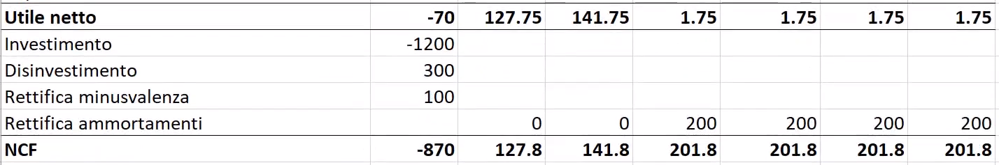
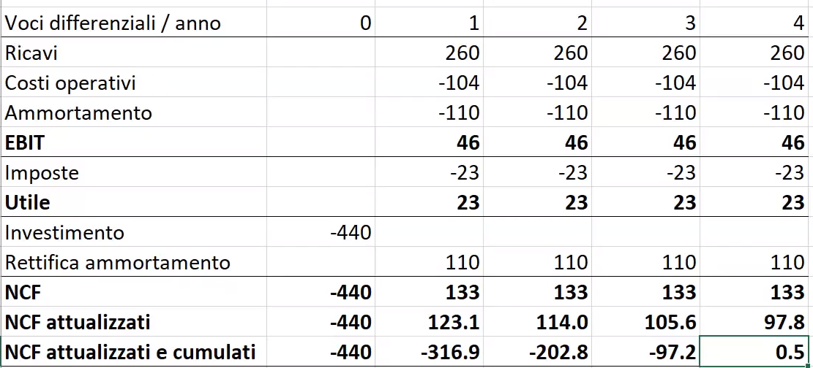

# Valutazione investimenti 

Un **investimento** è una immobilizzazione di risorse iniziale, la quale genera un reddito (o dovrebbe generare) nel futuro. Un investimento dovrebbe essere tale da remunerare gli investitori in misura sufficiente a giustificarne il rischio. 

Un po' di panoramica sui nomi delle cose in ambito investimenti: 

- obbligato: il caso base non è 'non investire', siamo obbligati a scegliere. 
- non obbligato: il caso base è 'non investire'.

Parte del corso molto semplice, l'unica parte 'critica' è rettificare l'utile netto e 'trasformarlo' in net cashflow (NCF), concetto su cui si basa la valutazione degli investimenti. 
Tramite il NCF e derivati possiamo usare criteri di accettazione (dire se è un investimento genera valore o meno) e d'ordinamento (quale investimento mi conviene?) . 

Tipi di criteri: 

- DCF (Discounted Cash Flow)
	- Net Present Value (il secondo più usato)
	- Profitability Rate (poco usato)
	- Internal Rate of Return (il più usato)
	- Payback attualizzato
- non-DCF
	- payback

In che senso 'discounted'? Il concetto è che uno stesso esborso ha 'peso' diverso a seconda della coordinata temporale a cui si trova. Quindi terremo in conto che 1000 euro di CashFlow oggi sono diversi da 1000 euro di CashFlow tra 1 anno .  

$$NPV=VAN=\sum\limits _{j=1}^{n}\frac{NCF}{(1+k)^j} +I_0=\sum\limits _{i=0}^{n}\frac{NCF}{(1+k)^i}$$

Cioè la sommatoria dei flussi di cassa in istanti diversi. Si sottrae l'investimento iniziale e si controlla se la sottrazione resistuisce un valore positivo, in tal caso può aver senso investire.
Nella formula di NPV il NCF lo si ottiene con la rettificazione del utile netto mentre $k$ (tasso di attualizzazione/di sconto) è sbatti da determinare, in genere viene dato dal testo. $k$ è il tasso di attualizzazione e rappresenta il costo opportunità del capitale. 

## Da utile a NCF

Si passa da logica economica a logica finanziaria. 
Come anticipato nel paragrafo del CashFlow operativo, calcolamo il NCF usando una rettificazione: sommiamo all'utile netto i costi non monetari (esempio minus/plusvalenza , ammortamenti, accantonamenti di credito/debito). 

Da $Utile \space Netto = (Ricavi - costi)*tassazione$ a $NCF$: 

- $+$ Costi non monetari: ammortamenti, accantonamenti, minusvalenze, svalutazioni 
- $-$ Ricavi non monetari: plusvalenza, rivalutazioni
- $-$ Investimenti
- $+$  disinvestimenti
- $\pm$  **Variazione** del Capitale Circolante Netto:

$\Delta CCN = \Delta  Crediti \space commerciali \space + \Delta  \space rimanenze \space - \space \Delta \space debiti \space commerciali$

Negli esercizi, spesso quando ci sono in ballo crediti/debiti e stiamo valutando l'investimento su un periodo di $x$ anni, quasi sicuramente ci toccherà riportare anche una colonna $(x+1)$esima proprio per il fatto che dobbiamo tener conto della variazione del CCN. 

*Nota che la somma degli $NCF$ attualizzati e cumulati è proprio $NPV$ .

Si tratta quindi di valutare un investimento in base al corrente e ai futuri stati finanziari utilizzando tutte le variabili note per predirne il risultato futuro.

- **PI**: sostanzialmente il rapporto tra $NPV$ e l'investimento iniziale. Mentre NPV è un criterio assoluto, il PI é un criterio relativo. PI è da preferirsi rispetto a NPV in presenza di vincoli di budget. 
- **Payback**: in quanti anni ricopro completamente il mio investimento 
- **IRR**: L'IRR corrisponde esattamente per il tasso $k$ per cui il $NPV$  eguaglia l'investimento effettuato. Concettualmente può essere visto come il tasso di rendimento che permette di raggiungere il break-even finanziario. L'IRR è poi utilizzato come 'parametro' per indicare le performance di un investimento o confrontare le performances di più investimenti in termini relativi e non assoluti.