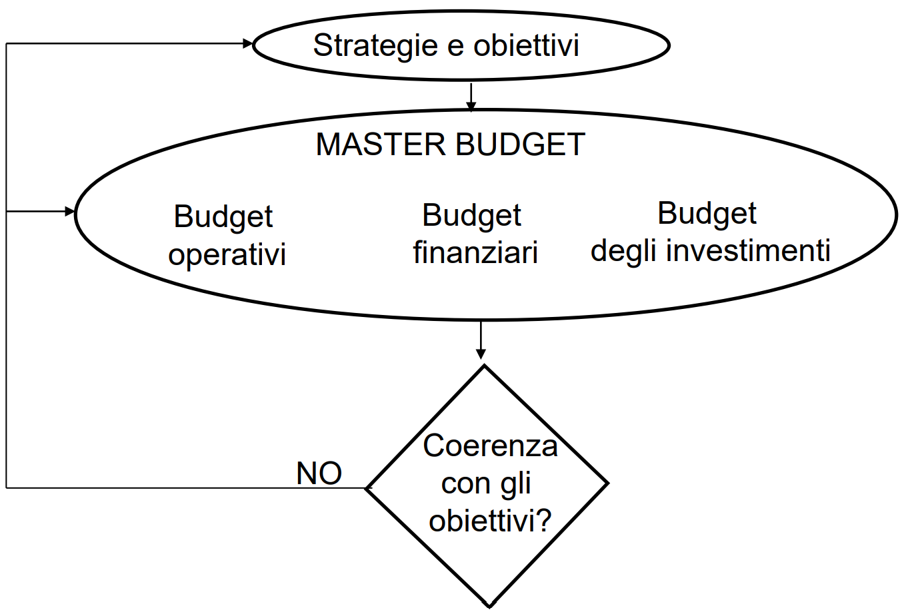

# Controllo di gestione 

Si fa budgeting per capire se rispettiamo gli obiettivi aziendali. 

## Master Budget

Il confronto tra tali valori previsionali e gli obiettivi determina l’approvazione del master budget, la sua revisione o addirittura una ridefinizione degli obiettivi quando non venga individuato alcun piano in grado di assicurarne il conseguimento

Il master budget é composto dai tre tipi di budget: 

- **budget operativi**:
	- **budget delle vendite**
	- **budget della produzione e delle scorte finali**
	- **budget del costo del venduto** 
	- **budget costi di periodo**:
- **budget degli investimenti** 
- **budget finanziari** 

In pratica nei nostri esercizi valuteremo soltanto i budget operativi e non considereremo budget degli investimenti e finanziari. 

## Budget operativo

Non è possibile calcolare il budget della produzione senza prima aver calcolato il budget del venduto, quindi bisogna andare in ordine. 

### Budget del venduto

Calcoli quante **unitá si vogliono vendere e di conseguenza il prezzo di vendita.
	
### Budget della produzione 

In base a quello che voglio vendere che quantitá devo produrre? 
	 $$Q_{p}= Q_{v} + SP_{f} - SP_{i}$$
con $SP_{f}$ e $SP_{i}$ rispettivamente le scorte di prodotto finali/iniziali. 
Ovviamente in questa fase si puó valutare se la quantitá di produzione richiesta puó essere coperta.. in caso contrario si cambierá politica di vendite, di scorte o si effettuerá un cambiamento alla capacitá produttiva o ancora si puó esternalizzare parte della produzione.
	 
Valutazione fattibilitá : 
$$\sum\limits _x Q_{x} t_{j,x} \le T_j$$
Cioé per ogni prodotto $x$ bisogna controllare che la disponibilitá totale della risorsa $j$ sia sufficiente a coprire la richiesta della risorsa totale. 
	 
### Budget del costo del venduto

Che si divide a sua volta in:

- budget degli acquisti: quantità complessiva di materie prime e semilavorati di cui approvvigionarsi. 
- budget del conto lavorazioni: entità delle lavorazioni esterne.
- budget dei costi di conversione: costi di conversione relativi alla trasformazione di input in prodotti finiti destinati alla vendita.
	
Sostanzialmente calcoli quante MP ti servono da comprare in base a quanto ti serve produrre (calcolato nel punto precedente) e a quante scorte di MP hai: 
		$$Q_{MP}=Q_{p}\times C_{MP} + SP_{f} - SP_{i} $$

Ma anche quanto ti costa la conversione (tipo il lavoro diretto, costo energia etc.)

### Budget dei costi di periodo

- *Approccio incrementale*: per prevedere i costi di periodo si moltiplicano i valori passati per un coefficiente che tiene conto di inflazione ed eventuali altri fenomeni.
- *Zero Based Budget (ZBB)* i responsabili delle varie unità organizzative identificano le risorse minime per il funzionamento della propria unità (molto oneroso).  
- *Overhead Value Analysis (OVA)*: per ogni attività si definiscono soluzioni alternative in termini di costi e benefici, costruendo quindi una possibile previsione. 

## Dopo il budgeting che minchia faccio? Analisi scostamenti 

L’analisi degli scostamenti di basa sul confronto tra i dati consuntivi e i dati preventivi. 
L’analisi degli scostamenti ci permette quindi di verificare se i risultati raggiunti sono allineati con quanto previsto ed eventualmente identificare le cause degli scostamenti (cioé della differenza tra il consuntivo e il previsto). 

i distinguono quattro tipologie di centri di responsabilità: 

- Centri di ricavo 
- Centri di costo 
- Centri di spesa
- Centri di profitto

### Budget flessibili 

Per analizzare gli scostamenti utilizziamo dei 'budget'intermedi' chiamati Budget Flessibili. Questi budget sono dei budget virtuali che mi permettono di 'scomporre' la causa dello discostamento in più determinanti. Tale disaggragazione ci permette di meglio identificare e analizzare meglio le cause di discostamenti. Ad esempio un discostamento dei ricavi può essere causato da diversi fattori tra cui ad esempio una variazione di volume di vendita o di prezzo. 
Questi budget flessibili si ottengono combinando parametri di budget preventivi con valori a consuntivo (consutivo *aka* effettivi/reali/rilevati).

### Analisi per ricavi 

Analisi scostamento ricavi: 

|        | Budget     | BF1 | Consuntivo| 
|:------:|:-------:|:------------------:|:--------:|
| Quantitá       | Standard |  Effettivo  |   Effettivo |
| Prezzo       | Standard |  Standard  |   Effettivo |
| Ricavi       |Standard |  Calcolato  | Effettivo |

E si valuta lo scostamento di volume tra il Budget e il BF, mentre si valuta lo scostamento di efficienza tra il BF e il Consuntivo.

$$Varianza_{volume}=\hat p (Q-\hat Q)$$
$$Varianza_{prezzo}= Q (p-\hat p)$$
$$Varianza_{totale}= Varianza_{volume}+Varianza_{prezzo}$$

dove i termini con il cappello sono quelli 'standard/previsti'.

In caso di piú prodotti analizzati contemporaneamente: 

|        | Budget     | BF1 | BF2 | Consuntivo| 
|:------:|:-------:|:---------:|:---------:|---------:|:--------:|
| Quantitá | Standard |  Effettivo  | Effettivo  |  Effettivo |
| Mixaggio  A | Standard |  Standard  |   Effettivo  |  Effettivo |
| Mixaggio  B | Standard |  Standard  | Effettivo  |   Effettivo |
| Prezzo  A| Standard |  Standard  | Standard  |  Effettivo |
| Prezzo  B | Standard |  Standard  |Standard  |   Effettivo |
| Ricavi  |Standard |  Calcolato  |Calcolato  | Effettivo |

### Analisi per costi

Analisi scostamenti in caso di costi MP: 

|        | Budget     | BF1 | BF2 | Consuntivo| 
|:------:|:-------:|:------------------:|:--------:|:--------:|
| Quantitá       | Standard |  Effettivo  |   Effettivo | Effettivo |
| a       | Standard |  Standard  |   Effettivo |Effettivo |
| c       | Standard |  Standard  |   Standard |Effettivo |
| Costi MP       |Standard |  Calcolato  | Calcolato |Effettivo |

Perchè un secondo livello? Per disaggregare ulteriormente le cause delle discostamenti rilevati, nella realtà questi processi sono fondamentali ad esempio per capire con chi prendersela in azienda: di chi è colpa se abbiamo fatto meno cash? 
Ma non solo per prendersela con le persone giuste, ma anche per isolare fattori esogeni (come può essere ad esempio il costo delle MP) con fattori interni all'impresa (come ad esempio l'efficienza di produzione). 
Secondo livello perché ci sono 2 variabili : 

- a: coefficiente di assorbimento di MP per unitá di PF
- c: costo unitario della MP

$$Varianza_{efficienza}=Q(CPI-\hat {CPI})$$
$$Varianza_{costo \space risorsa}=\hat {Q \hat a} (c-\hat c)$$
$$Varianza_{impiego}=\hat {Q \hat c} (a-\hat a)$$
Sussiste la relazione:

$$Varianza_{efficienza} = Varianza_{costo \space risorsa}+Varianza_{impiego}$$
E infine la varianza di volume in termini di costi, indicatore del 'ho piú/meno costi perché ho venduto di piú/di meno'. 

$$Varianza_{volume}=\hat {CPI} (Q-\hat Q)$$

Attenzione,nell'analisi costi si effettua un budget per ciascuna materia prima!  
I costi di assorbimento e costi della risorsa sono ovviamente per ciascuna risorsa.