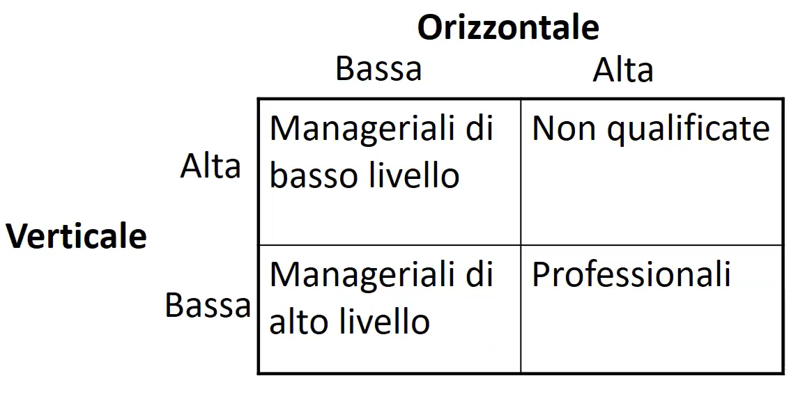
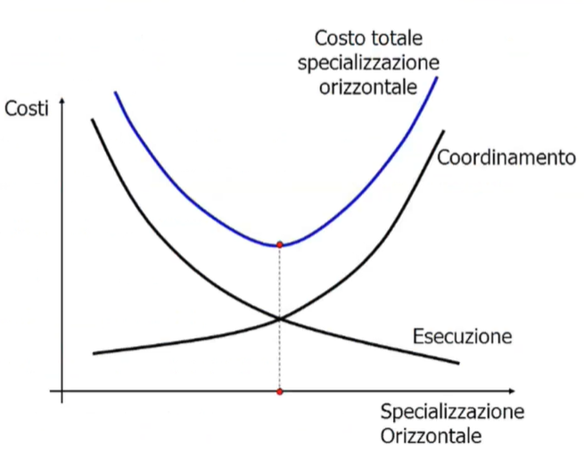

# Organizzazione 

## Microstruttura

### Specializzazione orizzontale e verticale 

Con specializzazione orizzontale si intende la varietà di mansioni svolte dal lavoratorie. Se il lavoratore è molto specializzato orizzontalmente significa che fa una sola/poche mansione/i.
Con specializzazione verticale si intende la distanza o profondità logica che c'è tra il lavoratore e lo svolgimento delle proprie decisioni. Ad esempio un manager ha basso livello di specializzazione poichè prende decisioni per altri e non svolge alcuno dei compiti/mansioni derivate dalle sue decisioni. In genere chi è poco specializzato verticalmente ha anche un'elevata autonomia decisionale. 

{width=50%}

La specializzazione può però inevitabilmente portare alla ripetizione dei compiti e in generale alla alienazione. 
Possibili tecniche per evitare alineazione e perdita di competenze:

- job enlargement
- job enrichment 
- job rotation 

### Meccanismi di coordinamento 

Servono meccanismi di coordinamento per microstruttura:

- adattamento reciproco 
- supervisione diretta 
- standardizzazione progetti
- standardizzazione risultati
- standardizzazione competenze 

Ulteriore modi: 

- formalizzazione 
- autonomia decisionale
- gestione motivazione: l'importanza di seguire un sistema di incentivi che motivi un individuo ad agire perseguendo gli obiettivi dell'impresa. Due tipi di motivazione:
	- motivazione intrinseca : puro piacere nel fare il compito
	- motivazione estrinseca : che dipende dalla propria remunerazione e/o per trovare un lavoro migliore

{width=40%}

## Macrostruttura 

### Gerarchia

Macrostruttura a gerarchia funzionale spesso utilizzata con sistemi di coordinamento a supervisione e in imprese monoprodotto con standardizzazione degli input nonchè in un contesto stabile. 
Efficiente si , ma lento a prendere decisioni, mi costa coordinarmi e scarsa attenzione per il cliente.

### Divisionale

Macrostruttura divisionale invece standardizza gli output a discapito di una maggiore complessità. 

### Meccanismi di coordinamento per macrostruttura

Servono meccanismi di coordinamento tra le varie unità organizzative: 

- manager integratori
- team inter-funzionali 
- sistemi di pianificazione e controllo 
- sistemi informativi aziendali