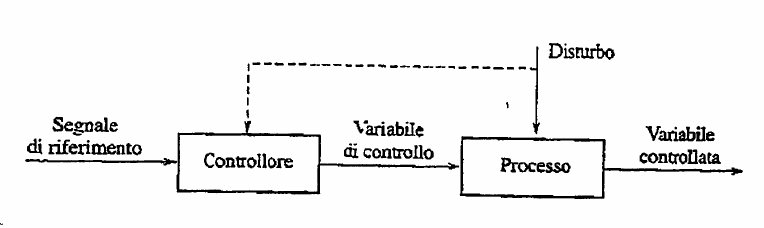
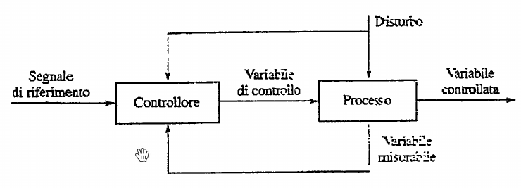

# Introduzione FDA

Gestione e studio dei problemi di controllo. 

Un problema di controllo lo si ha tutte le volte che voglio imporre un comportamento desiderato a un sistema. 

Caratteristiche di un problema di controllo:

- sistema fisico
- variabili di controllare
- variabili su cui agire per controllare
- l'andamento desiderato delle variabili che vogliamo controllare

Problemi di automazione: diversi campi, tutti affrontati con la stessa metodologia.

Diversi approcci per controllare: 

- Anello aperto ad azione diretta (feed forward)

- Anello aperto ad azione diretta con controllo del disturbo, *stessa figura ma con controllo disturbo*
- Anello chiuso Feedback/Retroazione (senza controllo disturbo)

- Anello chiuso Feedback (con controllo disturbo)

Come si può notare la differenza tra anello chiuso/aperto è la presenza o meno della possibilità di 'misurare' la variabile controllata, in modo da avere un feedback costante della variabile che stiamo cercando di controllare. 

Sistemi dinamici e non dinamici: 

- DINAMICI: anche conoscendo l'ingresso puntualmente (istante per istante) u(t) non riusciamo a ricavere y(t)
- NON DINAMICI: ci basta sapere u(t) per ricavare la nostra uscita y(t)

In generale dinamici sono tutti quei sistemi in cui oltre a sapere l'andamento degli ingressi ci serve sapere anche gli stati iniziali delle cosidette variabili di stato.

SISTEMI DINAMICI a Tc (tempo continuo) e SISO (Single Input Single Output) sono i sistemi che più spesso affronteremo e incontreremo. 

$$x_1(t) = \phi(x_1(t_0) , x_2(t_0) ... x_n(t_0),u[t_0,t],t)$$

$$y(t) = \gamma(x_1(t),...,x_n(t),u(t),t)$$

Come si può osservare dalle equazioni qua  sopra un sistema dinamico può essere scritto ad esempio in questo modo, cioè definendo prima tutte le equazioni che governano le variabili di stato e dopo esplicitare l'uscita (che ci interessa) come una funzione delle funzioni di stato, degli ingressi e del tempo. 

DEFINIZIONI (*SD = Sistema DInamico*)

- **SD LINEARE**: le funzioni phi e gamma sono lineari.
- **SD STAZIONARIO o TEMPO-INVARIANTE**: le funzioni phi  e gamma (entrambe!) non dipendono **direttamente** dal tempo, ma solo indirettamente attraverso u(t)
- **SD STRETTAMENTE PROPRIO**: la funzione y(t) dipende solo da variabili di stato e non dagli ingressi (d=0). Ovviamente indirettamente anche dagli ingressi, in quanto le variabili di stato dipenderanno sicuramente dagli ingressi.

Noi useremo sd LTI (Lineari in x e u , e tempo-invarianti) e posso sempre scrivere un mio sd in rappresentazione matriciale. 

$$\begin{cases} x'(t) = Ax(t) + bu(t)  \\ y(t) = c(x(t)) + du(t) \end{cases}$$

Dove A può essere una matrice (nel caso id più variabili di stato) , b un vettore e c  un vettore.

