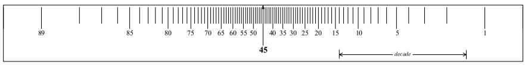

# Progetto del regolatore 

## Progetto statico

La specifica statica viene formulata mediante valori desiderati per l’errore
a transitorio esaurito $e_\infty$ .
Bisogna garantire la specifica statica a fronte di andamenti assegnati per
gli ingressi $w_t$ ed il disturbo sulla linea di
andata $d_a$). L’obiettivo è scegliere il tipo del controllore $R(s)$ ed eventualmente, se
necessario, calcolare il valore di minimo per il rispetto delle specifiche
(applicando il teorema del valore finale). 
L’errore a transitorio esaurito, per il principio di sovrapposizione degli effetti, è
dato dalla somma dei contributi dovuti agli ingressi (riferimento e disturbo sulla
linea di andata)
$e_\infty = e_{\infty w} + e_{\infty d_a}$
Ai fini del progetto statico è utile solo la parte statica della funzione d’anello,
(la parte dinamica non conta, siamo nel limite per $s \rightarrow 0$) e quindi, sulla base
delle caratteristiche degli ingressi (riferimento e disturbo sulla linea di
andata), si sceglieranno i valori più opportuni per il $g$ del polo nello zero e per il guadagno d’anello $\mu$.

## Progetto dinamico 

Gli zeri per forza gli introduci a sx  (così da buttare su la fase nel caso ), non ha senso introdurli a dx. Mentre i poli OVVIAMENTE devono essere del semipiano sx.

### Cancellazione critica

Una cancellazione si dice critica se avviene al di fuori della asintotica stabilità. 
Ne consegue che (nel caso a TC) non possiamo cancellare zeri nel semipiano destro. Significherebbe infatti che lo stiamo 'semplificando' con una parte instabile del sistema nascosta! (Se lo fai all'esame nell'esercizio di controllo verrai bandito). 

### Margine di fase $\phi _ m$

$\phi _ m$ = $180^o - \phi _{critica}$
In poche parole sottraggo da 180 gradi l'$arcotan(\frac{\omega _ c}{ \omega _x})$ con segno $\pm$ a seconda che $\omega x$ sia: 

- (segno -) un polo negativo o zero positivo 
- (segno +) uno zero negativo o polo positivo (che non possono esserci eh) 

Nella pratica non stiamo a calcolare l'arcotangente manualmente (a meno che in casi specifici in cui vogliamo dei vincoli ben precisi sul margine di fase) ma usiamo il regolo delle fasi in scala logaritmica (posizionando il $45^o$ sulla pulsazione critica).

## Compensazione in anello aperto di disturbi misurabili
Progettazione di un regolatore (chiamato compensatore) per regolare il disturbo in andata. In pratica vuoi il disturbo compensato ad un valore prossimo allo 0 (di modulo) quindi poni delle restrizioni sulla funzione di Trasferimento Y/D . Questa ti darà condizioni su come fare il Compensatore Ideale. Se è realizzabile (\#poli $\ge$ \#zeri) allora $C_{id}$ coinciderà con $C_{reale}$ altrimenti devi introdurre poli per renderla realizzabile a piacimento o seguendo la consegna del prof (in esame).

> La difficoltà sta tutto nel calcolare correttamente la FDT