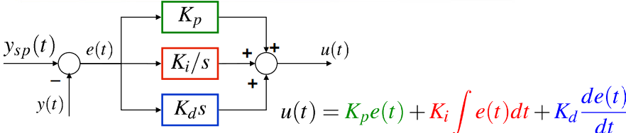
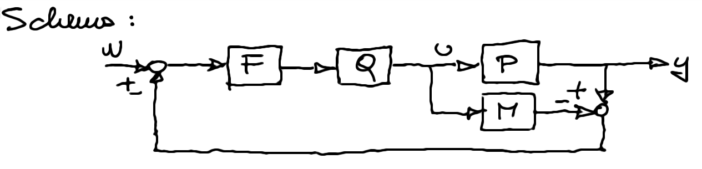
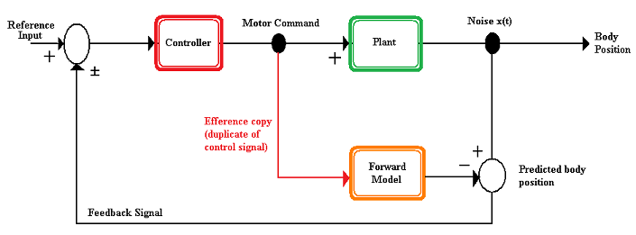

# Regolatori industriali PID 

Regolatori Proporzionali Integrali e Derivativi. Utilizzati largamente nell'industria. 

Visione alternativa:
$$U(s)=K_pE(s)+\frac{K_iE(s)}{s}+K_dsE(s)$$
$$U(s)=k(1+\frac{1}{T_is}+T_ds)E(s)$$

## PID a controllo a 2 gradi di libertà 
Legge PID in Forma Standard ISA reale a 2 gdl. 

$$U(s)=k((bW(s)-Y(s))+\frac{(W(s)-Y(s))}{sT_i}+\frac{sT_d}{1+s\frac{T_d}{N}}(cW(s)-Y(s)))$$

L’acronimo ISA sta per **International Society of Automation** .
Generalizzazione della legge di controllo del PID, frequentemente utilizzata nei regolatori commerciali, è detta **forma pesata**, con peso su set-point e  
misura (rispettivamente $b$ e $c$).
Per b=1, c=1 si ottiene la forma standard del PID, da notare di come questi parametri moltiplichino soltanto $W(s)$ e non $Y(s)$.
Permette di ottenere funzioni di trasferimento diverse (e quindi  
risposte diverse) tra ingresso di set-point e disturbo sull’uscita e  
l’uscita stessa  

## Accenno taratura PI e PID
Si tratta sostanzialmente di progettare un controllore con dei vincoli sullo zero e guadagno (nel caso di PI) o sugli zeri e sul polo (nel caso PID). 

- PI: un polo nell'origine e uno zero.  
$$R(s)=k\frac{(1+\tau _zs)}s$$ 
Quando progetti un PI per cancellazione, $\tau _2$ è appunto scelto per cancellare il polo del processo da tarare. 

- PID: due poli (di cui uno nell'origine) e uno zero.
$$R(s)=k\frac{(1+\tau _{z_1} s)(1+\tau _{z_2} s)}{s(1+\tau _{p_2} s)}$$ 

## Taratura peso 
- Regole di Ziegler-Nichols
- IMC-PID

## IMC - Internal Model Control
Si tratta sempre di tarare un regolatore ma ci basiamo sul modello interno del controllo. 

M è il modello del nostro processo. 

In pratica cerca di 'predire' il processo.  
Sappiamo che $\frac Y W = FQM$ poichè $M=P$ e non c'è quindi feedback. A questo punto cerco di porre $Q=\frac1M$. Se $Q$ risulta realizzabile allora prendo come $F$ la dinamica $\frac Y W$ voluta. (in genere data dal testo del esercizio), basta che $FQ$ sia realizzabile e che durante i calcoli non ci siano cancellazioni critiche (cioè vuol dire che eventuali zeri destri di $P$ rimangono). 
Infine mi ricordo che $$R(s)= \frac{FQ(s)}{(1-FQM(s))}$$
e sostituisco facendo il conto. 

### ADDENDUM: 

Se c'è un ritardo $e^{-tau s}$ dobbiamo cercare di approssimarlo:

- **Approssimazione di Padè** 
	- Padè (1,0) = $1 - s\tau$
	- Padè (1,1) = $\frac{1 - s\tau/2 }{ 1 + s\tau/2}$