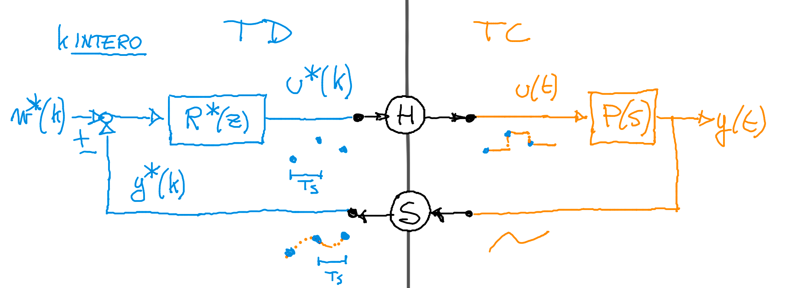

# Sistemi Discreti 
## Trasformata Zeta
Nel contesto della trasformata Zeta, la variabile complessa $z$ ha il significato operatoriale di **anticipo di un passo**. 
$$V(z)=Z[v(k)] := \sum ^ \infty _{k=0} v(k) z^{-k}$$
La trasformata Z è un operatore lineare. La proprietà più importante è quella del 'ritardo unitario':
$$Z[v(k+1)]=z*Z[v(k)]-zv(0)$$
_Può capitare negli esercizi in cui si fanno antitrasformate di Z ci sono ritardi anche di -2 -3 ecc. ecc. e per evitare di rendere i calcoli lunghi la consegna esplicita 'condizioni iniziali nulle' per eliminare il termine z*v(0)_ 

Lista Trasformate di Zeta note: 

- $Z[imp(k)]=1$ 
- $Z[sca(k)]=\frac{z}{z-1}$

## Schema di Controllo

$$R^*(z)=\frac{U(z)}{E(z)}$$

## Discretizzazione per realizzazione digitale di SD a TC

Si tratta di sostituire una formuletta già fatta con il $T_s$ ricavato dalle formule di campionamento. 

### Discretizzazione esatta
Idea: far evolvere il sistema a TC per un tempo pari a $T_s$. Cioè implica che se R(s) è AS lo è anche R(z). 

### Discretizzazione approssimata
é pesante da calcolare la discretizzazione esatta. Idea: approssimare la derivata temporale con il rapporto incrementale lungo un passo di campionamento $T_s$

### Metodo di Eulero Esplicito (differenze in avanti)
é un metodo di discretizzazione approssimata che può generare un SD a TD  **instabile** partendo da un SD a TC che è AS.
$$s=\frac{z-1}{T_s}$$

### Metodo di Eulero Implicito (differenze all'indietro)
$$s=\frac{z-1}{T_sz}$$

### Metodo di Tustin 
$$s=\frac{2(z-1)}{T_s(z+1)}$$

windup = anomala sovraelongazione di un regolatore dinamico, non necessariamente integrale. Vincoli lo stato del regolatore quando si raggiunge la saturazione.
Nota: con qualsiasi tipo di discretizzazione posso verificare la correttezza dei miei calcoli osservando che se R(s) ha un polo in 0 allora R(z) avrà un polo in 1. 
e il campionamento $T_s$ ? come lo si decide? 

## Campionamento $T_s$

Il campionamento $T_s$ deve rispettare alcuni vincoli. $w_s = \frac{2 \pi}{T_s}$

- **vincolo proporzionale alla $\omega _c$**, es: 'la ws deve essere almeno 20 volte la wc' 
- **vincolo sul modulo** ,dal teorema del campionamento di Nyquist. $2 \omega _n$** = $\omega _s$** è la massima pulsazione rappresentabile senza aliasing con un campionamento a frequenza $\omega _s$ . Più $|L(j\omega _n|$ è piccolo, meno aliasing. In pratica avrò una condizione sul modulo. Se ad esempio è -20dB cerco dove $|L|$ a tale modulo e trovo la $\omega _n$ . Il doppio sarà la minima  $\omega _s$ .  
- **vincolo Sample and Holding**:
	$\frac{3}{2}w_cT_s$ $\leftarrow$ ($ gradi detti dal testo $(\frac{\pi}{180})$ considerando il _ritardo dovuto al calcolo_. 
	$\frac{1}{2}w_cT_s$  $\leftarrow$ ($ gradi detti dal testo $(\frac{\pi}{180})$ _non considerando il ritardo_.
	
Tutti i vincoli sono dal basso di $\omega _s$ . Quindi tecnicamente potrei prendere una $\omega _s$ altissima o equivalentemente una $T_s$ bassissima.. ma nella realtà non è ottimo abbassare il tempo di campionamento $\rightarrow$ maggiore calcolo computazionale $\rightarrow$ mi serve una macchina più precisa. 

### Legge di controllo LTI a TD

_Possono capitare esercizi di questo genere... sono molto semplici. 
$G(z)=\frac{Y(z)}{U(z)}$ , risolvi l'equazione e antitrasformi, scali Y(z+1) a Y(z) e così via, in modo da esplicitare tutto a Y(z) e valori 'passati', non futuri.  Eventualmente se consegna lo chiede, sostituisci $u(k)$._

