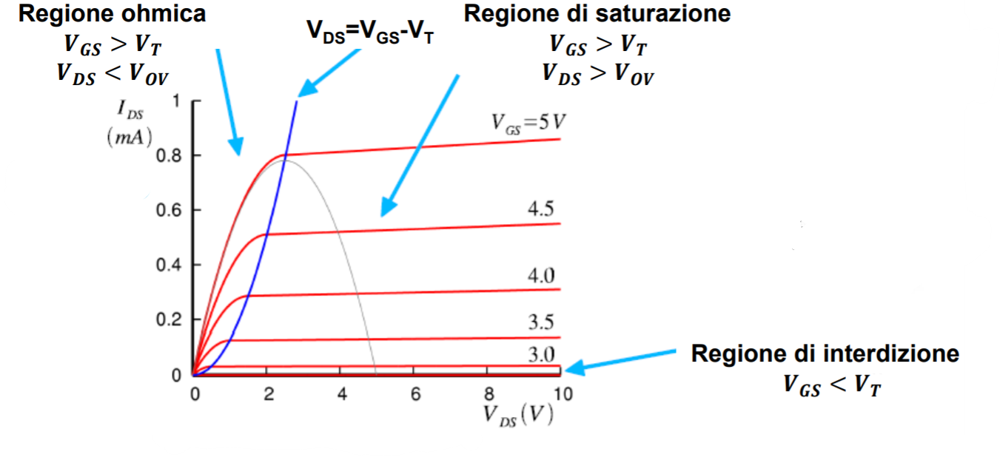

# Transistors 

## Nmos 
Metal Oxyde Semiconductor. Componente da tre terminali, dei quali individuiamo 3 terminali: il gate, il drain e il source.
Morale della favola: attraverso una tensione $V_{gs}$ possiamo comandare il transistor, portandolo a 3 possibili diversi stati, uno stato off, uno stato ohminico e uno stato di saturazione. Quando il transistor non è off, viene generata una corrente *i_ds*, che appunto parte dal terminale di *drain* e continua fino al *source* (non lasciarti ingannare dai nomi che invece si adattano bene in termini di 'da dove e dove vanno gli elettroni' e per il Pmos). 
Realtà: il transistor è un componente mega complesso, noi lo affrontiamo a mo' di quinta elementare, idealizzandolo e semplificandolo il più possibile. 

- Corrente che scorre tra d e s nel caso del transistor in fase ohmnico:
$$i_{}^{ohm}=2K_p(V_{gs}-V_{t}-\frac{V_{ds}}{2})V_{ds}$$
- Corrente che scorre tra d e s nel caso del transistor in fase di saturazione:
$$i_{}^{sat}=|K_p|(V_{gs}-V_{t})^2$$

dove $$K_p = \frac{1}{2} \mu _oC'_{ox}\frac{W}{L}$$

Per essere acceso il transistor dovrà avere una $V_{gs}>V_t$ e per essere in zona satura $V_{ds}>V_{gs}-V_t$ . 

## Pmos 
Duale con l'Nmos. Ma con alcune differenze. 
La tensione di gate sarà $V_{sg}$ e piloterà la corrente che a sto giro andrà da source a drain. Cambiano anche le condizioni di accensione e passaggio in zona di saturazione. Il Pmos si accenderà infatti per $V_{sg}>V_{t(p)}$ e passerà in zona omnica per $V_{sd}>V_{sg}-V_{t(p)}$ . 
*Il pmos per erogare la stessa corrente di un nmos equivalente dovrà essere dimensionato circa 3 volte più grande. Questo poichè la corrente 'sfrutta' le lacune le quali 'scorrono circa 3 volte più lenti degli elettroni'.*

Nota: viene sempre indicata con la freccina di corrente il terminale di source. 

## Riepilogo N/P mos 

- NMOS si accende se ga $V_{gs} > V_{t} > 0$, quindi in elettronica digitale se il GATE è a 1 è potenzialmente ON se invece è a 0 sarà **sicuramentente** OFF.
- PMOS si accende se ga $V_{sg} > |Vt| > 0$, quindi in elettronica digitale se il GATE è a 0 è potenzialmente ON se invece è a 1 sarà **sicuramentente** OFF.

Per potenzialmente ON si intende che il MOS può essere considerato acceso, con il dubbio se in zona ohmica, satura e con quale corrente.
Per sicuramente off si intende che non è proprio possibile accenderlo. Se in un NMOS mettiamo un gate a 0V dovremmo avere il source ad una tensione negativa per averlo acceso ed in digitale non si utilizzano tensioni negative.