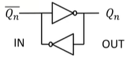

# Memorie 
Fino ad ora logiche combinatorie, ma in elettronica digitale è essenziale la memoria e non solo il calcolo combinatorio. 

Memoria più veloci che abbiamo:

- bistabili: appunto che possiedo solo 2 stati
- letch: bistabile pilotato da un circuito, sensibile sul livello alto.
- flip-flop: bistabile letch pilotato dal clock. Cioè l'evento di **edge rise** , il segnale di Edge Detection campiona e memorizza. 

Semplice bistabile: 

Due e solo due stati, quando non applico nessun segnale $Q_n$ si 'ricorderà' $Q_{n-1}$ . 

I bistabili gli utilizziamo per i registri dei processori con un clock di pipeline. Se ho un componente che ha tempi di propagazione maggior del mio clock devo 'spezzettare, allungando la timeline'.