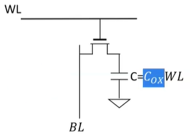
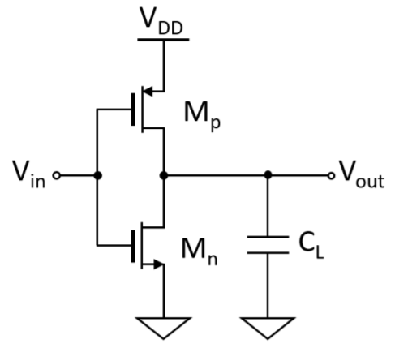
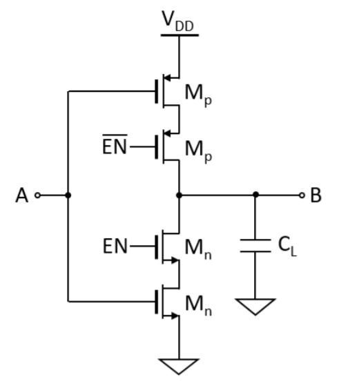
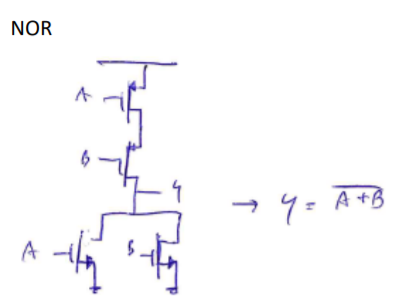
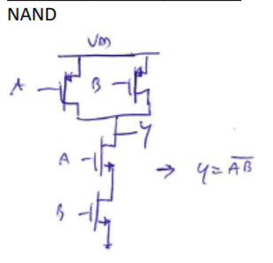

# Memorie RAM 
Non riusciamo a unificare la memoria in un'unica grande memoria cache. Riduciamo spazio ma dunque riduciamo anche velocità introducendo:

- sram = celle composte da un bistabile e 2 mos selettori con un dimensionamento adeguato per leggere/scrivere in modo corretto.
- dram = pass transistor! Composta da 1 condensatore e un mos di selezione (circuito semplice). Perchè **dynamic** RAM? Poichè ci sono parassitismi. Ci serve dunque un refresh nel'ordine dei ms (per quanto riguarda tecnologie implementative con precisione 22-40 nm).
- 

La semplice struttura si paga con una complessa gestione (gestione del refresh). Lettura distruttiva: la Big Line infatti si attacca quando deve leggere. Inoltre nel circuito ci sono anche parassitismi capacitativi che quindi introducono fenome di Charge Sharing tra i condensatori. 

### Esempi di porte logiche semplici semplici

Da notare bene la PDN (Pull Down Network) composta dagli nmos e la PUN (Pull Up Network) composta dai pmos. Essenziale capire la dualità tra le due reti e la loro **complementarità** : In tutti gli esercizi in cui è chiesto di creare una porta logica, nel 90% dei casi devi fare il complementare dei transistors che ti danno. Ricorda che il complementare é: serie di transistors diventa un parallelo di transistor, mentre il parallelo di transistor diventa una serie di transistors.

#### Inverter

{width=50%}

#### Inverter Tristate

Logica TriState é qualsiasi logica con signal di Enable e Enable negato. Ció mi permette di creare 3 stati diversi: 

- on 
- off 
- HZ (High Impedance) .

{width=50%}

#### NOR

{width=50%}

#### NAND

{width=50%}