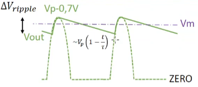

# Alimentatori 

Un alimentatore permette di raddrizzare l'alternata attraverso l'uso di un ponte raddrizzatore a singola o doppia fase oltre ad un filtro di condensatori per filtrare ed eventualmente un ulteriore diodo zener per ridurre il fenomeno di ripple.
$$V_{rms}= \sqrt{\frac{1}{T}\int_{t=0}^{t=T} v^2(t)dt}$$

$$V_{p}=\sqrt{2}V_{rms}$$

$$V_{pp}=2V{p}$$

$T_{ripple}=T$ in caso di raddrizzatore monofase e $T_{ripple}=\frac{T}{2}$ in caso di raddrizzatore doppiafase. 

$$\Delta V_{ripple}=V_{max}-V_{min}=V_{p}-V_P(1-\frac{T_{ripple}}{\tau})=V_p\frac{T_{ripple}}{\tau}$$

$$V_m=V_{max}-V_{min}$$

La bontà del alimentatore si valuterà infatti con il parametro del Ripple Factor. 
$$RF=\frac{\Delta V _{ripple}}{V_m}$$

