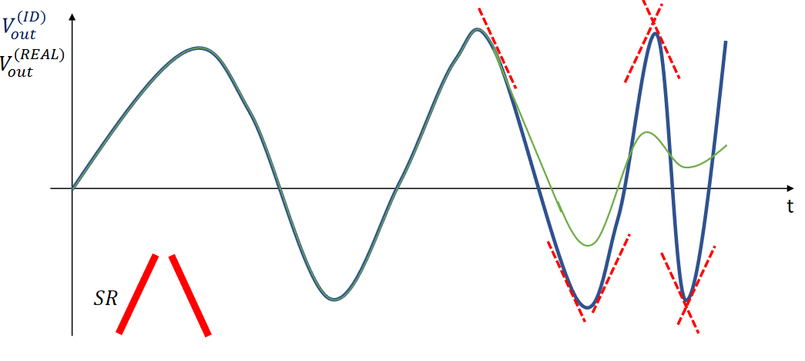

# Amplificatore Operazionale
L'amplificatore è un circuito in cui un segnale applicato attraverso una porta d'ingresso viene amplificato e fornito all'esterno attraverso una porta d'uscita. 

Caratteristica fondamentale di un amplificatore è il suo guadagno. Il guadagno può essere identificato in diversi modi, a seconda della grandezza fisica d'interesse. Guadagno di corrente/tensione/transconduttanza(tensione in ingresso e corrente in uscita)/tranresistenza(corrente in ingresso e tensione di uscita). 

## Risposta in frequenza 
Se l'amplificatore è lineare (cioè l'uscita varia linearmente rispetto al segnale d'ingresso) gode di una importante proprietà:
$$V_{in}=V_isin(\omega t) \rightarrow V_{out}=V_o sin(\omega t + \phi)$$
Appunto cambia ampiezza e fase, ma non la frequenza (pulsazione).
La Fdt è un numero complesso, funzione di $\omega$, il cui modulo è $|T(\omega)|=\frac{V_o}{V_i}$
mentre la fase è uguale allo sfasamento $\phi$. 
La funzione di trasferimento descrive il comportamento dell'amplificatore alle diverse frequenze. é dunque importantissimo utilizzarla. Come facciamo a ricavarla dalla rete? 
$$Z_c=\frac{1}{jwC}$$
$$Z_L={jwL}$$
$$Z_r = R$$
oppure direttamente con la trasformata di Laplace: 
$$Z_c=\frac{1}{sC}$$
$$Z_L={sL}$$
$$Z_r = R$$
L'amplificatore operazionale viene controllato tramite una differenza di tensioni, per minimizzare i disturbi esterni: viene amplificato il segnale **differenziale**. Se una scoreggia perturba i segnali che scorrono nei fili, essendo i fili molto vicini tra loro, verranno perturbati da un segnale uguale e dunque la differenza tra i due sarà nulla. 

## Non idealità 
Abbiamo classificato le varie non idealità del amplificatore operazionale:

- non idealità di polarizzazione
- non idealità dovute all'ingresso
- un mistro tra le due precedenti classi
- Innanzitutto l'opamp ha un guadagno differenziale elevato ma non infinito. 
- L'opamp in caso di ingresso differenziale nullo **non** presenta uscita invariata, ma cambia valore. 
- 
Abbiamo cioè un guadagno di modo comune. 
$$V_o = A_d V_{D}+A_{CM}V_{cm}$$
$$V_{CM}=\frac{V_1+V_2}{2}$$
Un parametro di merito di un opamp è il CMRR (common mode rejection rate) cioè:
$$CMRR=\frac{A_D}{A_{CM}}=20log_{10}(\frac{A_D}{A_{CM}})$$

- L'impedenza dell'opamp in ingresso **non** è infinita. Dunque possiamo inserire sia una capacità e resistenza differenziale tra i due morsetti differenziali, sia una capacità e resistenza di modo comune con un terminale a terra e l'altro a uno dei due morsetti. 

- L'impedenza in uscita non è nulla dunque introduciamo una resistenza in uscita.

- **Correnti di bias**: anche a segnale in ingresso nullo, le correnti entranti non sono nulle, dunque le possiamo rappresentare collegando un generatore di corrente a ciascun morsetto. 
- **Corrente di offset**: la corrente di offset $I_{os}$ in un amplificatore operazionale è la corrente data dalla differenza tra le due correnti di ingresso (applicata con verso positivo da + a -). 
- **Tensione di offset**: ponendo gli ingressi a massa ci si aspetterebbe una tensione di uscita nulla, ma ciò non accade. Inseriamo dunque un gen. di tensione su uno dei due morsetti. La tensione di offset è definita quindi come la tensione differenziale che deve essere applicata per portare la tensione di uscita dal valore di $V_{offset}$ a 0. A livello pratica, per essere calcolata, si applica un gen. di tensione per convenzione al morsetto +. Con il segno 'concorde' al morsetto, cioè ponendo il + del generatore verso il morsetto +. 
- **Slew Rate**: $V_{out}=G*V_{in}$ non è immediato. La derivata di $V_{out}$, cioè la sua massima pendenza, satura allo Slew Rate. 

