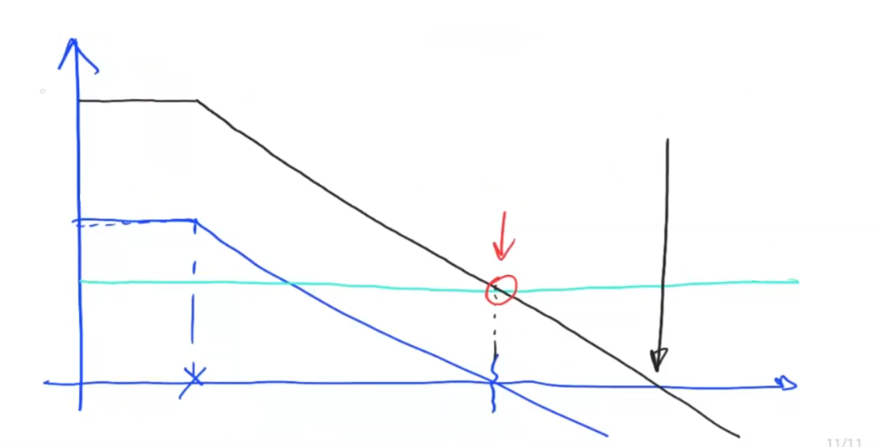
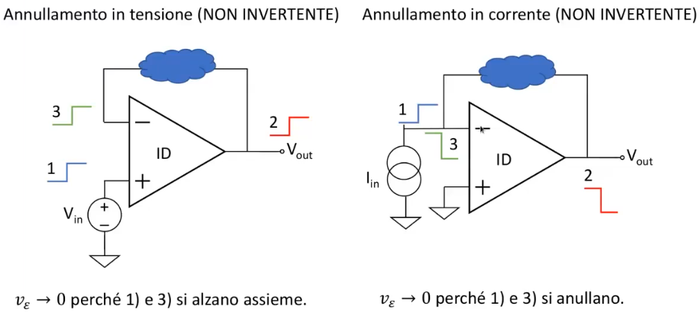

# Retroazione 
$$G_R(s)=G_{ID}(s)\frac{1}{1-\frac{1}{G_{loop}(s)}}$$
da notare come se $|G_{loop}||>>1$ allora $G_{reale}\simeq G_{id}$
altrimenti posso o calcolare $G_{reale}$ o approssimare $G_{reale}\simeq -G_{loop}G_{id}$

In genere il nostro approccio sará quello di calcolare $G_{id}$, cioé considerando l'opamp ideale e poi calcolare il $G_{loop}$ con un metodo meccanico, cioé 'aprendo' il circuito subito dopo l'opamp e osservando l'impedenza che un ipotetico generatore di test vede. Poi in base alle esigenze scegliere come approssimare $G_{reale}$.

## Prodotto guadagno banda
$$G(f_1)f_1=G(f_2)f_2$$
in caso di pendenza nel diagramma di Bode del modulo a 20 db/decade . 
Altrimenti $$G(f_1)f_1^2=G(f_2)f_2^2$$ in caso di pendenza a 40 db/decade o $$G(f_1)f_1^3=G(f_2)f_2^3$$ con pendenza a 60 db/decade. 

## Margine di fase 
$$\phi _m = 180^0 - fase (L)$$
Usiamo questo indicatore come stabilitá del circuito. In questo corso considereremo stabile un circuito che ha margine di fase di almeno 60 gradi. 

### Regoline che fanno comodo 
Se $|G_{loop}|$ taglia asse a 0db: 
	- con 20 db/dec -> sicuramente stabile se non c'é un polo dopo 
	- con 20 db/dec e dopo c'é un polo -> potrebbe essere instabile 
	- con 40 db/dec -> potrebbe essere instabile 
	- con 60 db/dec -> sicuramente instabile 

