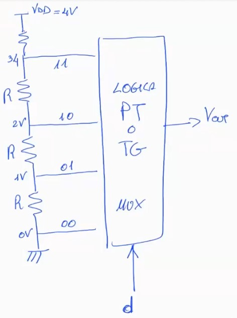
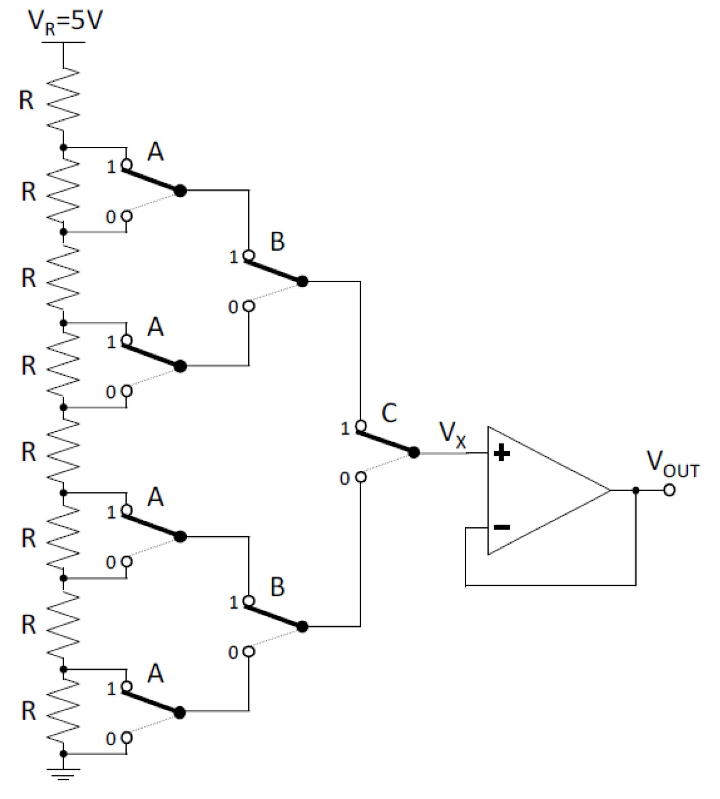
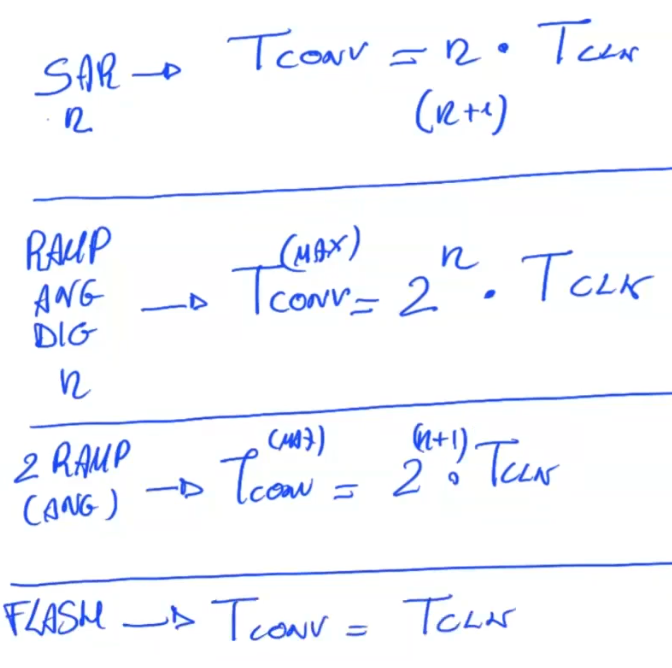
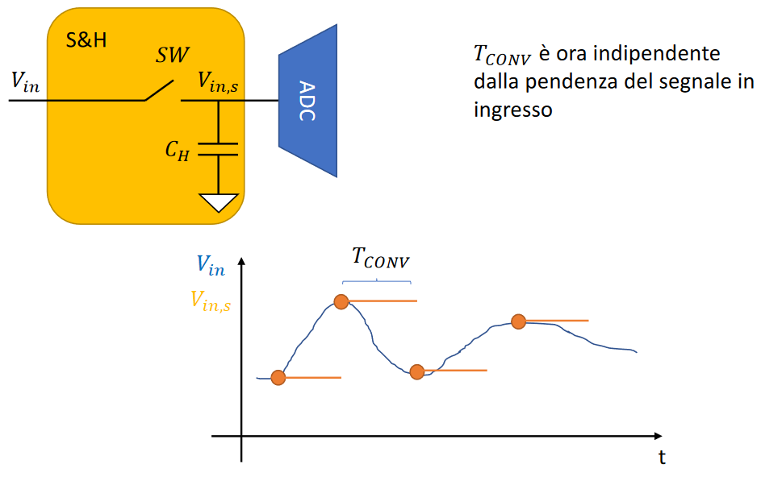
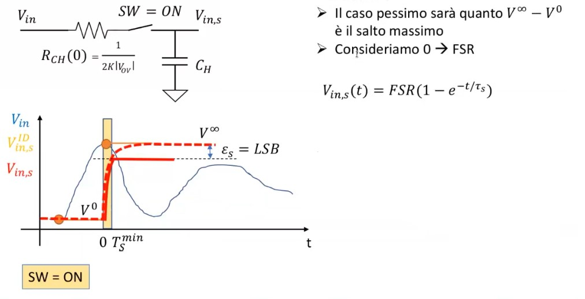
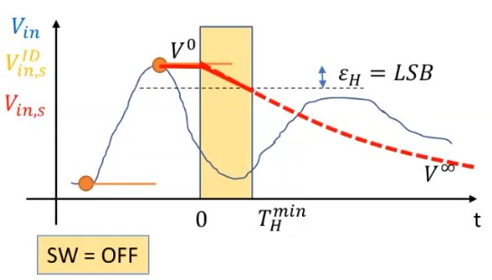

# Acquisizione digitale
Sappiamo che i circuiti digitali hanno performance e costi migliori dei circuiti analogici. Dunque nel mondo moderno utilizziamo convertitori analogici-digitali per portare fenomeni fisici nel mondo elettronico e digitali-analogici per fare il contrario.

## DAC
Digital-Amplitude converter. 

{width=75%}

FSR = Full Scale Range e ci dice il range di tensione che abbiamo a disposizione per esprimere i nostri bit. 
$$FSR=V_{dd} - V_{ss}$$
$$LSB = \frac{FSR}{2^n}$$
dove con $n$ si indicano il numero di bit che vogliamo rappresentare. 
Cioé suddivido la mia tensione massima in vari livelli, e a ciascun livello assegno la mia codifica di bit. 
Banalmente, l'implementazione piú semplice di questa cosa la si realizza con una rete di resistenze. 
Vorrei quindi avere una retta con una inclinazione perfetta, avendo quindi per ciascuna codifica il giusto livello di tensione. Nella realtá peró ho un guadagno che mi 'inclina un po' troppo, o un po' troppo poco' la mia retta alla varie tensioni, introducendo quindi un errore. 
Inoltre la retta non é lineare, é una curva. 
Dovrei costruire una Calibration Table, cioé manualmente andare a correggere ciascun voltaggio. 
Con CT si intende che $V_{(i)} - V_{(i-1)}$ dovrebbe sempre essere 1. 

Possibile con circuiti semplici. Non fattibili per un DAC da 24 bit ad esempio .. dovrei infatti correggere $2^{24}$ tensioni.

Nella realtá i DAC vendono venduti con un  margine d'errore.
Tutte le non idealitá del DAC derivano dalle non idealitá "a cui siamo abituati"del Opamp che si trova al suo interno.

Non idealitá del DAC: 

- non linearitá 
- guadagno 
- settling time: tempo impiegato dal DAC per raggiungere in output la corretta tensione 
- non monotonicitá: non monotona inteso che la retta tensioni-bit non é monotona crescente.

### Bestiario dei DAC: 

- **DAC flash**

{width=75%}
- **A resistenze pesate** : non é scalabile perché mi serve un'alta sensibilitá sulla costruzione delle resistenze. 
- **Maglia a R-2R pesate**: bisogna costruire solo 2 tipi di resistenze!

## ADC 
Tensione in ingresso -> un numero in bit. 
$$FSR=V_{dd} - V_{ss}$$
$$LSB = \frac{FSR}{2^n}$$
Come sempre $LSB$ ha il significato di 'risoluzione'. 

Non idealitá che affliggono l'ADC: 

- non linearitá 
- guadagno 
- offset 
- t conversione 
- codice mancante: forte errore di non linearitá 
- massima pendenza d'ingresso
- **quantizzazione**: dovuta al naturale arrotondamento/troncamento 

### Magnitudo dell'errore di quantizzazione

valore atteso: 
$$\mathbb{E}[\epsilon_e]= \frac{LSB}{2}$$

varianza: 
$$\mathbb{E}^2[\epsilon_e]= \frac{LSB^2}{12}$$

**DNL** : non linearitá differenziale, distanza dal valor medio del gradino.  
**INL**: non linearitá integrativa 
Principali indici per caratterizzare gli ADC. 

### Bestiario degli ADC:

- **ADC flash**: moltooo veloci, ma pochi bit, alti consumi. 
- **ADC a rampa digitale**: piú lenti dei flash. Bassi consumi, molto scalabili. 
- **ADC a tracking**: ottimizzazione degli ADC a rampa digitale. 
- **ADC a rampa**: (rampa analogica) bassi consumi 
- **ADC a doppia rampa**: 
- **ADC a SAR (approssimazioni successive)**: concretizzazione dell'algoritmo di ricerca binaria. $Iterazioni=log_2(N)$ dove n é il numero di bit. $T_{conv}=nT_{clk}$.
- **Sigma-Delta**: secondo tipo piú usato, si basa un algoritmo avanzato.  

### Tempi di conversione per l'ADC:

- **SAR: $T_{conv}=n*T_{CLK}$**
	A volte per gli ADC SAR si considera un ulteriore colpo di clock che sta a rappresentare il tempo necessario per 'bufferizzare' il risultato in uscita. Usare $n*T_{CLK}$ o $(n+1)*T_{CLK}$ è equivalente ai fini d'esame. 
- **RAMPA/TRACKING: $T_{conv}(max)=2^n*T_{CLK}$**
- **DOPPIA RAMPA: $T_{conv}(max)=2^{(n+1)}*T_{CLK}$**
- **FLASH: $T_{conv}=T_{CLK}$**

## Sample and Hold

Gli Switch sono dei transfer-logic, con tutte le problematiche viste in digitale.  In questo caso devono portare in segnale analogico dall’ingresso alla capacità di hold. 

### Fase Sample

### Fase Hold

All'esame saltano fuori un sacco di quesiti riguardo il giusto dimensionamento dei parametri del condensatore o dei tempi di hold/sample. 
In genere i tempi di hold sono dipendenti dai tempi di conversione dell'adc e dalla capacità del condensatore. 
I tempi di sample sono dipendenti dalla resistenza del Mos acceso e dalla capacità del condensatore.