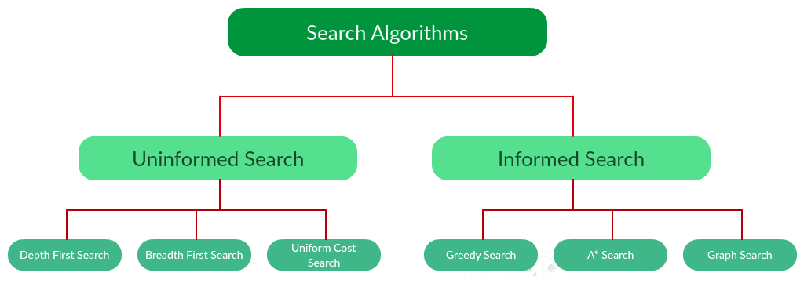

# Search Strategies

The idea is to search between many alternatives. Many problems could be formulated in terms of search problem. 
A directed graph that rapresents all the possible states. We can't use graph theory! The state space are too big! 
A problem-solving agent has to find a solution only with a small portion of the graph. We have to simplify the search. To do this we create a 'search tree' from the graph. 
For example: DeepBlue used a tree-search algorithm. In a similar way also AlphaGo.

Strategies to order nodes in the frontier. Yes, all the search strategies are basically 'take a node from the graph and take it to the frontier where it will be analyzed/expanded'.

Evaluation of search strategies:

- completeness: I'm guaranteed to find the solution?
- optimality: does the strategy finds always the optimal solution?
- complexity: performance in memory and computation
- parameters: branching factor and depth of the shallowest goal.

## Main workflow

Extract the node out from the frontier and check if it's the goal state. If it's not, generate all the successors (adding them to the frontier, also called OpenSet). **In case of graph-search and not tree-search, you should check also if the state is repeated (to avoid the cycles).** So to check if a state is repeated, another list is needed and every time during the algorithm a repeated state is found, that one is deleted with all its successors.

> Note that the 'goal test' must be done when the node is extracted, and not when it s generated! 

## Uninformed Search strategies

### Breadth-first (BFS)

All nodes of level k selected before the nodes of level k+1 (the queue of the frontier is implemented as FIFO).
It's always **complete**  but **optimal** only if all the costs are equal (actually the cost of a node has to be a monotone decreasing function of the depth of the node). 

### Depth-first (DFS)

Starts from an successor and the continues to his successor. It always choose the deepest one. When the deepest one is not the solution, it backtracks and choose the second deepest one and so on. (Queue implemented as LIFO).
The problem with depth-first search is that is **not complete**! It could take endless paths (cycles) without finding the solution.  
**Complete for acycle state spaces**. 
**Not optimal**.

Variants of DFS:

- Backtracking 
Slightly variation. When a node is expanded, instead of generating all the possible successors, only one action is executed and only one successor is generated. It reduces the used space

- Depth-limited search 
Basically a depth-first search with a limit depth L where each node is considered as level without any successor.

- Iterative deeping search
A letal combination of BFS and DFS and a better version of the Depth-Limited variant. It's basically the Depth-Limited variant but we increase the depth at every iteration (if no solution is found).
This solution is **complete and optimal** (like BFS) and also has linear memory complexity (like DFS).

### Uniform Cost Search (UCS) 
Instead of inserting all vertices into a priority queue, we insert only one node at time. Extract always minimum path cost. Prioritized frontier. UCS is **complete** and **optimal**  but only if all cost are strictly positive! No problem for loops.

## Informed Search Strategies

In an informed search, a heuristic is a function that estimates how close a state is to the goal state (Lesser the heuristic, closer the goal).
Possible heuristic functions are:

- Manhattan distance
- Euclidean distance
- Octile distance

### Greedy Best-First Search
$$f(n)=h(n)$$
The evaluation function is only the heuristic. **Not complete** and **not optimal**, but in case of search graph is complete. 

### A* search 
$$f(n)=g(n)+h(n)$$
The tree-search version of A* is optimal if $h(n)$ is admissible. It's also optimally efficient:with the same heuristic no algorithm is better. The graph-search version of A* is optimal if $h(n)$ is consistent.

#### Heuristic admissibility
The golden rule for  $h(n)$ is that it has always to **understimate** the cost. 

#### Heuristic consistency
$$h(n) \le c(n, n_1) + h(n_1)$$
When goal states have a heuristic value of zero, consistency implies admissibility.