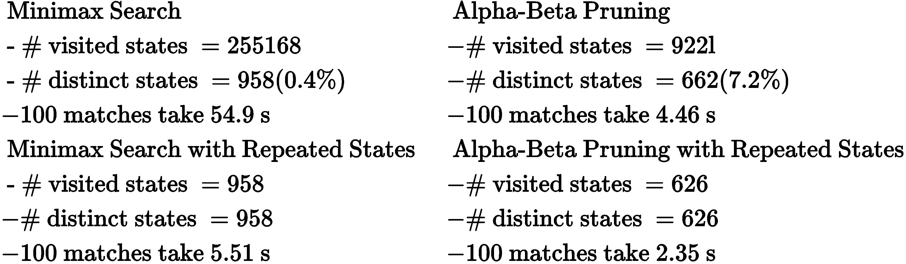
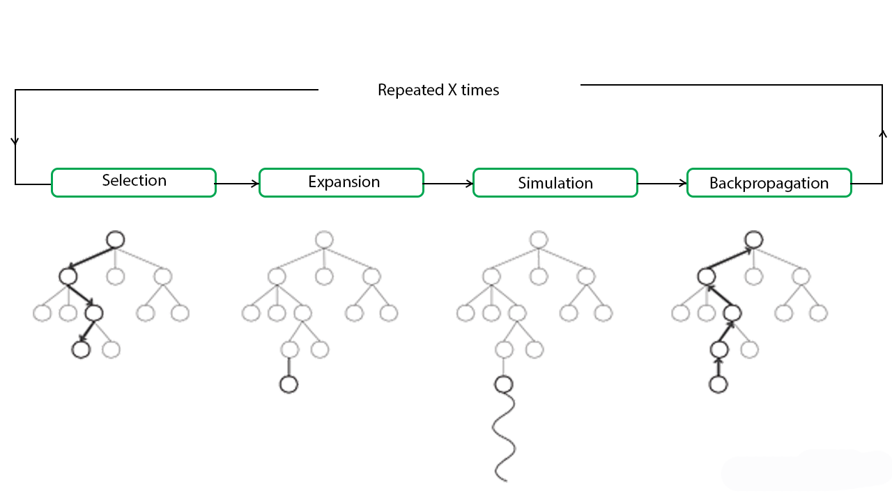

# Adversarial Search

Typically used in deterministic/stochastic enviroments. 
Multi-agent enviroment, perfect information, 2-players, turn-tracking and 0 sum games.

## Minimax Search 

Based on DFS exploration for tree. 
Variants: 

- Expected MiniMax: Variant is the **expected minimax** that is basically a minimax based on probability: there is a third player between Max and Min that plays random moves (it rapresent the Nature or the Randomness).
- MiniMax with repeated states

## Alpha-Beta Pruning 

Based on MiniMax Algorithm tries to prune much as possible the tree to improve efficient. The goal is to identify that portions of tree that are guaranteed to contain the solutions. 
The main idea is to keep track of highest value for max player along the path ($\alpha$) and the lowest value for min player along the path ($\beta$).

The **golden rule** to remember how to apply MiniMax with $\alpha - \beta$ pruning:

> The max node makes the check on beta to prune (it prunes only if $v \ge \beta$) otherwise it updates the value of alpha (if $v > \alpha$) while the min node makes the check on alpha to prune (only if $v \le \alpha$) otherwise it updates the value of beta (only if $v<\beta$).

## Montecarlo Search

For complex game it's not easy to evaluate the next state and build on the minimax algorithm. So we need a method to evaluate the next move without knowing anything about the game. How?
With **randomness**. With randomness we let chance be our guide to figure out which next move might be the best one to pick.
The MCTS algorithm is based on randomness (the name refers to the gambling district in Monte Carlo).
MCTS randomly sample the solution space and building a 
search tree accordingly. It is often used in games with very large configuration spaces, like Chess or Go. 
MCTS works by iterating four steps: 

- **Selection** :
	a child selection policy is recursively applied to descend through the tree until the most urgent expandable node is reached (a node is expandable if it represents a nonterminal state and has unexpanded children)
- **Expansion** :
	one (or more) child nodes are added to expand the tree, according to the available actions
- **Simulation** :
	a simulation is run from the new node(s) according to the default policy to produce an outcome
- **Backpropagation** :
	the simulation result is propagated up through the selected nodes to update their statistics.

So MCTS use 2 policies: 

- **Tree policy** that selects or creates a leaf node from the nodes already contained within the search tree (selection and expansion).
- **Default policy** plays out the problem (game) from a given non-terminal state to produce a value estimate (simulation).