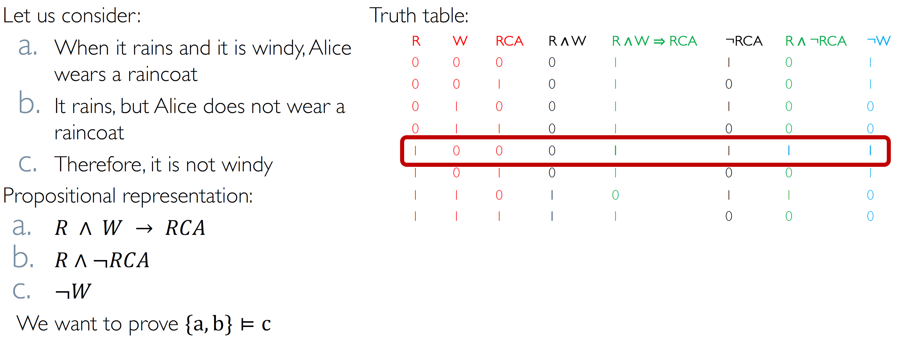
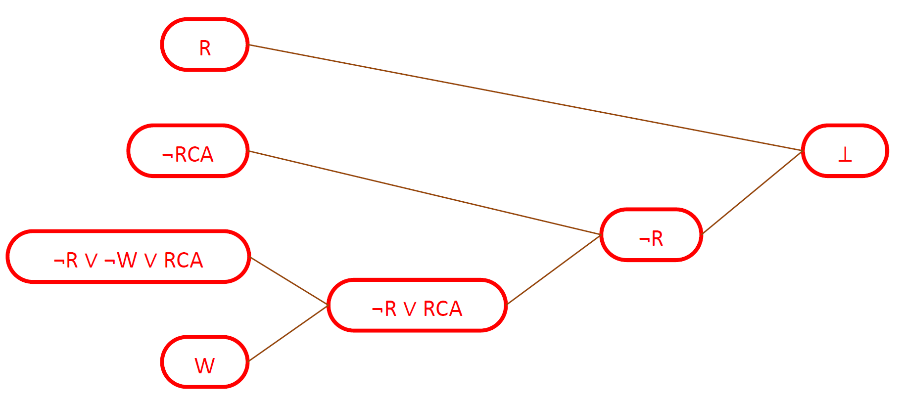

# Logic Based AI 

We can make AI based on Logic. 
The most important part of an agent based on knowledge is the **knowledge base**, a set of formulas that rapresents the knowledge (we could name them as axioms). 
Talking about logic we have to specify what semantic is and syntax is: 

- Syntax defines which formulas are well done. 
- Semantic defines the truth of a formula in a possible world (model), so it defines the 'meaning' of the formula. 

Entailment (conseguenza logica) $a \models b$ ($\alpha$ entails $\beta$ ) iff in every model where $\alpha$ is true, also $\beta$ is true. 
An inference algorithm is an algorithm which tries to prove an entailment. An inference algorithm has to be sound (finds **only** the formulas that are really entailments) and complete (finds **all** formulas that are logically entaltain).
This is the base to say that every formulas derived from $KB$, if $KB$ is true is also true and in this way we can do inference on our $KB$. 

## Propositional Logic

### Model checking

A simple algorithm to prove entailments. This reasoning procedure is sound and complete and always terminates, making reasoning in PL decidable. But remember that it works if the models space is finite!
Also MC is inefficient when many propositional symbols are involved, because it has to compute a table of size $2n \times M$, where $n$ is the number of propositional symbols and $M$ is the number of subsentences the appear in the premises and the conclusion.

### DPLL 

Certain applications of PL require an agent to establish whether a set of sentences $\alpha$ is or is not satisfiable (there is an assignment of values to the symbols of $\alpha$ that makes  $\alpha$  true?).

The problem of establishing the satisfiability of a set of propositional sentences is known as SAT. Many interesting problems, including establishing propositional entailment, can be reduced to SAT problems.

- A possible solution of SAT is given by truth tables: $\alpha$ is satisfiable if, and only if, it has truth value 1 in at least one row of its truth table.
- A more efficient method is provided by the DPLL algorithm

The DPLL algorithm is base on the concept of CNF: 

- Conjunctive Normal Form represents a sentence as a conjunction ($\wedge$) of clauses
- a clause is a disjunction ($\cup$) of literals 
- a literal is either a propositional symbol or the negation of a symbol.

Every sentence of PL can be transformed in an equivalent sentence in CNF. 

Said what is a CNF, the DPLL is a backtracking (depth-first) search over models with some heuristics:

- Early termination: stop when all clauses are satisfied: $(A \cup B) \wedge (A \cup \neg C)$ is satisfied by $A=1$ .
- Any clause is falsified
- Pure literals: if all occurrences of a symbol in yet-unsatisfied clauses have the same sign, then give the symbol that value
- Unit clauses: if a clause has a single literal, set the corresponding symbol to satisfy clause: $(A \cup B) \wedge \neg C$ , $C$ must be set to false

Where DPLL is used? 

- Circuit verification: does this VLSI circuit compute the right answer?
- Software verification: does this program compute the right answer?
- Software synthesis: what program computes the right answer?
- Protocol verification: can this security protocol be broken?
- Protocol synthesis: what protocol is secure for this task?
- Planning: next classes

## Theorem Proving 

### Resolution 

Resolution is similar to DPLL (when this is used to establish entailment): it starts from a CNF representation of the premises and the negation of the conclusion.
Propositional resolution is an extremely powerful rule of inference for PL.

#### Forward chaining and backword chaining

Forward chaining is data-driven, automatic, “unconscious” processing, can derive everything that is entailed by the KB, but lots of work is irrelevant to a specific goal. 
FC keeps applying this rule, adding new facts, until nothing more can be added. Forward chaining is sound and complete for KBs composed of definite clauses.

- Soundness: follows from soundness of Modus Ponens 
- Completeness: the algorithm reaches a a fixed point from where no new atomic sentences can be derived. 

Backward chaining is goal-driven, appropriate for problem-solving, its complexity can be much less than linear in the size of the KB. BC works like forward chaining, but backward, starting from the goal, which is a positive literal.

## Planning Agents 

The planning techniques are the union of logic and tree search to find the solution of your problem. The tree search is needed to travel through the tree while the logic is used to rapresent the state: in fact every node is a set of logic formulas. 

### STRIPS

STRIPS is a language for expressing problems and is composed by:

- An initial state
- The goal state: any conjuction of literals. The goal only specifies the subgoals which necessary have to be present in a goal state: so the Closed World Assumption isn't valid. Another way to say that is that the goal state is not 'complete' description of the state.
- A set of actions that can be applied. Each action is described by:
	- preconditions (what must be established before the action is performed)
	- postconditions (what is established after the action is performed)

Some other rules about STRIPS: 

- Unique names assumption: different constants are different objects
- Domain closure assumption: the domains contains only the objects denoted by a constant 
- Closed world assumption: every facts that is not explicitly asserted is false
- Preconditions and Goal cannot contain negative literals.

### PDDL

Planning Domain Definition Language is 'evolution' of STRIPS. PDDL can contains negative literals in goals and preconditions and also it uses variables in the goal.