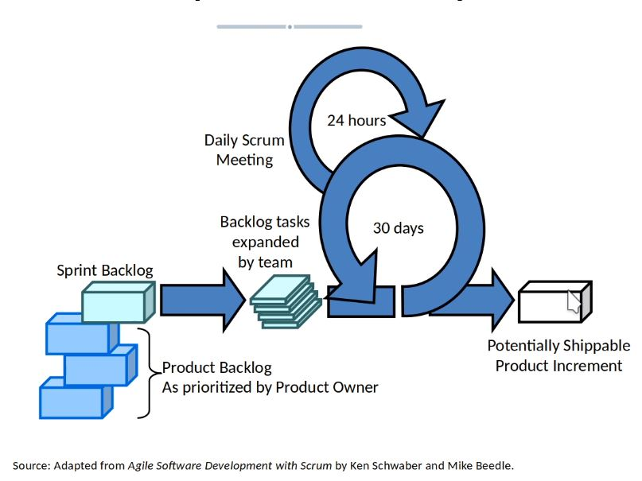
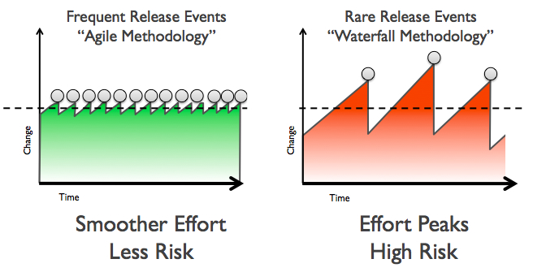
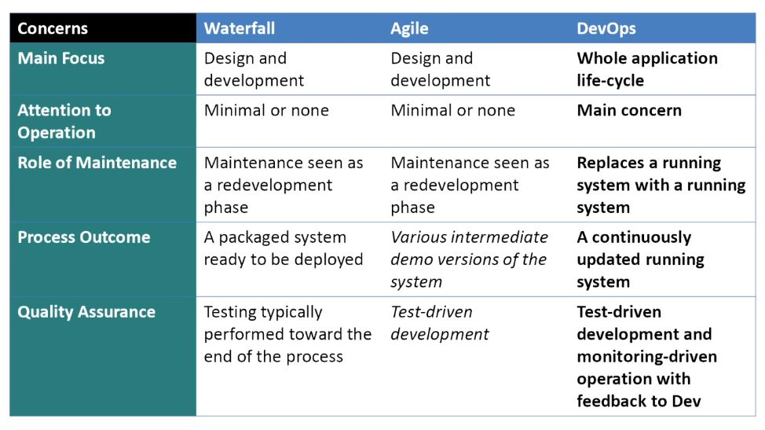

# Lifecycle del software
## Waterfall 

- studio fattibilità 
- analisi e specifiche
- progettazione 
- implementazione e test
- integrazione e test di sistema
- messa in opera 
- manutenzione
Troppo statico e rigido, utilizzabile solo in progetti 'critici' in cui il rigore, la precisione e sicurezza ha più priorità rispetto alla flessibilità. 
Modello che ha la sua età .. in origine non considerava neppure una fase di 'manutenzione'.

> Manutenzione? no -> non c'è mica usura. 

In realtà sappiamo che oggi giorno la manutenzione è sempre più rilevante ... il software infatti si 'evolve' durante lo sviluppo .. cambiamento del contesto, cambiamento dei requisiti e specifiche magari non note/mal implementate inizialmente. 

Classifichiamo diversi tipi di manutenzione:

- correttiva
- adattiva
- perfettiva

> Costo delle correzioni ritardate è esponenziale. Attività di testing dovrebbe quindi essere costante, poichè rimediare gli errori in uno stato avanzato del processo è estramamente costoso. 

Il ciclo a cascata non risponde alla esigenze di manutenzione, quindi ha senso solo per programmi il cui focus è la correttezza (il software di un aereo). Non ha senso per un sito di e-commerce (esempio).
Il ciclo a cascata è inoltre 'black-box' .. 0 interazioni con l'utente a parte l'inizio e la fine. 

## Agile 

Sostanzialmente i modelli agili o extreme programming & co sono modelli a cascata iterati all'infinito. Continue versioni diverse.. microcicli di vita. Per ogni microciclo, o 'sprint', i requisiti sono congelati. Alla fine del microciclo si possono eventualmente cambiare i requisiti. Introduzione di **backlog**, cioè una lista ordinata per priorità di funzionalità da introdurre. 

### Extreme Programming 

Continuo riaggiustamento .. si continua a buttare via un sacco di codice .. ''non mi deve far spaventare il continuo cambiamento''. 

> Non fossilizzarti a prendere la decisione perfetta. 

{width=50%}

### DevsOps

Le aziende che tipicamente potrebbero avere maggiori benefici da un orientamento DevOps sono quelle con rilasci di software frequenti. Il metodo DevOps aiuta le aziende nella gestione dei rilasci, standardizzando gli ambienti di sviluppo. L'integrazione DevOps ha come obiettivo il rilascio del prodotto, il testing del software, l'evoluzione e il mantenimento in modo tale da aumentare affidabilità e sicurezza e rendere più veloci i cicli di sviluppo e rilascio. Molte delle idee che costituiscono DevOps provengono dalla gestione di sistemi aziendali e dalla metodologia agile.
I teams che adottano la cultura, le procedure e gli strumenti DevOps ottengono prestazioni elevate e creano più rapidamente prodotti, incrementando la soddisfazione dei clienti.

## Riassunto modelli di sviluppo

