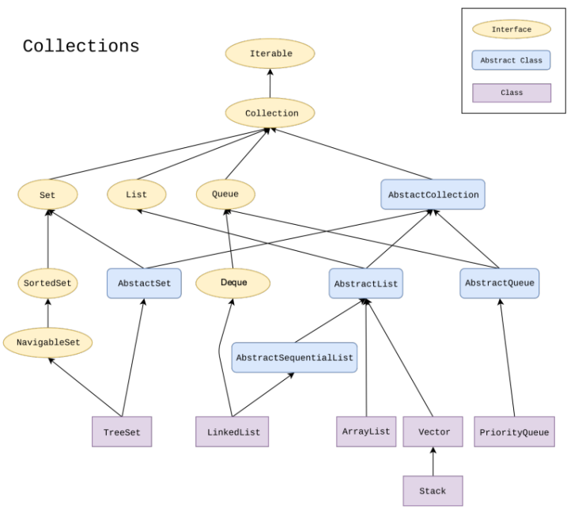
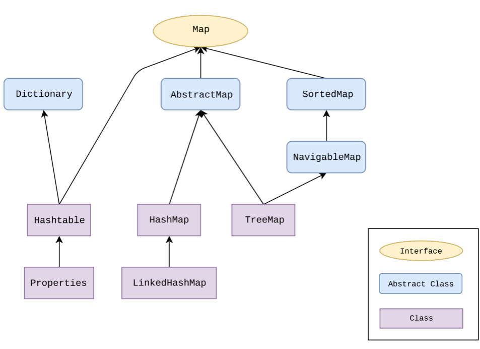

# Object Oriented Programming 

## Introduzione OOP

Il linguaggio C è un linguaggio procedurale (procedure = funzioni): ogni programma viene decomposto in "moduli" sempre più semplici implementabili in procedure e funzioni. 
In OOP i "moduli" non sono solo funzioni ma anche classi. 
Ogni modulo è quindi una interfaccia con una specifica e ben definita sintassi. Per contro esiste l'implementazione, cioè una parte interna. 
Interfaccia svolge quindi il ruole di ponte tra il modulo e i clienti (utilizzatori).
Una buona modularizzazione facilita il riuso e influenza positivamente la verificabilità (partendo dal presupposto che ogni componente è corretto, se riscontro problemi so che è colpa solo di come li ho collegati tra loro), manutenibilità e comprensibilità.
L'approccio tradizionale top-down è adatto a progettare algoritmi ma non sistemi di grosse dimensioni. 

## Java ed ereditarietà 

Polimorfismo/ereditarietá è la capacità per un elemento sintattico di riferirsi a elementi di diverso tipo. In Java una variabile di un tipo T può riferirsi ad un qualsiasi oggetto il cui tipo sia T o un sottotipo di T. 

Una sottoclasse (o sottotipo) di una classe eredita metodi e attributi dalla sopraclasse. Posso quindi assegnare dinamicamente a oggetti di tipo sopraclasse, oggetti della sottoclasse.
Nota: la sottoclasse eredita tutti i metodi ma soltanto gli attributi *protected* . 

Java garantisce che la sostituibilità non comprometta la type safety: cioè il compilatore verifica che ogni oggetto venga manipolato correttamente in base al tipo statico e garantisce che a runtime non sorgano errori se si opera su un oggetto il cui tipo dinamico è un sottotipo del tipo statico.

Il tipo statico è quello definito dalla dichiarazione mentre il tipo dinamico è definito dal costruttore usato per definirlo e può essere sottotipo del tipo statico (ma non viceversa):

````Java
Automobile myCar = new Automobile(); 
Teslino yourCar = new Teslino(); 
myCar = yourCar;
````

### Regola d'oro ereditarietà:

- non è possibile assegnare ad una sottoclasse la propria sopraclasse (anche se interfaccia). 


## Overloading e overriding

Il compilatore, quando trova una chiamata di un metodo risolve staticamente l’overloading, individuando il metodo chiamato in base al tipo statico. 

Altrimenti se un metodo della sopraclasse non è statico e viene chiamato da un oggetto il cui tipo statico è la sopraclasse, ma il tipo dinamico è la sottoclasse, tale metodo della sottoclasse che lo ridefinisce (overriding) sarà soggetto a **binding dinamico**. Cioè dinamicamente a *runtime*, il compilatore 'sceglierà' di utilizzare l'implementazione della sottoclasse. 

Il binding dinamico si applica a run-time: il codice sceglie a runtime il metodo “più vicino” tra quelli che hanno il prototipo stabilito staticamente.

### Regola d'oro:

- si applica binding dinamico solo se si ridefinisce il metodo facendo **overriding** , **non** se ne si aggiunge un altro con diversa *segnatura*.


## Binding su parametri

Ricorda che Java quando viene chiamata una funzione con parametro, Java guarda il tipo statico di tale parametro! 
Java quando fa overriding, **non guarda eventuali tipi dinamici dei parametri** ma sempre e solo tipi statici! 
Tipi dinamici non influenzano la chiamata e la decisione. L'unico modo per fare 'overriding' in base al parametro é utilizzando un **casting** esplicito.

### Casting 

Il casting da una classe a una sopraclasse è un’operazione SEMPRE consentita. L’operazione di casting viene eseguita inserendo tra parentesi tonde il nome della classe nella quale si vuole convertire un oggetto.
Invece il casting da una classe a una sottoclasse è possibile solo se l’oggetto  è veramente un esemplare della sottoclasse (cioè a livello dinamico è davvero il sottotipo), altrimenti non è permesso.
Il controllo della correttezza di questo casting può essere fatto solo durante l’esecuzione (run-time). Se il casting non è permesso, viene segnalata l’eccezione ````ClassCastException````.

## Attributes

Keywords: 

- ````public //ovunque````
- ````protected //stesso package e sottoclassi della classe
- ````private //solo stessa classe````
- ````static````

Con la keyword 'static' posso far si che un attributo (ma anche metodo) può essere modificato/letto senza per forza istanziarne una classe. Gli attributi statici vengono condivisi tra tutti gli oggetti. I metodi statici non sono soggetti ad overriding ma sono soggetti a overloading.

## Interfacce
Le interfacce sono classi astratte che non implementano i propri metodi, ma li definiscono solo.
Una qualsiasi classe che implementa una interfaccia **deve** fare overriding su **ogni** metodo dell'interfaccia.
Le interfacce sono utilizzate come un ulteriore livello di information hiding, ma anche come 'trick' per avere una sorta di multi-ereditarietà. Infatti le classi non possono ereditare da più classi, ma possono implementare più classi (separate da virgola al momento dell'implementazione). 


### Collezioni e mappe varie in Java






### Iterators

````Iterator<E>```` è un'interfaccia che permette di scandire e rimuovere oggetti da collezioni. È composta dai metodi:
````boolean hasNext()```` restituisce True se c'è un elemento successivo, mentre  ````next()```` restituisce l'elemento successivo.
````remove()```` rimuove l'elemento corrente.

````Java
class MyIterator implements Iterator<E> {
public boolean hasNext() {
...
}
public E next() throws NoSuchElementException {
...
}
public void remove() throws UnsupportedOperationException {
...
}
}
````

Con Iterator è poi possibile usare il for generalizzato (o il metodo ````forEach()````  ) su oggetti che implementano tale interfaccia.

````Java
operations.forEach(System.out::println)
````

## Exceptions 
Un’eccezione è un oggetto speciale restituito da un metodo. 
Le eccezioni vengono segnalate al chiamante che può gestirle nella maniera più opportuna. Le eccezioni sono classi come altre che estendono la classe ``
````Exception````.  

```Java
public void faiQualcosa() { 
	try { 
		leggiFile();
	 } catch(FileInesistenteException fi) { 
	 System.out.println("Ooops! Il file non esiste!"); } 
	 catch(FileDanneggiatoException fd) { 
	 System.out.println("Ooops! Il file ha dati scorretti!"); 
	 }
```

Per sollevare esplicitamente un’eccezione, si usa il comando throw, seguito dall’oggetto (del tipo dell’eccezione) da “lanciare” al chiamante e per terminare immediatamente l’esecuzione del blocco di codice. 

````Java
public int fuck(int n){
	if (n<0) 
		throw new NegativeException(); 
	else if (n==0 || n==1) return 1; 
	else return (n*fuck(n-1)); 
	}
````

Un blocco try/catch può avere un ramo finally in aggiunta a uno o più rami catch: Il ramo finally è comunque eseguito sia che all’interno del blocco try non vengano sollevate eccezioni, sia che all’interno del ramo try vengano sollevate eccezioni gestite da un catch.
Nell'ultimo caso il ramo finally viene eseguito dopo il ramo catch gestisce l’eccezione. 
Le eccezioni possono contenere dati che danno indicazioni sul problema incontrato e possono anche essere definite dall’utente.

````Java
public class MyException extends Exception {
	public MyException() {
		super();
	}
	
	public MyException(String s) {
		super(s);
	}
}
````


## Recap OOP

I principali concetti da portarci a casa sono quindi:

- polimorfismo ed ereditarietà: se x è persona e uno studente è una persona. Ad x posso assegnare uno studente. Ma se x è uno studente non posso assegnarli una persona. La classe deve 'inglobare' la sottoclasse.
- late binding: a causa del precedente punto, cioè a causa del polimorismo, il compilatore non sarà in grado a priori di sapere qual è il sottotipo associato all'oggetto se non al momento dell'invocazione (runtime). Il late binding si riferisce proprio a questo aspetto, cioè al fatto che la funzione e il sottotipo vengono **bindati dinamicamente**.
- information hiding: nascondo all'utilizzatore come è fatto il mio modulo.
- incapsulamento: non posso accedere alle informazioni se non attraverso i metodi.