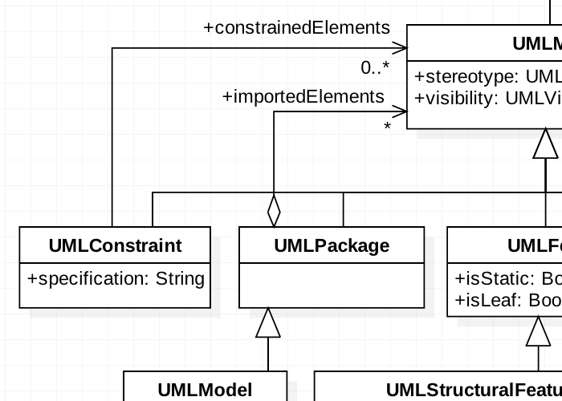
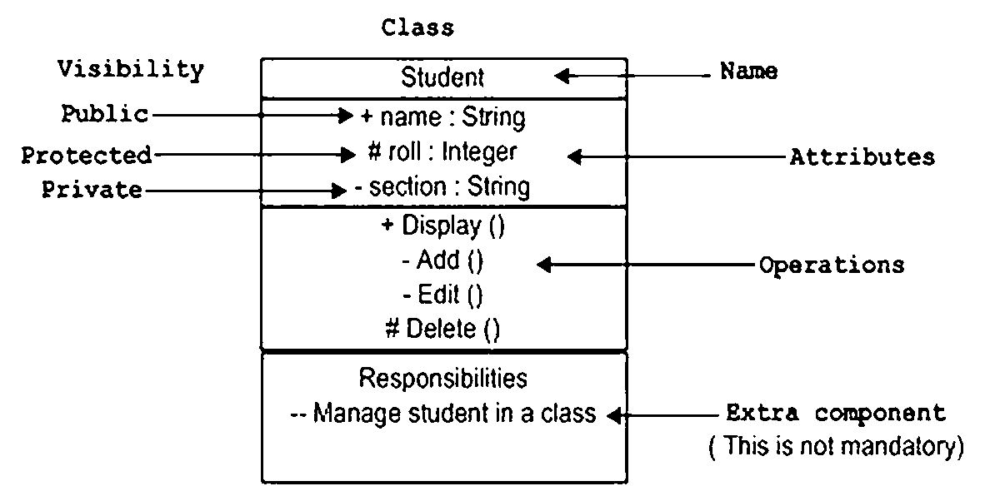
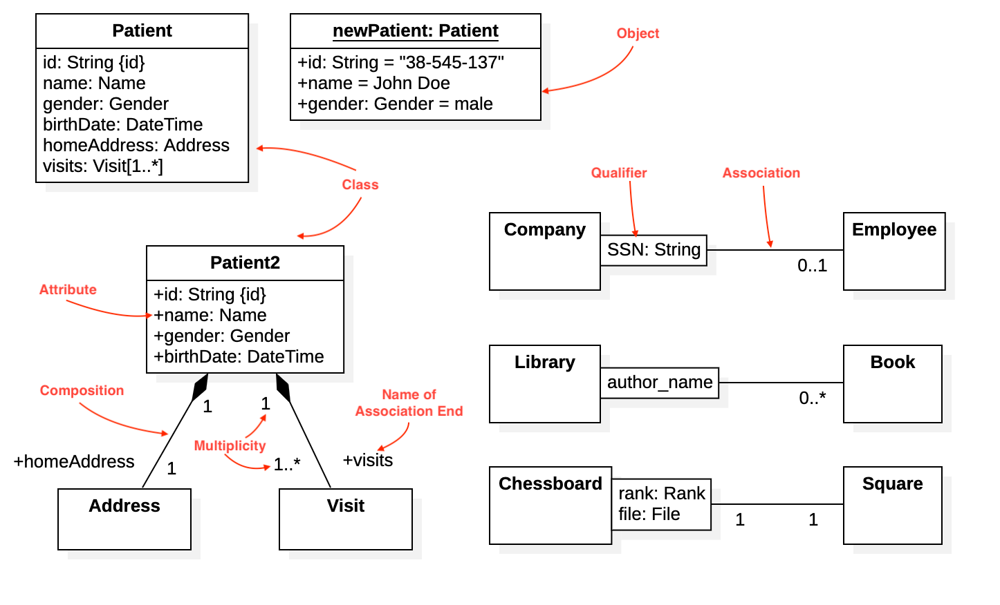
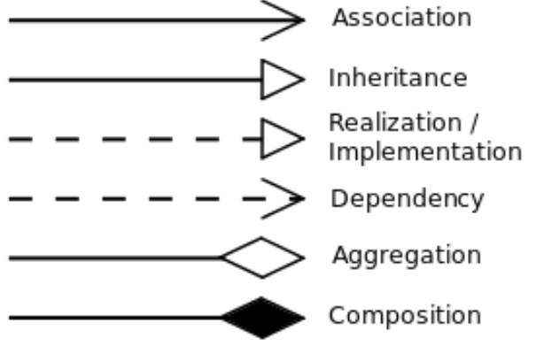
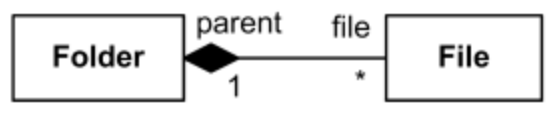
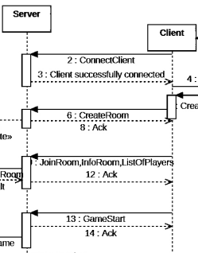

# UML 

### Struttura base classe:

### Tipi di relazione:
{width=50%}

- associazione: i due componenti sono semplicemente associati. In genere hanno un nome (verbo) e una molteplicitá 
- aggregazione: un componente logicamente viene aggregato dal componente superiore
- composizione: é una aggregazione forte... se il contenitore viene eliminato, anche i contenuti vengono eliminati. Tipico esempio:  mazzo e carte 

	
- ereditarietá: esprime l'ereditarietá 
- dipendenza: 'relazione di utilizzo'
- implementazione: usato per indicare l'implementazione delle interfacce 

### Diagrammi di sequenza 

Dall'alto verso il basso si puó leggere la sequenza di una operazione tra piú classi. In genere si costruisce prima il diagramma di classe e poi quello di sequenza.

- Frecce piene se il messaggio é sincrono 
- Frecce vuote se il messaggio é asincrono 
- Frecce tratteggiate se il messaggio é una risposta

{width=20%}