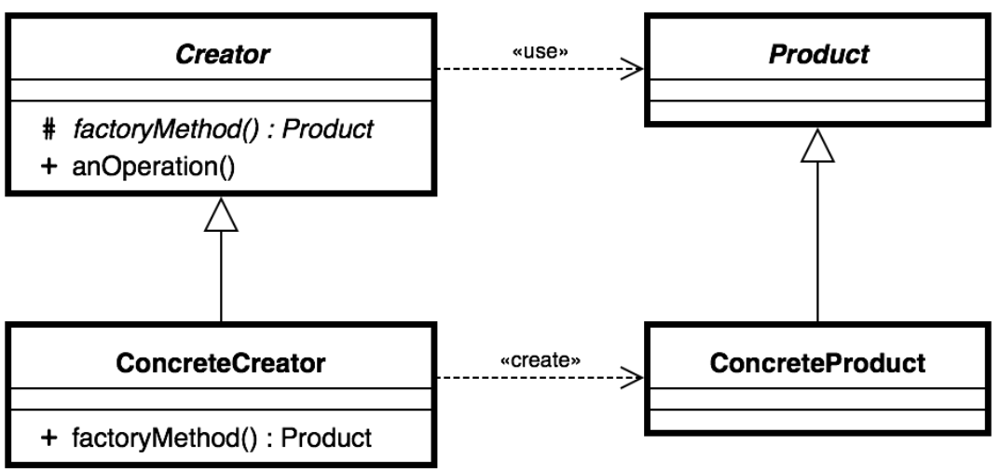
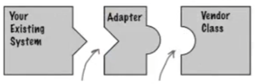
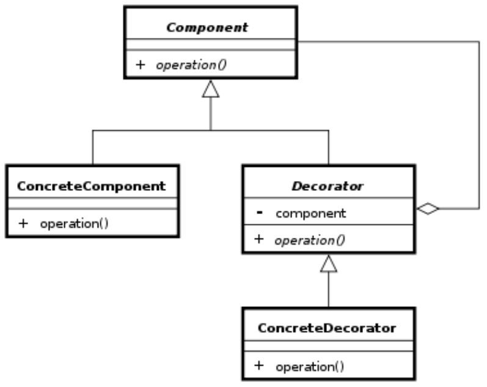
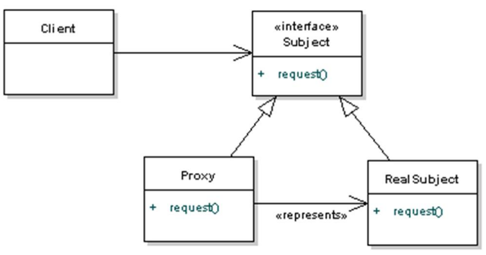
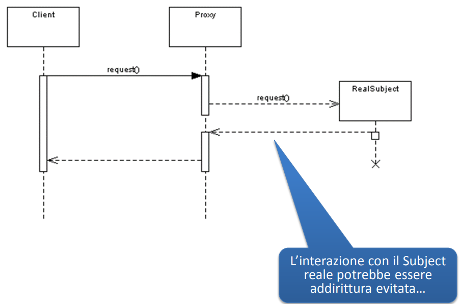
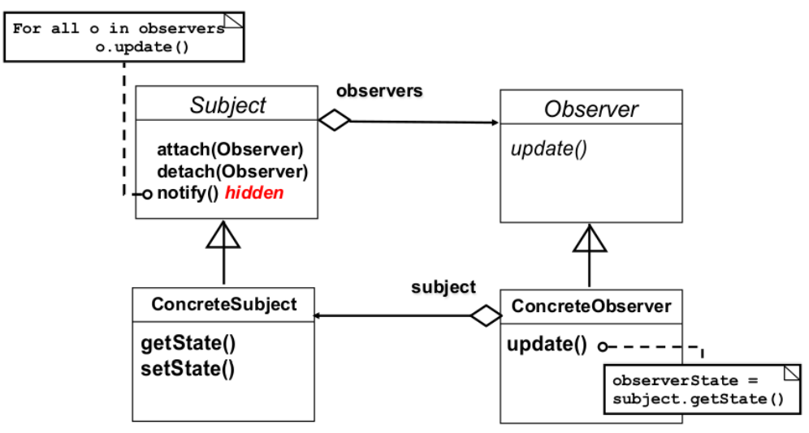
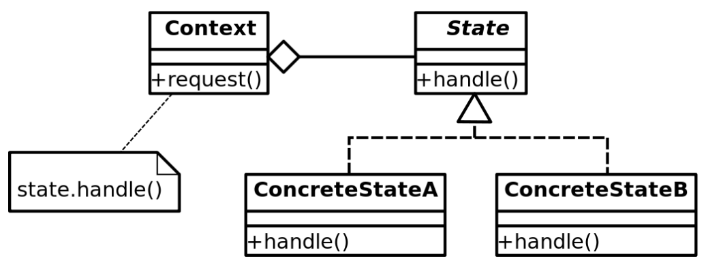

# Java e Pattern Designs 
Classificazione patterns: 

- creazionali : riguardano la creazione di oggetti
- strutturali : riguardano la composizione di classi
- comportamentali : si occupano di come interagiscono tra loro gli oggetti

### Creational Patterns 

- Abstract Factory: crea istanze specifiche/appropriate usando la Concrete Factory  
- Concrete Factory: implementa l'interfaccia della AbstractFactory per far si che si fa il giusto override. 

Lo stesso (abstract/concrete) per i prodotti. 

- Singleton:  una classe la cui istanza é sempre singola. 

### Structural Patterns 

- Adapter: per matchare interfacce diverse 

- Bridge: per separare l'interfaccia di un oggetto dalla sua implementazione
- Decorator: per aggiungere responsabilitá/funzionalitá ad oggetti esistenti dinamicamente 

{width=50%}

- Facade: una classe che rappresenta un insieme di altre classi e maschera la complessitá.
 

- Flyweight: un'istanza 'leggera' usata per condividere risorse
- Proxy: Un oggetto che rappresenta un altro oggetto, in genere usato per evitare di istanziare oggetti pesante se non veramente necessari.

{width=50%}
{width=50%}

### Behavioral Patterns 

- Chain of Responsability: un modo per 'passare' una richiesta in una serie di classi a mo' di catena di montaggio nella quale ogni classe adempie alla propria responsabilitá.
- Command: incapsula una richiesta in una classe command, per 'standardizzare' le richieste.
- Iterator: per accedere sequenzialmente ad una collezione. 
- Mediator: per semplificare la comunicazione tra classi 
- Memento: per 'snapshottare' lo stato di una classe
- Observer: un modo per notificare agli oggetti 'Listeners' o 'Observers' un cambiamento sul oggetto osservato. 

- State: un oggetto la cui configurazione cambia a seconda dello stato (che varia a runtime).

- Strategy: incapsula gli algoritmi all'interno di una classe: utili per quei casi in cui é necessario cambiare/scegliere un algoritmo dinamicamente. 

- Comparator: Implementazione di una generica interfaccia Comprator per comparaare oggetti di tipi diversi. 

- Template Method
- Visitor
- MVC: 
	- Model: dove risiede la logica dell'applicazione 
	- View: visualizza i dati del Model 
	- Controller: riceve i comandi dell’utente (generalmente attraverso il View) e li attua modificando lo stato degli altri due componenti

