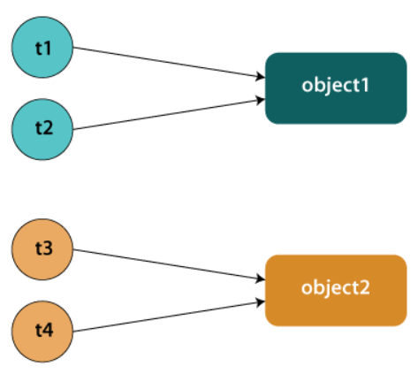

# Threads 

In Java, la classe Thread in realtà implementa un’interfaccia chiamata Runnable, la quale definisce il metodo run() , il quale contine il codice del thread. 
In Java i metodi che contengono sequenze di operazioni le quali accedono a dati condivisi vengano eseguite dai diversi thread in mutua esclusione specificando tali metodi con la parola chiave ````synchronized```` .

Il linguaggio Java assegna un intrinsic lock a ciascun oggetto. 
Quando un metodo ````synchronized```` viene invocato, viene eseguita la seguente serie di istruzioni: 

1) Il programma controlla l’esecuzione di metodi synchronized 
2) se nessuno é in esecuzione, l’oggetto viene bloccato (assume quindi uno stato locked) automaticamente. Altrimenti, se l’oggetto é giá bloccato, il task chiamante viene sospeso fino allo sblocco.
3) Il lock viene acquisito automaticamente  
4) Il metodo viene eseguito 
5) Il lock viene rilasciato automaticamente

### wait() 

Per rilasciare il lock sull’oggetto e sospendere il task, si usa l’istruzione wait() ;  sará poi l’istruzione notify() di un altro metodo ad eventualmente far riprendere il thread.  


````Java
class CrazyTest {
private boolean randomStuff;

	synchronized public void crazyMethod() {
		while (!randomStuff) {
			try{
				wait(); //the thread is waiting
			}catch(Final InterruptException e){
				e.printStackTrace();
			} 
		//crazy lines after waiting
	}

	synchronized public void crazyMethodThatNotify() {

		//doing something awesome

		randomStuff=true;

		notifyAll(); // o notify()

	}
}
````

Si può inoltre applicare un lock ad un oggetto all'interno di un metodo tramite ````synchronized(ObjectToLock)```` , che blocca l'oggetto fino al termine del codice del blocco. In generale la regola da seguire è di sincronizzare tutti gli oggetti mutabili e accessibile da più threads. 

````Java
class AwesomeTest{

	public void method(stuff) {
		synchronized(this) {
			.... //code while LOCK
		}
		//UNLOCK
	}

}
````


L’accesso ai campi static é controllato da un lock speciale, diverso da quelli associati alle istanze della classe. 
````static synchronized```` é una cosa piú generale: a livello di classe e non di oggetto singolo. Ad esempio per un attributo static (quindi un attributo che é sopra la singola istanza, ma é a livello di classe) puoi fare uno synchronized static che "estende la sincronizzazione anche a livello di classe" .


{width=25%}

In caso di sincronizzazione statica su un attributo della classe dei due oggetti, si sincronizzeranno anche i threads di colore diverso. Senza static, i threads si sincronizzeranno solo con quelli dello stesso colore/operanti sullo stesso oggetto. 


Con synchronized si possono comunque creare le solite possibile situe legate  ai Threads: 

- Deadlock: due o più thread sono bloccati per sempre, in attesa l’uno dell’altro.
- Starvation: un thread o piú hanno difficoltà a "vincere" e lockare l'accesso a una risorsa e quindi hanno difficoltà a procedere. 
- Livelock: errore di progetto che genera una sequenza ciclica di operazioni inutili ai fini dell’effettivo avanzamento della computazione. (loop)

## New Thread esplicito

````Java
public void methodOnNewThread(){
	
	
	new Thread( () -> method()).start();

	//oppure
	 
	new Thread(){
		public void run(){
			method();
		}
	}.start();
	
}
````


Per lanciare pezzi di codice on the fly in un thread separato rispetto al chiamante. Ovvero, il chiamante ritorna subito, mentre il thread separato esegue il vero e proprio metodo in 'differita'.

## Locks
Synchronized definisce un caso elementare di lock (implicito), ma meccanismi più sofisticati sono forniti dal package ````java.util.concurrent.locks````.
Un lock, definito dall’interfaccia lock, può essere acquisito da un solo un thread, come nel caso degli “implicit lock” associati a codice synchronized ma é piú avanzato, poiché permette ai thread di 'ritararsi' usando metodi tipo tryLock(). 

Da ````java.util.concurrent.locks```` è possibile utilizzare un lock esplicito, dichiarando esplicitamente un lock e poi in un try statement provare ad attivare il lock e infine rilasciarlo nel finally statement.

````Java
// Crea un lock
Lock lock = new Lock();
try {
	// Prova ad attivare il lock
	Boolean isLocked = lock.tryLock();
	// ...
} finally {
	// Disattiva il lock
	lock.unlock();
}
```` 

## Variabili atomiche 

Le variabili atomiche, dichiarate in java.util.atomic , sono un'implementazione più fine di alcuni tipi di synchronized statements, come per esempio un counter. Si specificano le singole variabili come Atomic e si può interagire con esse tramite appositi metodi.
````Java
import java.util.concurrent.atomic.AtomicInteger;
class AtomicCounter {
	private AtomicInteger c = new AtomicInteger(0);
	public void increment() {
		// Sommo 1 a `c`
		c.incrementAndGet();
	}
	
	public void decrement() {
		// Sottraggo 1 a `c`
		c.decrementAndGet();
	}
	public int value() {
		return c.get();
	}
}
```` 

## Executors 

Gli strumenti finora disponibili impongono una stretta relazione tra il compito che deve essere eseguito da un thread e il thread stesso. I due concetti possono essere tenuti distinti in applicazioni complesse, mediante apposite interfacce. Gli esecutori consentono una gestione efficiente che riduce il pesanti overhead dovuto alla gestione dei thread. 
Se $t$ è un Runnable ed $e$ è un Executor:

````Java
// new Thread(r)).start(); 
e.execute(r); 
````  
