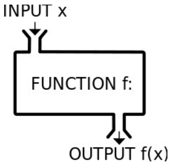

# Programmazione Funzionale 

{width=50%}

Erlang, Lisp e [Haskell](../../../MSc(english)%20(WIP)/Principles%20of%20Programming%20Languages/src/01.Haskell.md)  sono linguaggi puramente funzionali. 

## Functional Interfaces
Da java 8 abbiamo zucchero sintattico che ci permette di semplificare ad esempio la dichiarazione di un comparator in questo modo: 

````Java
Comparator c = (Persona p1, Persona p2) -> {
if (p1.getEta() < p2.getEta()) return -1; 
else if (p1.getEta() > p2.getEta()) return 1; 
else return 0; };
````

*Alternativamente senza usare questa functional interface avremmo dovuto fare la classe Comparator che implementava l'interfaccia comparator di Persona e che faceva quindi overriding del metodo compare(Persona 1, Persona 2) .*

Tutte le interfacce con un solo metodo possono essere viste come Functional Interfaces in Java , dunque ad esempio anche l'interfaccia Runnable lo :

````Java
Thread t = new Thread(() -> doSomething()); 
t.start();
````

*Nota: doSomething() é la funzione svolta dall'unico metodo dell'interfaccia, cioé il metodo run.*

## Stream
Gli stream permettono di concatenare funzioni che agiscono su collection. Partendo da una Collection il metodo stream() ritorna un oggetto Stream, il quale possiede diversi metodi utilissimi: 

- ````forEach()````: nel caso ad esempio di una lista di stringhe posso applicare un metodo per ciascun input. Attenzione che questa funzione **non trasforma** .. esegue soltanto un'operazione con gli elementi ma non sugli elementi. 

````Java
list.stream().forEach(String episode -> { 
	WatchList.add(episode); 
	// ... 
	});
````

- ````map()````: applica la funzione in ingresso che mappa da dominio U a dominio T e la applica a ogni elemento dello stream di U, ottenendo un nuovo stream di T. 

````Java
//Two equivalent expressions: 
list.stream().map(x -> x.size());
lis.stream().map(x::size())
````
Per funzioni piú complicate posso proprio scrivere cosí: 
````Java
list.stream().map((x) -> {
x.size(
return 
}
));
````
*Da una lista di stringhe ottengono una lista di interi* . 

- ````filter()````: nel caso ad esempio di una lista di interi posso applicare filter(predicato) che mi filtra la lista, eliminando gli elementi che non soddisfano il predicato.

````Java
list.stream().filter(x -> x%2 == 0);
````
- ````distinct()````: elimina i duplicati degli oggetti U (deve essere definita la equals(U))
- ````flatMap()````: funzione simile a map() ma mappa da dominio U a dominio Stream\<T>
- ````sum()```` o ````average()````: sono funzioni di riduzione poiché riducono (al contrario di flatMap()) uno stream in un unico elemento.
- ````reduce()````: puó essere esplicitata la propria funzione di riduzione. Gli argomenti di tale funzione sono il valore identitá (iniziale) e la funzione lambda che si basa su $acc$ e $elem$ ; cioé rispettivamente un elemento successivo nello stream/lista e il risultato parziale. 
````Java
listOfIntegers.stream().reduce(0, (elem, acc) -> elem + acc));
```` 
Altro esempio con reduce() per il calcolo del massimo:  

````Java 
final int maxExpensive = prices.stream().reduce(0, Math::max);
````

- ````parallel()````:gli elementi di uno stream se sono indipendenti tra loro possono essere analizzati in parallelo.

- ````collect()````: utile ad esempio per collezionare lo stream in una lista: 

````Java
listOfIntegers.stream().collect(Collectors.toList()) 
/*
// Nel caso di strutture dati “standard” esistono collectors predefiniti: toList(), toSet(), toMap() 
*/

````


- ````orElse(T other)````: se lo Stream() non restituisce nulla, si forza la restituzione del oggetto other di tipo T (qualsiasi oggetto).  Un esempio è quando findFirst() ritorna un optional e si usa .orElse(null) per ottenere effettivamente un valore. 
````Java
//longestInUppercase
people.stream().filter(name -> name.equals(name.toUpperCase())).reduce((name1,name2) -> name1.length()>=name2.length() ?name1 : name2).orElse("n.a.");
}
````

- ````count()```` : alla fine se mi serve il conto 

- ````sorted(Comparator comparator)````: prende in ingresso uno stream e opzionalmente, puó prendere in ingresso un comparator per ordinare gli elementi. 

### Esempio Optional 

````Java
public static void longestName(List<String> names) { 

final Optional<String> theLongest = friends. stream().reduce((namel, name2) -> namel.length() >= namel.length() ? namel : name2); 

theLongest.ifPresent(name -> System.out.println(String.format("The longest name: %s", name))) 
````


Uso di Optional L’accesso al valore all’interno di un Optional puó avvenire tramite: 

- ````o.ifPresent()```` : prende in ingresso una funzione che accetta T e ne fa uso 

- ````o.flatMap()````: prende in ingresso una funzione da T a Optional. Ritorna un Optional se é empty. 

- ````o.orElse()````