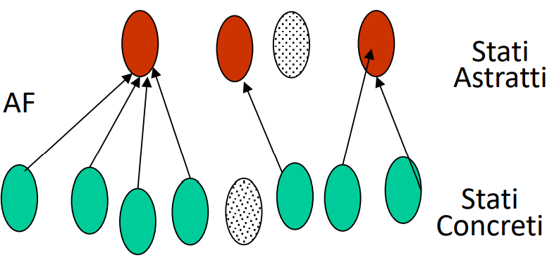

# ADT e JML

## ADT

From wikipedia: 
> An **abstract data type** (**ADT**) is a class of objects whose logical behavior is defined by a set of values and a set of operations. This is analogous to an algebraic structure in mathematics.
>  An ADT is defined by its behavior from the point of view of a **user**, of the data, specifically in terms of possible values, possible operations on data of this type, and the behavior of these operations. This mathematical model **contrasts with data structures** , which are **concrete** representations of data, and are the point of view of an implementer, not a user.

Un tipo sarà definito dai possibili valori assumibili e operazioni. Tale tipo avrà una specifica astratta, la quale si distinguerà dall'implementazione dell' oggetto concreto. 

- Specifica $\rightarrow$ condizioni che l'oggetto astratto rispetta
- Implementazione $\rightarrow$ algoritmo e struttura dati nei metodi 

Le operazioni effettuabili su ADT si possono classificare in:

- creators: crea oggetti (in genere costruttori se non sono producers)
- producers: produce oggetti usando altri oggetti dello stesso tipo
- mutators: modificano ADT
- observers: in genere puri 

Un ADT può essere: 

- Mutable: richiede almeno metodi creators, observers e mutators
- Immutable: richiede almeno creators, observers e producers 

## JML 

JML (Java Modelling Language) viene utilizzato per definire precondizioni/postcondizioni e invarianti di oggetti/metodi in linguaggio naturale/matematico.

````//@````  per ogni riga,  oppure 
````/*@   */```` .
````//@requires````  per le precondizioni e 
````//@ensures```` per le postcondizioni.

## Specifiche parziali 

Le specifiche parziali sono specifiche, 'contratti' che devono essere rispettati da un metodo. Si dicono parziali poichè pongono vincoli sugli input. 
Quindi sono scomponibili in precondizioni e post condizioni. e non in 'condizioni'. 
Indica che cosa è vero quando il metodo lancia un'eccezione.

Robe usabili: 
````Java
/result  
/old(Exp) //valore prima della espressione
&& , || , ! , ==>, <==, <==>, <=!=> //espressioni logico matematiche usabili
(\forall variable, range, condition)
(\exists variable, range, condition)
(\num_of variabile; cond. ciclo (boolean); condizione (bool))
(\sum var; cond. ciclo (boolean); espressione)
(\product var; cond. ciclo (boolean); espressione)
(\min var; cond. ciclo (boolean); espressione)
(\max var; cond. ciclo(boolean); espressione)
````
## Specifiche totali 

Le specifiche totali si caratterizzano per non usare ````//@requires````  
````//@ensures```` ma per l'uso in ````&&```` delle ````/signals(Exception e) ...;```` in ````//@ensures````  . Questo per indicare la corretta throw delle eccezioni.    
Quindi il passaggio 
$Parziale \leftrightarrow totale$ è meccanico: pigli le requires, le neghi e le disgiungi tra loro. 


## Invarianti pubblici e privati 
L'invariante "cattura" ogni singolo istante del oggetto astratto e fa asserzioni riguardo quelle proprietà *che non variano mai*. 
Un invariante dichiarato “private” in JML è autorizzato a usare anche le parti private (metodi puri e attributi) della classe, altrimenti un inviarante pubblico no.
Sia la funzione di astrazione che l'invariante di rappresentazione sono in genere descritte in JML come un invariante privato. 

Ci possono essere eccezioni a questa ultima frase solo nel caso in cui si volesse esprimere il cosiddetto ' **invariante astratto** ' , cioé un invariante per la classe astratta. In questo caso allora si utilizza un public invariant. 

I metodi puri si specificano con ```` /@pure@*/ ```` e sono utilizzabili nella specifica, poichè sono 'puri' cioè non modificano lo stato interno ma agiscono da puri osservatori.

````Java
/*@ public invariant
/assert  (something)
*/
````

L'invariante non copre proprietá evolutive: tutte quelle proprietà che 'dipendono dallo stato precedente' non considerarle neanche. 

Perchè le proprietà astratte sono utili? 
Gli utilizzatori della classe possono usare le proprietà come assunzioni sul comportamento della classe.

## Abstract Function e Represantation Invariants 

Ogni ADT puó essere implementato con piú strutture dati, chiamata rappresentazione. La rappresentazione non è univoca e può essere liberamente scelta.
Esiste quindi la funzione di astrazione AF è l'entità che definisce il significato della nostra rappresentazione.
L'AF è definita solo per stati concreti validi. Per definire se uno stato è
valido o meno usiamo un altro tipo di invariante: il cosiddetto invariante di rappresentazione RI. 
La RI è una funzione caratteristica per gli stati validi: restituisce true ogni volta che lo stato è valido, falso altrimenti. 


### Abstract Function 

La Funzione di astrazione è una funzione non iniettiva che associa a ogni stato concreto al più uno stato astratto: molti stati concreti possono essere associati allo stesso stato astratto (es. [1,2,5] e [2,1,5] corrispondono allo stesso stato astratto {1,2,5} nel caso del ADT dell'insieme di interi).




Se con il RI specifichiamo 'quali stati sono legali'; con l'AF associamo gli **stati astratti** con gli stati concreti che rispettano le proprietà del RI:
L'AF si rappresenta con un private invariant, che mette in relazione gli **attributi privati** e gli **observer pubblici**.

Consiglio: definisci i metodi base/pure sui quali si appoggiano tutti gli altri. 


### Representation Invariant

Il rep. invariant definisce quali rappresentazioni sono legali (true). Il RI deve essere verificato in tutti gli stati osservabili dagli utilizzatori.
Un RI è un modo molto preciso per descrivere le ipotesi da rispettare **sempre** perchè una rappresentazione dell'ADT sia **legale**, e dunque valga la funzione di astrazione.

#### esempio RI e AF:

Ad esempio nel caso di un ADT che usa come implementazione un array (**attributo privato**):

- l'RI specificherà ad esempio il fatto che l'array non dovrà mai essere nullo e che se contiene elementi ciascun elemento non dovrà mai essere nullo (in qualsiasi istante)
- l'AF specificherà che l'**observer pubblico** del ADT ````.size()```` dovrà essere uguale al metodo ````array.size()```` , dove array è l'**attributo privato**. 

Nel AF in genere si specificano le condizioni riguardo **attributo privato** $\rightleftarrows$ **observer pubblico** . 


## Don't expose your rep! 

Errore comune puó essere quello di 'esporre il rep' : cioé ritornare la referenza ad un oggetto mutabile del rep o inserire nel rep un oggetto mutabile. 
In entrambi i modi permettiamo di modificare il rep esternamente e quindi invalidarlo. 

## Extra, C# Code Contracts
Cosí come in Java esiste JML, anche negli altri linguaggi di programmazione in genere ci sono sistemi per modellizzare specifiche. Ad esempio in C# ci sono i ''Code contracts". Alla stessa maniera i contratti ci permettono di specificare precondizioni, postcondizioni e anche invarianti di oggetti nel framework .NET.