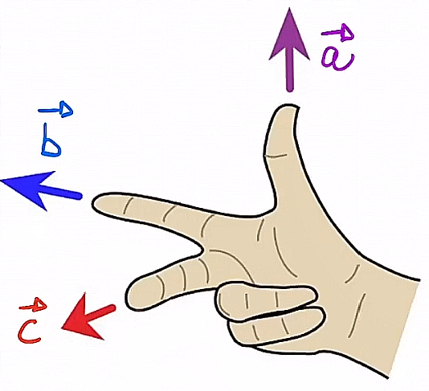
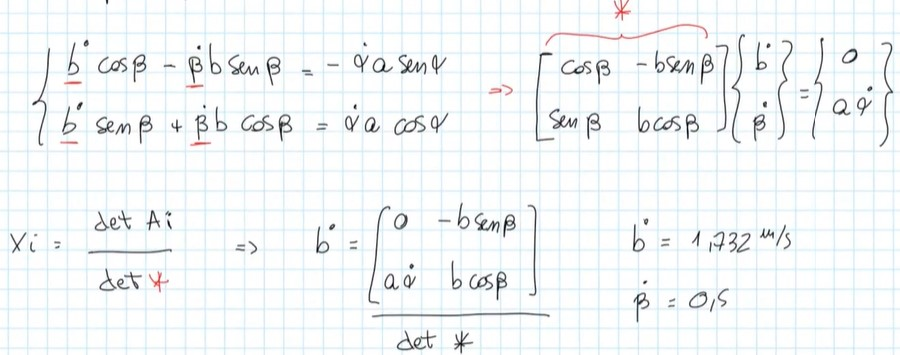

# Cinematica del punto 
## Notazione con Coordinate cartesiane 
$$\vec P = x \vec i +y \vec j$$
$$\vec V = \dot x(t) \vec i + \dot y(t) \vec j$$
Dove $\vec i$ e $\vec j$ sono i vettori unitari del sistema di riferimento (versori).

## Notazione con Numeri Complessi
$$\vec P = x + y i$$
$$\vec V = \dot x(t) + \dot y(t) i$$
Dove $i$ è l'unità immaginaria. Di conseguenza il numero complesso può a sua volta essere scritto con la notazione polare...

## Notazione Polare
$$\vec P=Pe^{\theta i}$$
$$\vec V= \dot Pe^{\theta i} + P \dot \theta i e^{\theta i}$$

## Ripasso prodotto vettoriale e scalare

### Prodotto vettoriale
$$\vec c = \vec b \wedge \vec a$$
Il prodotto vettoriale di due vettori è un terzo vettore con direzione ricavabile tramite la regola della mano destra e modulo $ba \sin(\alpha)$, dove $\alpha$ è l'angolo compreso tra $\vec b$ e $\vec{a}$ . Verrà utilizzato spesso per calcolare la velocità tangenziale di un punto che si muove lungo orbita circolare di raggio R ad esempio e con una certa velocità angolare.

### Prodotto scalare
$$\vec c = \vec b \cdot \vec a$$
Il prodotto scalare di due vettori è uno scalare uguale a $ba \cos(\alpha)$, dove $\alpha$ è l'angolo compreso tra $\vec b$ e $\vec{a}$ . Il prodotto scalare verrà spesso utilizzato per calcolare la potenza di coppie e forze o per calcolare la derivata dell'energia cinetica.

## Ripasso regola di Kramer per sistemi
Comoda in alcuni casi per risparmiare conti.

## Rivals per la velocità

La velocità **assoluta** di un punto qualsiasi di un corpo rigido rispetto a un altro punto qualsiasi $O$ è data dalla sovrapposizione di 2 contributi: 
1) contributo di traslazione di un suo punto arbitrario $O$
2) contributo di rotazione del corpo rigido attorno al punto scelto, rispetto ad un asse perpendicolare al piano del moto 

$$\vec{x} = \vec{v_o} + \vec \omega \wedge(X-O) $$

## Rivals per l'accelerazione

L'accelerazione **assoluta** di un punto qualsiasi di un corpo rigido rispetto ad un altro punto qualsiasi $O$ è data dalla sovrapposizione di 3 contributi: 
1) contributo di traslazione o trascinamento di un suo punto arbitrario $O$
2) accelerazione tangenziale
3) accelerazione centripeta 
$$\vec{x} = \vec{a_o} + \dot {\vec \omega} \wedge(X-O)  + \vec \omega \wedge [\vec \omega \wedge(X-O) ]$$

## Moti relativi per le velocità

$$(P-O) = (O_1 - O) + (P-O_1)$$

scrivendo $(P-O_1)=x_p\vec{i}+y_p\vec{j}$ posso derivare tranqui $(P-O)$ e $(O_1 - O)$ ma non $(P-O_1)$ in quanto i primi 2 avranno fissi i versori $\vec{i}$ e $\vec{j}$ mentre l'ultima componente non avrà i versori fissati, ma essi potranno cambiare  'orientamento' (poichè la terna mobile in $O_1$ può ruotare su sè stessa). 
Dobbiamo calcolare per l'ultima componente la derivata di un prodotto quindi $\leftarrow$ ma questo sarà sbatti. 

$$\dot{x_p}\vec{i}+\dot{y_p}\vec{j}=\dot{x_{o_1}}\vec{i}+\dot{y_{o_1}}\vec{j}+\dot{x_{p_1}}\vec{i}+ \dot{y_{p_1}}\vec{j} + {x_{p_1}}\vec{\dot{i}}  +{y_{p_1}}\vec{\dot{j}}$$ 

La dimostrazione consiste di vedere la terna come 'un corpo rigido' e utilizzare Rivals per le velocità: il tutto per calcolare le 2 derivate rispetto al tempo dei versori del sistema di riferimento mobile. 
Sappiamo per Rivals per le velocità che  $\vec{p} = \vec{v_{o_1}} + \vec \omega \wedge(P- O_1)$ , quindi possiamo eguagliare le equazioni e dire che ${x_{p_1}}\vec{\dot{i}}  +{y_{p_1}}\vec{\dot{j}}$ è esprimibile come $\vec \omega \wedge(P-O_1)$ .
Quindi il contributo dato dalle componenti con $\vec{\dot{i}}$ e $\vec{\dot{j}}$ può essere espresso come un contributo di rotazione rispetto al centro della terna. Nota che $\omega = \dot \phi \vec{k}$ dove $\phi$ è l'angolo dei vettori $\vec i$ e $\vec j$  della terna centrata in $O_1$ rispetto ai vettori **assoluti** della terna centrata in $O$ .

### Formule di Poisson
Quindi eccoci con le **formule di Poisson**:
$$\dot{\vec i} = \vec \omega \wedge \vec{i_1}$$
$$\dot{\vec j}  = \vec \omega \wedge \vec{j_1}$$

e ci consentono di calcolare le 2 derivate rispetto al tempo dei versori del sistema di riferimento mobile. 

Per concludere, la derivata di: 
$$(P-O) = (O_1 - O) + (P-O_1)$$
sarà: 

$$\vec{v_p} = \vec{v_{o_1}} + \vec{v_{p_{rel}}} + \omega \wedge (P-O_1) $$
da notare che il primo e l'ultimo (il terzo) componente della equazione precedente si tratta del cosiddetto **contributo di trascinamento** e può essere visto come "la velocità che avrebbe il punto $p$ se fosse inchiodato con la terna mobile". 

## Teorema dei moti relativi per le accelerazioni (o teo. di Coriolis)

Tenendo in considerazione che  $\omega \wedge (P-O_1)$ derivando sarà $\dot \omega \wedge (P-O_1) +  \omega \wedge \dot{(P-O_1)}$  e che $$\frac{\vec{{v}_{p_{rel}}}}{dt} =  \vec a_{p_{rel}} + \vec \omega \wedge \vec{v_{p_{rel}}}$$
otterremo:
$$\vec{a_p} = \vec{a_{o_1}} +  \dot{ \vec \omega} \wedge (P-O_1) + \vec \omega \wedge [ \vec \omega  \wedge (P-O_1)] + \vec{a_{p_{rel}}} + 2(\vec \omega \wedge \vec{v_{p_{rel}}})$$
che può essere vista come:

$$\vec{a_p} = \vec{a}_{p_{trascinamento}}  + \vec{a_{p_{rel}}} + \vec{a_{p_{coriolis}}}$$

cioè: 

$$\vec{a}_{p_{trascinamento}} =  \vec{a_{o_1}} +  \dot{ \vec \omega} \wedge (P-O_1) + \vec \omega \wedge [ \vec \omega  \wedge (P-O_1)]$$
dove si può evidenziare la componente di traslazione, la componente di accelerazione tangenziale e la componente di accelerazione normale $\vec \omega \wedge [ \vec \omega  \wedge (P-O_1)]$ .

Evidenziamo inoltre la componente di accelerazione di Coriolis $2(\vec \omega \wedge \vec{v_{p_{rel}}})$ la quale si annulla per $\vec \omega =0$ e $\vec v_{rel} =0$ o nel caso in cui $\vec \omega$ e $\vec v_{rel}$ sono paralleli tra loro, situazione possibile solo nello spazio 3D e non nel piano. 

