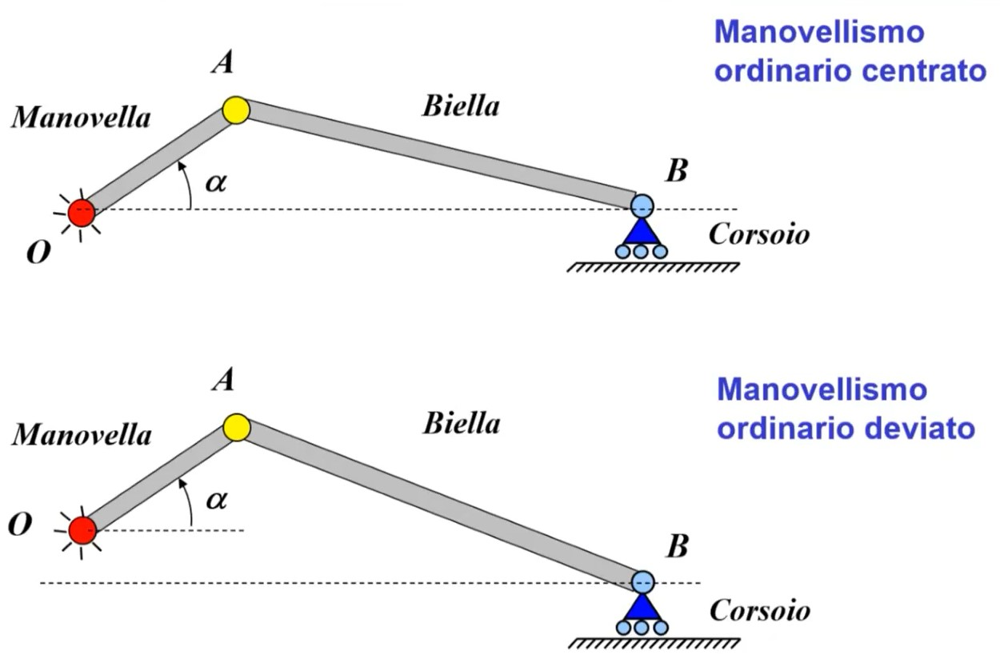

# Cinematica del corpo rigido 

In genere la velocità di un punto di un corpo rigido in moto dipende non solo dalla traslazione di tale corpo ma anche della rotazione. 
In caso di corpo che trasla e basta però la velocità e l’accelerazione saranno uguali in qualsiasi punto.

## Cinematica sistemi meccanici 

### Meccanismi e Equazione di chiusura

Classificazione dei meccanismi in due macrocategorie: 
1) con catena a cinematica aperta: se esiste un corpo connesso unicamente a un solo corpo, quello che lo segue o che lo precede. 
2) con catena a cinematica chiusa: il contrario dell'aperto, ogni membro è collegato sia al corpo che lo precede o che lo segue. 'Il telaio chiude il meccanismo'

Nel caso (1) posso descrivere il moto del sistema considerando la dinamica di un moto relativo a quello di uno dei  corpi che lo compongono. Nel caso (2) si usa una **equazione di chiusura** :)

### Equazione di chiusura
Equazione di chiusura é una equazione vettoriale, espressa generalmente con la notazione dei numeri complessi (notazione polare), la quale esprime la condizione per cui i vettori che rappresentano i corpi all'interno del sistema formano sempre un poligono chiuso. 
In genere tale poligono viene chiuso dal telaio (il telaio é tutto ció a cui i corpi che studiamo si 'fissano', lo possiamo vedere come tutto il mondo esterno) ma non é detto. 
L'equazione di chiusura deve necessariamente per ogni corpo 'avere' un vettore corrispondente, altrimenti si tratta di catena cinematica aperta ed é una semplice equazione vettoriale.

#### Ricordati la convenzione scelta

Il giorno dell'esame ti arriva davanti questo grafico e incominci a fare i tuoi conti... Ti scrivi la tua equazione di chiusura (definizione in seguito) e purtroppo ti trovi una lunghezza negativa. Perchè? 

Non ti accorgi che l'angolo in $O$ è scritto con la convenzione 'contraria' e discorde con l'angolo disegnato in $C$ . 
**Devi mantenere la stessa convenzione durante i tuoi calcoli!** L'angolo in $C$ partirà dalla linea di $F_1$ per intenderci e proseguira fino all'asta $BC$ se vorrai mantenere la convenzione usata in $O$.

#### Quadrilatero articolato 

Cinematismo utilizzato per trasformare un moto rotatorio di un albero nel moto traslatorio di un corsoio o vicerversa. 
1 gdl, come tutti i casi considerati in questo corso. 
Esiste una Regola di Grashof per classificazione dei quadrilateri articolati ma bho... mai usata, vattela a cercare su Wikipedia.

#### Manovellismo ordinario
Composto da:

- manovella
- biella
- corsoio
Serve per trasferire un moto rotatorio in uno traslatorio e viceversa, utilizzato in particolare in motori, compressori e presse. 

Il manovellismo ordinario è a catena cinematica chiusa. Possiamo identificare nel movimento due punti di nostro interesse, che dipendono dall'angolo $\alpha$ .
- PME (Punto Morto Esterno) per $\alpha = 0$ 
- PMI (Punto Morto Interno) per $\alpha = \pi$ 

Possiamo definire un ratio $\lambda$ come $\lambda = \frac{a}{b}$ dove $a$ e $b$ sono rispettivamente la lunghezza della manovella e la lunghezza della biella. Più il ratio è minore di 1 e più il moto del sistema può essere descritto/approssimato trigonometricamente, cioè come un moto armonico. 

Due modi diversi per risolvere il Manovellismo Ordinario: 
- equazione di chiusura: alla fine salterà fuori che ogni punto è sempre descrito da una componente di trascinamento e una di traslazione rispetto alla terna centrata in A (congiunzione tra manovella e biella).
- Jacobiano del moto: definito come un rapporto di velocità: $\frac{v_b}{\dot \alpha}$. Il **Jacobiano** esprime quindi un legame cinematico tra la velocità che ci interessa e la velocità del grado di libertá che mi consente di descrivere il moto del sistema. In caso di 1 gdl il jacobiano é molto comodo.  

Tipico esempio di catena a cinematica aperta: 

