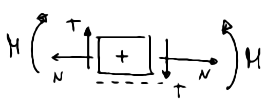
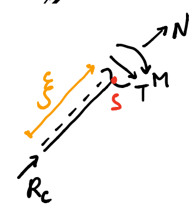

# Meccanica statica 

## Statica del punto 

Condizione necessaria e sufficiente per la statica del punto materiale:

$$\sum\limits F_{attive} + F_{reattive} = 0$$

## Statica del corpo rigido

### Corpo rigido
Il corpo rigido è un insieme infinito di punti che ha dimensioni finite. Il corpo rigido è indeformabile, cioè dopo qualsiasi spostamento ci sarà sempre un nuovo sistema di riferimento tale per cui la posizione del corpo rigido del corpo rispetto a tale sistema è identica alla posizione del sistema di rif. iniziale. Inoltre l'indeformabilità del cr implica che la distanza tra i punti rimane fissata, così come gli angoli formati da 2 rette passanti per 2 generiche coppie di punti.

Coordinate corpo rigido:
$$x_a \space x_b \space \varphi$$ 

Condizione necessaria e sufficiente per la statica del punto materiale:

$$\begin{cases}
\sum\limits F_{attive} + F_{reattive} = 0 \newline  \\
\sum\limits M = 0
\end{cases} $$

Abbiamo quindi 3 equazioni scalari (l'equazione della forza si divide in 2 per le componenti). 

### Momenti e coppie

Il momento delle forze attive e reattive rispetto al polo $O$ é : 

$$M_{o}= \sum\limits \vec F \wedge (P_i-O) + \sum\limits \vec{C_j}$$

Cioè il momento di un corpo rispetto al  polo $o$  è la sommatoria di tutti i momenti delle forze e di tutte le coppie di forze. 
Il momento di una forza é il prodotto della rispettiva forza per il braccio (cioé distanza tra punto di applicazione e polo).
Invece una coppia di forze è: 
$$C=\vec{F}\times d$$
Dove $d$ è la distanza di applicazione delle due forze. Abbiamo una coppia di forze ogni volta che ci sono due forze con verso opposto, parallele e stesso modulo applicate in due punti diversi. 

### Vincoli
Ogni vincolo che blocca il movimento è sostituibile con una forza vincolare, tale forza nei nostri esercizi la scomponiamo in due forze ovviamente. Ogni vincolo che blocca la rotazione invece è modellizzabile con un momento. 

Un corpo rigido mentre nello spazio possiede 6 gradi di libertà, nel piano ne ha solo 3: 2 traslazionali (x e y) e uno rotazionale.

### Sistema di corpi rigidi 
Un sistema di corpi rigidi può essere visto come un insieme di CR tra loro opportunatamente vincolati, visti esternamente come un unico corpo rigido chiamato **Telaio** . 
In ogni problema con corpi rigidi soggetti a vincoli si applica la Regola di Gruber.

### Regola di Grubler 
$$\#gdl_{sistema}=\#gdl_{CR} - \#vincoli $$

Dove il numero di gdl (gradi di libertà) di un corpo rigido è 3 . 

Possiamo quindi classificare un sistema di corpi rigidi in base al suo numero di gdl. 
Per $\#gdl \ge 1$ i sistemi vengono chiamati meccanismi, mentre per $\#gdl \le 0$ il sistema non si muove a meno di deformazioni strutturali. In particolare il secondo caso può essere a sua volta diviso in **isostatica** ($\#gdl = 0$) e **iperstatica** ($\#gdl < 0$). 

## Esercizio di statica 

Approccio per esercizi di statica: 
- Spezzare il sistema in $n$ (numero di corpi) parti.
- Per ciascuna parte analizzo le forze che agiscono. Vale il principio di azione e reazione: le azioni presenti su una parte della struttura (ottenuta post separazione) sono uguali e contrarie alle azioni presenti sulla restante parte. Nota bene che a questo punto non analizzo alcuna forza interna. Per calcolare il momento di una forza ci sono due modi: possiamo calcolare la componente perpendicolare al braccio della forza usando la trigonometria oppure (in alcuni casi molto piú comodo) calcolo la distanza della retta di applicazione della forza rispetto al polo scelto. 

- Avrò delle forze incognite, tali forze poi le risolvo 'combinando' le equazioni delle varie parti che ho trovato
- A questo punto ho risolto il punto 1 dell'esercizio di statica. Nel punto 2 di ogni ese. di statica verrà chiesto di analizzare una singola parte del sistema su cui agisce una forza concentrata e disegnare i grafici delle **forze interne** agenti sulla parte. 

### Azioni interne 
I corpi nella realtà potrebbero avere anche delle deformazioni. Vogliamo capire in quali condizioni $\leftarrow$ entriamo in questo ''stato''. Per far ciò ci basiamo su **sezioni** del corpo, cioè punti in cui dividiamo il nostro corpo. 
Inevitabilmente ci saranno delle discontinuitá in ogni forza concentrata per quanto riguarda le azioni interne $N$ e $M$. Se abbiamo momenti concentrati, il momento flettente avrá una discontinuitá ... altrimenti sará continua pure essa! 

*Approccio consigliato da me* : tagliare in due pezzi e partire entrambe le volte dagli estremi per andare verso l'interno. La forza in mezzo la ignori sempre. Se invece per qualche motivo non puoi devi analizzare lungo un'unica direzione $x$: facendo i casi in si è prima della forza concentrata (senza considerarla) e dopo (considerandola).

Convenzione utilizzata in questo corso:

Viene considerato positivo quando esso impone al concio una rotazione oraria, cioè a sinistra del concio il taglio va verso l'alto e a destra verso il basso, mentre è negativo quando esso impone al concio una rotazione anti-oraria.
Se il momento è positivo lo si mette dalle parti delle fibre tese. 
> Equilibrio di rotazione sempre rispetto al punto $P$, cosí per trovare $M$ senza aver d'impiccio $N$ e $T$ .  

Nota bene che $T$ e $N$ vanno calcolate nel sistema di riferimento dell'asta! Quindi se è inclinata tiene bene a mente che $T$ e $N$ saranno inclinate.

## Geometria delle masse 

### Baricentro 
Baricentro come punto in cui é possibile concentrare tutta la masse del corpo rigido, quindi come centro delle forze peso, cioé come punto in cui é possibile ridurre la risultate di tutte le forze. $$x_{g}=\frac{\sum x_{i} m_{i}}{M}$$ e $$y_{g}=\frac{\sum y_{i} m_{i}}{M}$$
Ma non é necessario calcolarlo sempre. Ad esempio il baricentro appartiene sempre all'asse di simmetria (se c'é) o all'intersezione degli assi (se ce né piú di uno) . O ancora si puó calcolare usando la media pesata con le masse dei baricentri delle figure "semplici e note" che compongono il corpo. 

Il baricentro é inoltre il punto con il momento d'inerzia minimo in tutto il corpo. Questo risultato deriva dal **teorema del Trasporto**:
$$J_{P}=J_{G}+m{PG}^2$$

La distribuzione di massa all'interno di un corpo attraverso il momento d'inerzia diventa quantificabile. Le forze di coppia d'inerzia a mo' di spaghettata ci esprimono quanto sia difficile mettere in movimento un corpo. 

Il baricentro di un omogeneo a spessore costante il baricentro coincide con il baricentro geometrico della figura. 
Il baricentro lo possiamo vedere come il punto in cui tutta la massa é concentrata o del punto in cui ogni forza viene applicata. 

Nel caso di moto piano il momento d'inerzia sará sempre rispetto all'asse z. $$J_c = \sum m_i d_i ^2$$
per questo per un sistema di corpi. 
Per un corpo rigido, cioé un insieme infinito di punti materiali. 
$$J_c = \int _ V d^2 \space dm = \int _ V d^2  \rho \space dV  = \int _V (x^2 + y^2) \rho dV$$

Il momento d'inerzia rispetto a un generico polo dipende dal polo mentre il momento d'inerzia del baricentro é una caratteristica del corpo. 

### Teorema di Huygens (teo. del trasporto)

$$J_o = J_G + m \vec{GO}^2$$

la dimostrazione consiste in scrivere il momento $J_o = \int _V (x_g + x_o)^2 + (y_g + y_o)^2) \rho dV$ e poi risolvere l'integrale raccogliendo e facendo considerazioni. Ritroverai, svolgendo i quadrati, esattamente l'equazione scritta sopra, facendo attenzione che $x_g$ e $y_g$ sono costanti e che i doppi prodotti sono nulli. 

In caso di corpo omogeneo a spessore costante, l'integrale di volume diventa un integrale di superficie. 
$$\int _A (x^2 + y^2) \rho h \space dA$$