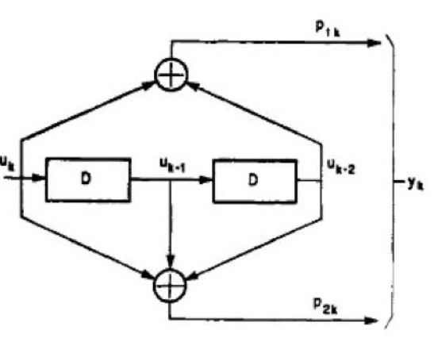
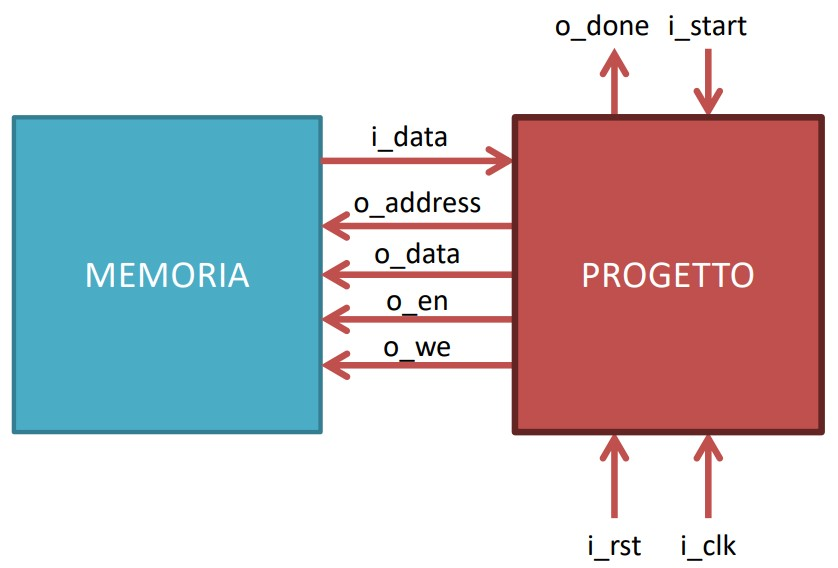
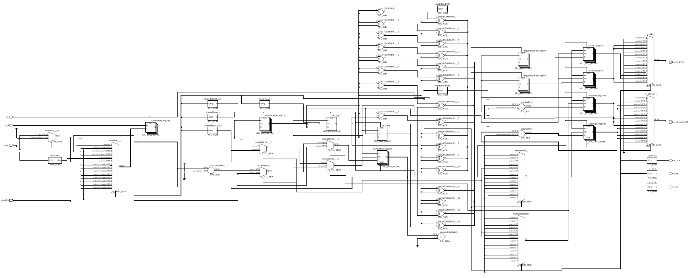
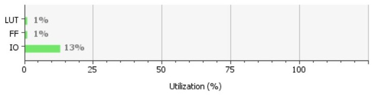
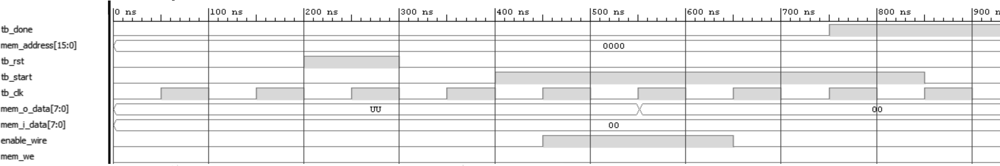
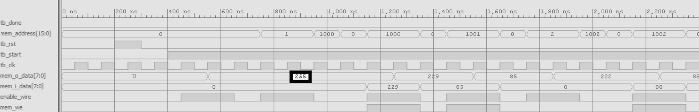
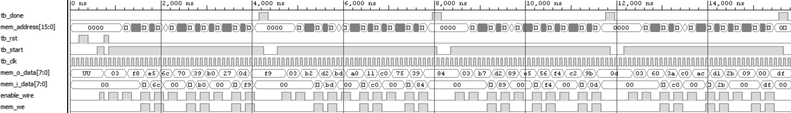

\maketitle
\newpage
\tableofcontents
\newpage

[Reti Logiche](../../projects/polimi-notes/BSc([/Reti%20Logiche/Reti%20Logiche.md) 

# Introduzione

Il progetto proposto é una implementazione in linguaggio VHDL di un codificatore convoluzionale. Lo scopo del codificatore convoluzionale é di ottenere un trasferimento di dati affidabile. In questo caso si avvale di una codifica con un tasso di trasmissione $\frac{1}{2}$: ogni bit viene codificato con 2 bit.  Il modulo riceve in ingresso una sequenza di parole di 8 bit, e restituisce in uscita una sequenza di lunghezza doppia di parole da 8 bit. 

## Specifica 

Il flusso in uscita è ottenuto come concatenamento alternato dei due bit di uscita (in figura p1k e p2k). Il modulo legge la sequenza da codificare da una memoria con indirizzamento al byte. La lunghezza delle sequenze (compresa tra 0 e 255 bytes) é memorizzata all'indirizzo 0  della memoria e lo stream di uscita (in bytes) é invece memorizzato a partire dall’indirizzo 1000(mille). 
Il modulo partirà nella elaborazione quando un segnale START in ingresso al modulo verrà portato a 1. Il segnale di START rimarrà alto fino a che il segnale di DONE in uscita dal modulo non verrà portato alto, cioé al termine della computazione e scrittura della sequenza di bytes. Il modulo é in grado di codificare più flussi uno dopo l’altro. 

## Interfaccia modulo
Il modulo interagisce con la memoria nel seguente modo: 

- i_clk è il segnale di CLOCK al quale il modulo si sincronizza
- i_rst è il segnale di RESET che inizializza la macchina 
- i_start è il segnale START descritto nella specifica
- i_data è il segnale he arriva dalla memoria in seguito ad una richiesta di lettura, necessario per leggere i bytes
- o_address è il segnale di uscita con cui si specifica a quale indirizzo della memoria accedere
- o_done è il segnale DONE descritto nella specifica
- o_en è il segnale di ENABLE della memoria
- o_we è il segnale di WRITE ENABLE:
	- 1 per scrivere 
	- 0 per leggere
- o_data è il segnale di uscita dal componente verso la memoria, necessario per salvare i bytes

# Architettura
Si é deciso di optare per una architettura Macchina a Stati Finiti + Datapath. 
La MSF si occupa di controllare lo stato e tutti i segnali d'interfaccia descritti in Interfaccia oltre a quelli interni necessari per controllare il Datapath. Quest'ultimo consiste nel vero e proprio convolutore e di tutti i registri di memoria necessari per svolgere correttamente la computazione, comprese le operazioni di contatori d'indirizzi. 

- MSF implementata con: 
	- un processo che descrive lo stato prossimo per ciascuno stato
	- un processo che coordina i segnali interni per il Datapath e d'interfaccia in base allo stato corrente del modulo
- DataPath implementato con: 
	- un processo che svolge il calcolo del convolutore
	- registri di memoria a supporto del convolutore e dalla MSF 

## Stati e registri
- RESET: stato di reset della macchina
- START: stato che coordina i segnali per leggere l'indirizzo 0, cioé la lunghezza della sequenza.
- READ_ADDR: lettura e memorizzazione dimensione sequenza
- ENABLE_READ_UK: attivazione segnali per lettura byte n-esimo
- READ_UK: lettura byte n-esimo
- COMPUTE: codifica convoluzionale vera e propria
- WAITING_COMPUTE: memorizzazione in registri di memoria delle informazioni appena calcolate e attivazione segnali per stati successivi
- ENABLE_WRITE_1: attivazione segnale per scrittura primo byte dello stream di uscita
- WRITE_1: scrittura byte in uscita
- WAITING: cambio di segnali e incremento dell'indirizzo di scrittura
- ENABLE_WRITE_2: attivazione segnale per scrittura secondo byte dello stream di uscita
- WRITE_2: scrittura byte in uscita
- MOVING: basandosi sul contatore della lunghezza della sequenza determina se concludere la computazione o continuare, leggendo un nuovo byte
- DONE: stato di DONE, segnale di DONE portato a 1 ed eventuale ritorno a stato di RESET in caso di nuova sequenza

Registri di memoria a supporto della computazione: 

- counterBytesFF: contatore per il numero di bytes letti all'indirizzo 0
- uk2FF: penultimo bit del byte precedente al byte in ingresso nel modulo
- uk1FF: ultimo bit del byte precedente al byte in ingresso nel modulo
- output1FF: memorizzazione del primo byte in uscita	

- output2FF:  memorizzazione del secondo byte in uscita
- readAddressFF: memorizzazione e incremento del indirizzo di lettura
- writeAddressFF: memorizzazione e incremento del indirizzo di scrittura
- inputDataPathFF: memorizzazione del byte letto

## Schematico finale

# Risultati sperimentali: 

## Sintesi 
Si é scelto di utilizzare la fpga consigliata, la  Artix-7 FPGA xc7a200tfbg484-1 . I vincoli di clock sono largamenti rispettati e le risorse della board minimamente sfruttate. 

|  Resource | Utilization |Available|Utilization \% |
|------|-------|----|---|
|LUT|104|134600|0.08|
|FF|96|269200|0.04|
|IO|38| 285|13.33|

## Simulazioni 
Si sono effettuate 3 simulazioni: 

- Sequenza nulla: primo caso limite che verifica che il progetto si comporti correttamente in caso di sequenza di lunghezza nulla. 

- Sequenza massima: secondo caso limite che verifica che il progetto si comporti correttamente anche a fronte della lunghezza piú lunga possibile, cioé una sequenza UK da 255 bytes.

- Piú segnali di i_start:

 

# Conclusioni 

Il componente passa con successo tutti i test da me proposti. L'architettura scelta (MSF + Datapath) é notoriamente utilizzata per la flessibilitá che offre a fronte di eventuali espansioni e modifiche del progetto. L'implementazione attuata é naive e ho preferito scrivere codice semplice e lungo piuttosto che corto e stringato. Essendo le risorse della board cosí poco utilizzate non ho introdotto ottimizzazioni, le cui possibili individuate sono:

- la rimozione dei registri writeAddressFF e readAddressFF a fronte dell'introduzione di un secondo registro oltre a counterBytesFF come contatore della sequenza, scrittura e lettura (risparmiando un flipflop)
- la rimozione dei registri dei registri output1FF e output2FF, 'collegando' l'output del Datapath direttamente con l'uscita del modulo
