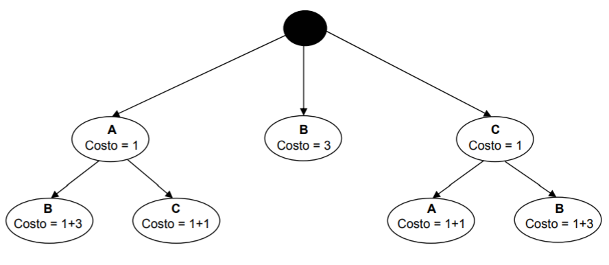

# Algoritmo di Branch and Bound

è possibile che a un certo punto una tab non presenti ne essenzialitá, ne dominanze di riga o colonna. Si dice 'ciclica'. Un possibile approccio a tale situazione é il metodo di Branch and Bound. 

Il **branch and bound** è una tecnica che scompone il problema, provando tutte le soluzioni possibili fino a trovare quella corretta scartando a priori alcune strade. 
L'algoritmo enumera le possibili combinazioni della tabella in modo furbo, utilizzando un albero. Ogni volta che un ramo mi supera il bound di costo, mi fermo. 
Prendo diverse scelte espandendo l'albero e una volta determinata una prima soluzione completa **si fissa il costo ottenuto come bound** e si risale lungo l’albero fino a raggiungere la penultima scelta fatta e da li si riparte esplorando le altre alternative. A ogni iterazione che mi porta a superare il bound precedentemente fissato mi fermo. Se invece trovo una nuova soluzione completa fisso un limite piú stretto. Quindi pian piano a forza di iterazioni abbasso il limite per selezionare la soluzione migliore. 
Nota che il costo associato ad ogni nodo é pari a quello del nodo superiore piú quello dell’implicante scelto. 

