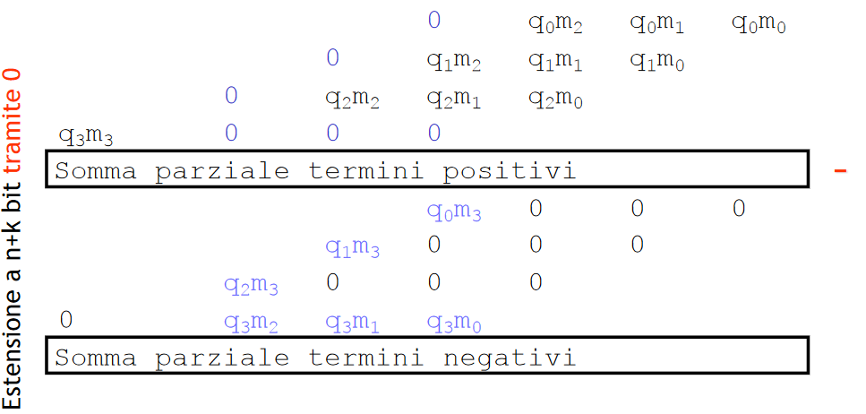
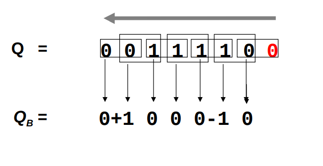
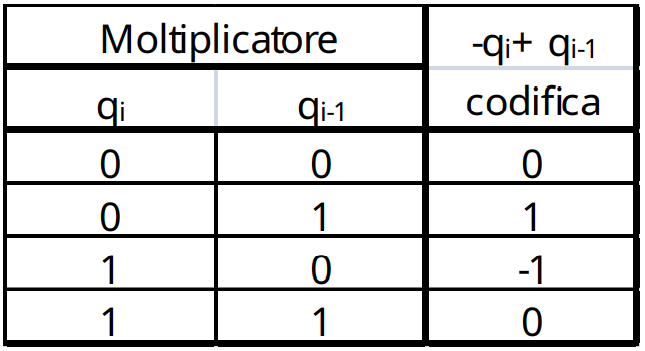
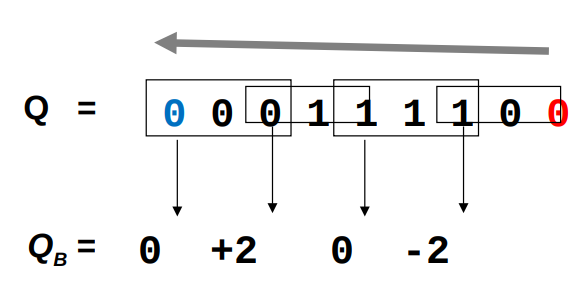
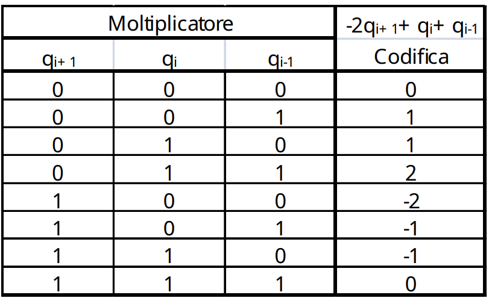

# Aritmetica

## Standard ieee 754 

Standard per scrivere numeri con la virgola mobile in binario. 
Nel caso di singola precisione:
$$(-1)^S 1,mantissa\space 2^{E+127}$$

E poi $S$ $E$ $M$ : con $S$ é logicamente a 1 bit, $E$ a 8 bit e $M$ a 23 bit. Nel caso a doppia precisione $S$ é 1 bit, $E$ 11 bit e $M$ 52 bit.

## Somma tra numeri binari a virgola mobile
Per sommare due numeri in virgola mobile con diverso esponente bisogna considerare la mantissa del numero con più piccolo esponente e farla scorrere a destra (sommando un 1 ad ogni passo all’esponente) fino a quando i due esponenti non si equivalgono. 
Si esegue l’operazione di somma (algebrica) tra le mantisse per determinare il valore ed il segno del risultato e se necessario si normalizza il risultato.

## Moltiplicazione di numeri binari 
La fai come alle elementari ma in complemento a 2. L'unica accortezza é di ricordare che nel caso di XY ci sono 4 casi:

- X positivo, Y positivo no problem
- X é negativo, Y positivo no problem
- X positivo, Y negativo li scambi e moltiplichi uguale (oppure calcoli con i segni invertiti)
- X negativo, Y negativo, calcoli il prodotto tra i loro valori assoluti altrimenti il risultato é sbagliato. 

> la morale é che il moltiplicatore non deve essere negativo

### Algoritmo radici positive e negative 
Alternativamente alla classica moltiplicazione, in caso di moltiplicatore negativo si puó usare l'algoritmo delle radici positive/negative . Si tratta di scomporre la matrice iniziale in due sottomatrici, una con i soli termini negativi, l’altra con solo quelli positivi. Il risultato è  dato dalla differenza dei due risultati parziali.

### Codifica di Booth per le moltiplicazioni 
Il concetto base della codifica di Booth é di codificare il moltiplicatore per ridurre i prodotti parziali e semplificare quindi la rete combinatoria/conti. La bellezza della codifica di Booth é che adatto per operandi di qualsiasi segno.
La codifica di Booth é disponibile in due gusti: 

- Radix 2 
- Radix 4 

Sia per Radix 2 che Radix 4 si **aggiunge uno zero** a destra del numero. E poi si divide il numero in gruppetti da 2 (radix2) o 3 (radix3) e si converte in base alle seguenti tabelle ciascun gruppettino. Poi si effettua la moltiplicazione stile elementari.

#### Radix 2 

{width=50%}

{width=50%}

#### Radix 4 

{width=50%}

{width=50%}

Nota come anche Radix4 alla fine risulti comodo: 

-  1 si tratta di ricopiare il numero
- -1 si tratta di invertire e sommare 1 (complemento)
- -2 si tratta di shiftare verso sinistra di una posizione il numero e di calcolarne il complemento
- 0 solo zeri