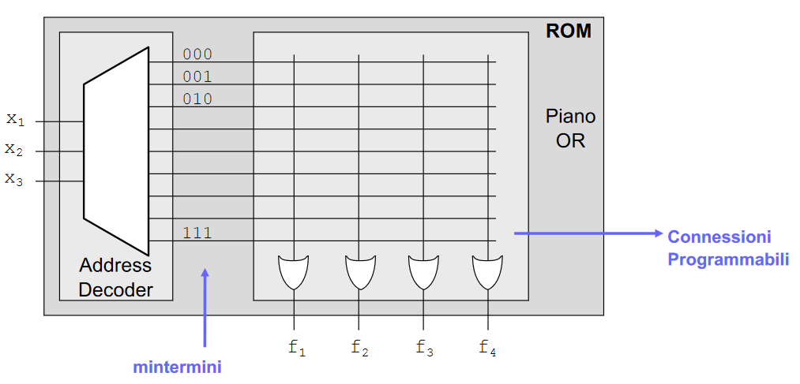
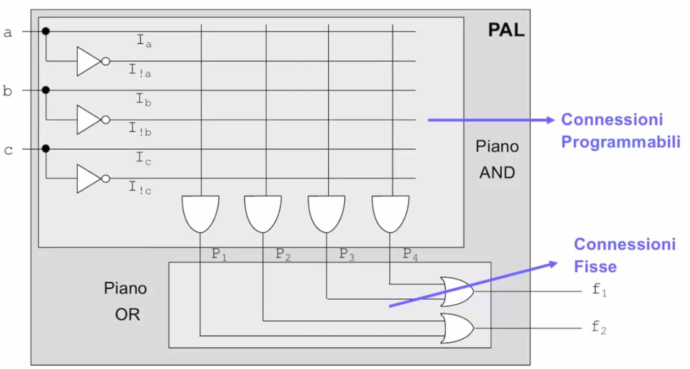
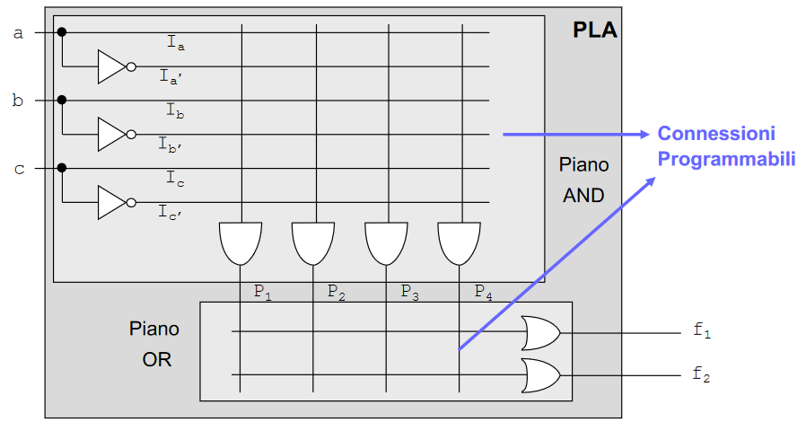
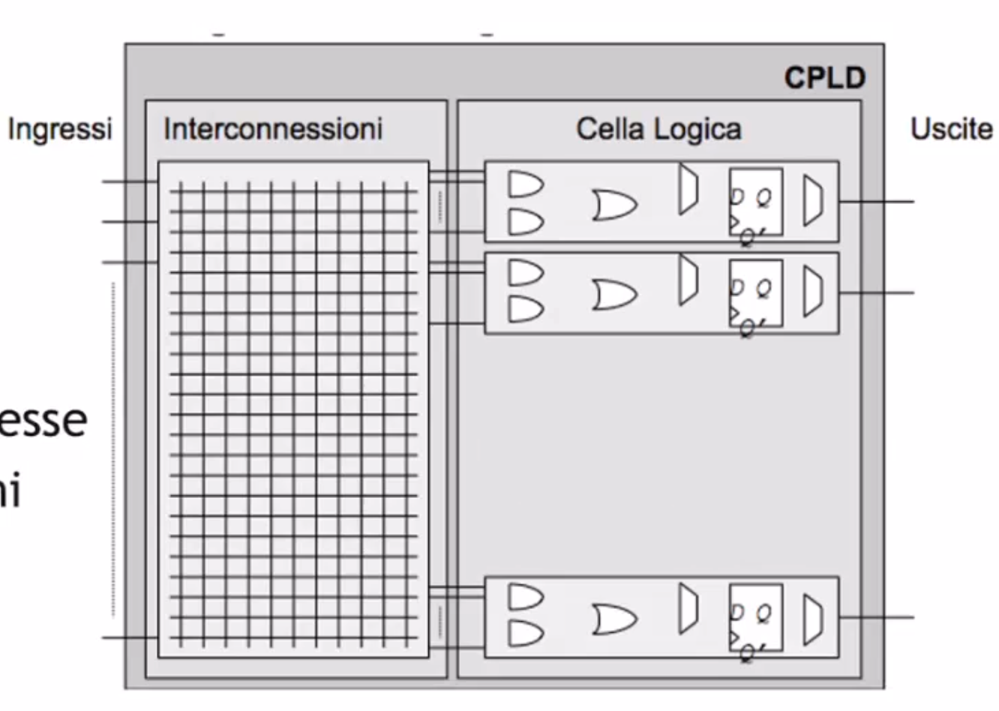
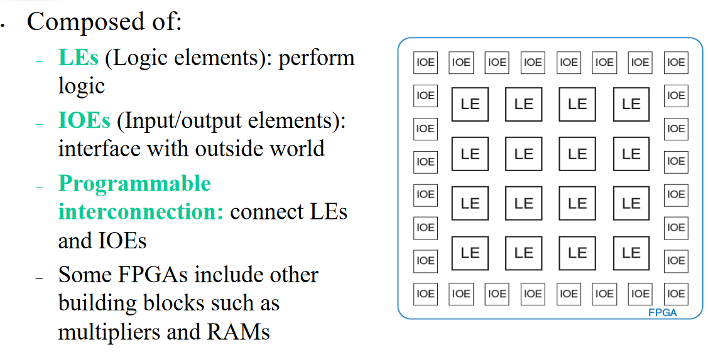

# Logica programmabile

- piano OR
- piano AND 

## ROM 
Read only memory. Piano AND fissato, piano OR adattabile. 

{width=50%}

## PAL 
piano OR fisso, piano AND programmabile. Le uscite non possono condividere termini prodotto. 

{width=50%}

## PLA 

Piano AND/OR programmabile. Completa libertá. 

{width=50%}
Le PLA sono più lente delle PAL a causa della programmabilità della sezione OR: le connessioni fuse-based,  o comunque programmate, presentano una resistenza maggiore rispetto a quelle cablate.

## CPLD
Complex Programmable Logic Devices: sono una evoluzione delle PLA e PAL  e sono caratterizzati da:  

- Connessioni globali  
- Logica concentrata  

Rispetto a PAL e PLA:  

- Hanno dimensioni molto maggiori  
- Sono costituite da celle più complesse  
- Consentono di ottenere prestazioni più elevate  
- Hanno una struttura più regolare e facilmente programmabile.

## FPGA 

