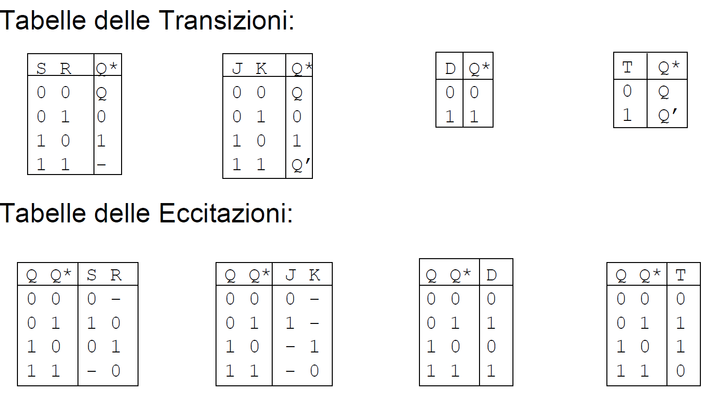
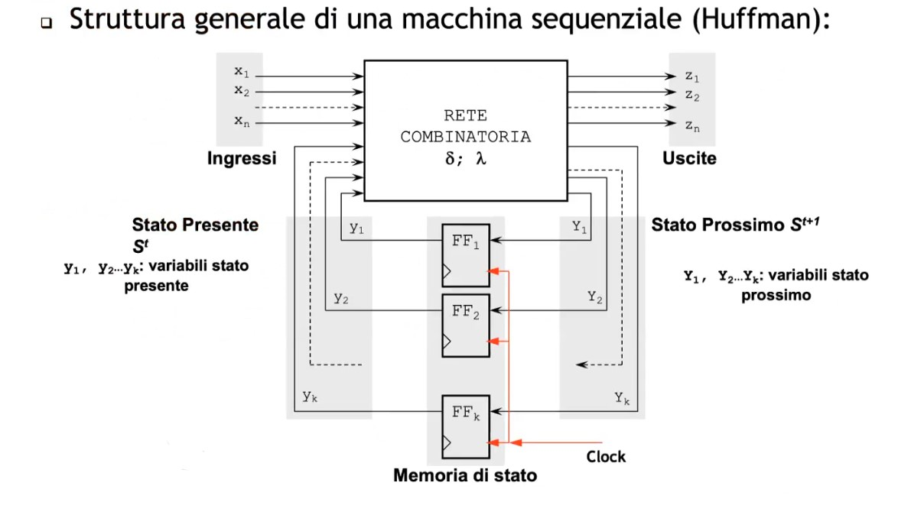

# Circuiti Sequenziali 

Circuiti nel quale il valore dell'uscita dipende sia dagli ingressi ma anche dal tempo. Il circuito ha infatti memoria del passato. 
Memorie a disposizione:

- **Bistabile**: appunto che possiedo solo 2 stati
- **Latch**: bistabile pilotato da un circuito, sensibile sul livello alto.
- **Flip-flop**: bistabile letch pilotato dal clock. Cioè l'evento di **edge rise** , il segnale di Edge Detection campiona e memorizza.

Diversi tipi di flipflop : 

- **flip-flop SR**: comandato dai segnali di SET e RESET. Il principale problema è il loro stato proibiti, cioè quando SR sono entrambi a 1.
- **flip-flop JK**: funziona identico al SR, con J=S e K=R . è un miglioramento del SR, in cui quando entrambi sono settati a 1 non dà problemi.
- **flip flop D**: flip-flop 'Data'
- **flip-flop T**: flip flop 'Toggle'

Diverse tabelle per i bistabili: 

- **tabella transizioni**: mi dice cioé le funzioni svolte dal bistabile/flipflop. Transizione $S,I \rightarrow S$ 
- **tabella eccitazioni**: mi dice cosa dovrei applicare al bistabile/flipflop per ottenere uno specifico stato dallo stato attuale. Eccitazione $S,S^* \rightarrow S$ 

> è importante saper ricavare le tabelle di eccitazione piuttosto che ricordarsele

Con i circuiti sequenziali abbiamo il cosiddetto concetto di stato. Questo è un tassello fondamentale per realizzare concretamente modelli comportamentali come le MSFD o DFSM (Deterministic Finite State Machine).
Nella **macchina di Huffman** abbiamo una netta separazione tra rete combinatorio e logica sequenziale.
 

Da notare come nella logica combinatoria debba implementare le giuste tabelle di eccitazioni per le funzioni di $\delta$ e $\lambda$.
