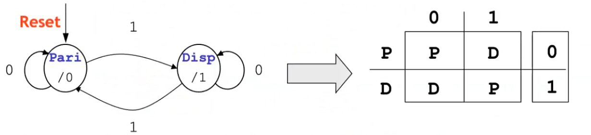

# Macchine a stati finiti 

$$(\mathbb{I}-\mathbb{U}-\mathbb{S}-\delta - \lambda)$$
dove:

- $\mathbb{I}-\mathbb{U}$ sono gli alfabeti di ingresso ed uscita
- $\mathbb{S}$ è l'insieme degli stati 
- $\delta$ è la funzione dello **stato prossimo**, cioè una funzione che ha in input un ingresso appartenente all'alfabeto d'ingresso e uno stato e ha in output lo stato prossimo 
- $\lambda$ funzione d'uscita, ha due varianti:
	- funzione d'uscita per **macchina di Mealy** è del tipo $\lambda: \mathbb S \times \mathbb I \rightarrow \mathbb U$
	- funzione d'uscita per **macchina di Moore** è del tipo $\lambda: \mathbb S\rightarrow \mathbb U$

Anche se spesso le direttive/testo dell'esame specifica molto bene quale delle due usare delle due macchine, si é dimostrato che esse sono equivalenti.
Tabella di stato + tabella di eccitazione del bistabile : costruisco la tabella delle eccitazioni. Procedendo in questo modo si ottiene la descrizione della rete combinatoria che ha per ingressi lo stato presente e l'ingresso primario e produce in uscita le configurazioni da applicare ai bistabili per produrre le transizioni desiderate. 
Nel caso di flip flop di tipo D il valore assunto da D é uguale a quello dello stato prossimo. Per questa ragione la tabella delle transizioni coincide esattamente con la tabella dello stato di codificata. 

Ultimo passo della sintesi delle macchine a stati finiti: costruzione della tabella delle eccitazioni dalla tabella delle transizioni di stato codificato. L'ultima tabella costituisce il punto di partenza per effettuare la sintesi delle reti combinatorie che realizzano la funzione di stato prossimo e d'uscita. Spesso se il problema é complesso il diagramma di transizione dello stato a cui si perviene include stati rindondanti, quivalenti o in caso di macchine non completamente specifica compatibili. Prima di procedere alla codifica dello stato si effettua quindi una minimizzazione. 

## Sintesi FSM 

Passi per sintesi macchina a stati finiti: 

1) Diagramma degli stati della macchina (consegna/specifica)
2) Diagramma $\rightarrow$ tabella degli stati: tabella degli stati é costituita da colonne che stanno per le transizioni e 'dentro' le celle gli stati di destinazione a partire dagli stati correnti (righe).

3) Riduzione della tabella degli stati: sostanzialmente elimini tutti gli stati rindondanti, aka eliminare le righe clone di altre righe nella tabella degli stati. In questa fase verifichi quindi la raggiungibilità degli stati ed eventuale equivalenze/compatibilità. 
4) Tabella transizioni: dalla tabella degli stati ridotta otteniamo la tabella transizioni. Semplicemente tabella degli stati codificata con 0 e 1.
5) Tabella delle eccitazioni: _tabella delle eccitazioni dei FlipFlop + Tabella transizioni = logica combinatoria_ . E qui dipende da quali bistabili utilizziamo: 
	- Se usiamo Flip Flop di tipo D la tabella delle transizioni coincide con quella delle transizioni, altrimenti no! 
	- In caso di altro bistabile dobbiamo fare manualmente la tabella di eccitazione. Il concetto é  'quale ingresso del mio bistabile mi serve per andare dallo stato $Q$ allo stato prossimo $Q*$?'. Questa é la domanda a cui dobbiamo rispondere per generare la tabella delle eccitazioni della macchina, usando la tabella delle eccitazioni del mio bistabile. Facciamo il conto singolarmente per ogni bit. **nota bene che per ogni bit mi serve un flip flop a sé.**

6) Sintesi tabella della veritá: possiamo vedere la tabella delle eccitazioni come una tabella della veritá stringata. Generiamo quindi una tabella della veritá che ha gli stati e l'ingresso e i due segnali per i flip flop con l'uscita. In genere in questo corso in questo passaggio dovremmo utilizzare sempre Karnaugh a meno che specificato diversamente. Tabella veritá della rete combinatoria che prende ingresso e stato presente, e restituisce uscita e tabella eccitazioni per i flip flop. 

### Sintesi sequenziale sincrona
$$N_{FF,min}= \lceil log_2|S|\rceil$$ è il numero minimo di flip flop necessari per memorizzare gli stati. 

**Macchina minima specificata** = la macchina con il minor numero possibile di stati per crearla.