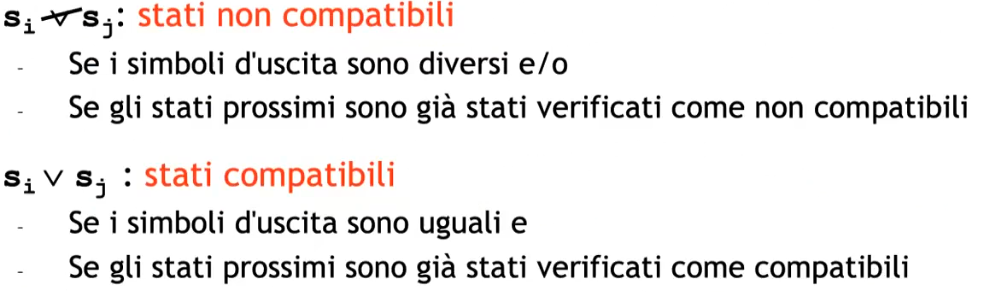
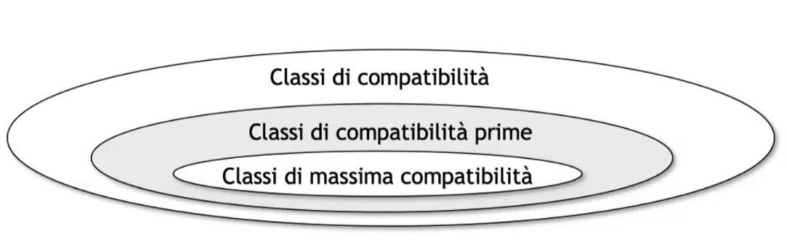
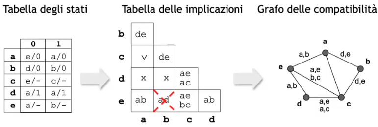
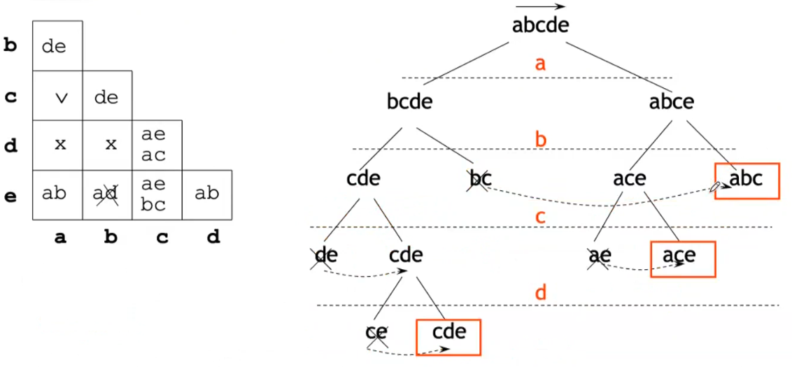

# Minimizzazione FSM

In questa parte vedremo più in dettaglio la fase della riduzione di una FSM completamente specificata e non specificata. 

## Macchine completamente specificate
Due stati $s_i$ ed $s_j$ appartenenti ad $\mathbb S$ sono indistinguibile sse per $\forall x$ simboli d'ingresso:

- Le uscite sono le stesse $\lambda(s_i,x)=\lambda(s_j,x)$$ 
- Gli stati prossimi sono uguali$\delta(s_i,x)=\delta(s_j,x)$

Due stati indistinguibili sono quindi equivalenti e interscambiabili. 
L'indistiguibilità è una relazione d'equivalenza (transitiva, riflessiva, simmetrica), cioè una relazione che crea classi d'equivalenza. 
Una macchina è minima se nel suo insieme di stati non esiste una coppia di stati equivalenti. 

### Regola di Paull Unger 

Riduzione del numero degli stati, costruzione della macchina minima e della partizione di equivalenza. 
Regola di Paull - Unger é una regola iterativa.
Si crea un effetto a cascata del tipo lo stato $S_x$ é equivalente allo stato $S_y$ sse lo stato $S_z$ e $S_w$ é equivalente ...e cosí via. 
Alla fine troveró equivalenze, non equivalenze o equivalenze circolari. I vincoli circolari sono indistinguibili anch'essi. 

**TABELLA DEGLI STATI $\rightarrow$ TABELLA DEGLI STATI RIDOTTA**

## Macchine non completamente specificate

Per alcune ragioni alcune uscite non le conosciamo.

### Compatibilità 

Non si parla più di distinguibilità ma di **compatibilità**. 
Due stati $s_i$ ed $s_j$ appartenenti ad $\mathbb S$ sono compatibili ($sse \space per \space \forall x$ simboli d'ingresso:

- Le uscite sono le stesse $\lambda(s_i,x)=\lambda(s_j,x)$ **laddove sono specificate** 
- Gli stati prossimi sono uguali $\delta(s_i,x)=\delta(s_j,x)$

La compatibilità è meno forte della indistinguibilità .. simmetrica e riflessiva ma **non** transitiva! 
**La compatibilità non è una relazione d'equivalenza.** 

### Tipi di compatibilità 

- **Le classi di compatibilità** sono insiemi di stati compatibili a coppie, dunque nel grafo delle compatibilità è un sottografo.
- **Le classe di compatibilità prima** se è una classe di compatibilità **non coperta** da nessun'altra classe di compatibilità oppure coperta da un'altra classe ma che però aggiunge un vincolo. Cioè sono tutte le classi più grandi con meno vincoli. (I vincoli vengono riportati sugli archi).
- **Le classe di massima compatibilità** è la classe più grande che non viene inglobata da nessun'altra classe. (Ignori il vincolo di tenere d'occhio i vincoli).

Una classe di compatibilitá prima é una classe di compatibilitá che non é coperta da nessuna altra classe di compatibilitá con i suoi stessi vincoli. 
Una classe di massima compatibilitá é un caso particolare di classe di compatibilitá prima, é infatti una classe che non é coperta da nessuna altra classe indipendentemente dai vincoli. 
Parleremo solo di macchina **ridotta** (e non minima) nel caso di macchine non completamente specificate poichè non useremo un algoritmo che ci garantisce la minimalità.  Per ridurre il numero di stati voglio far collassare le classi di compatibilità in un unico caso. Devo seguire però la chiusura delle varie partizioni valida. Cioè devo ottenere una macchina **deterministica** quindi devo trovare la giusta chiusura tale che poi le transizioni mi portano in classi di compatibilità ben definite e non stati che appartengono a più classi di compatibilità. Il nostro obiettivo è trovare una classe di partizione del mio grafo delle compatibilità **chiusa**. 
Può essere che uno stato si trovi in più classi di compatibilità. Posso al momento di compilare la tabella ridotta scegliere una delle due classi, poichè entrambe valide. 

Contrariamente a quanto indicato per le macchine completamente specificate, i vincoli devono essere mantenuti anche se corrispondenti a una coppia (o piú) compatibili non vincolati $\vee$. Si continua fino a quando non si finisce la tabella delle implicazioni e si trova il grafo delle compatibilitá. 
Per trovare **la macchina minima** dovrei ricorrere al bruteforcing e confrontare (inoltre la macchina minima potrebbe non essere unica). 
Esistono però **algoritmi non esaustivi ma basati su euristiche**.
Un approccio potrebbe essere quello di utilizzare non le classi di compatibilità prime, ma le classi di massima compatibilità. Questo approccio non è deterministico e addirittura in alcuni casi potrebbe peggiorare la situa dandoci più stati e quindi diventando inefficace. 

#### Classi di massima compatibilità usando l'albero dei compatibili massimi. 

Algoritmo che si basa su un albero binario diviso in livelli, ciascuno corrispondente ad un nodo del grafo delle compatibilità. 
Ad ogni livello vengono generati due figli per ogni nodo con il seguente criterio:

- Dato un nodo e un livello, si costruisce il suo successore di sinistra considerando tutti gli stati del progenitore tranne il nodo analizzato
- Dato un nodo e un livello, si costruisce il suo successore di destra considerando tutti gli stati del progenitore giá analizzati, il nodo analizzato e gli stati successivi ad esso compatibili.
- Un nodo é foglia dell’albero se sono stati esaminati tutti gli stati che lo compongono, **tranne al piú l’ultimo**.
- Un nodo puó essere eliminato, se tutti i suoi stati sono compresi in un altro nodo che é una foglia o che si trova nel suo stesso livello. 
- Le foglie identificano le classi di massima compatibilitá
 
 Il limite superiore al numero degli stati della macchina ridotta é pari al numero delle classi di massima compatibilitá, cioé 5. Una possibile macchina ridotta é quella costituita considerando come stati tutte le classi di massima compatibilitá.

