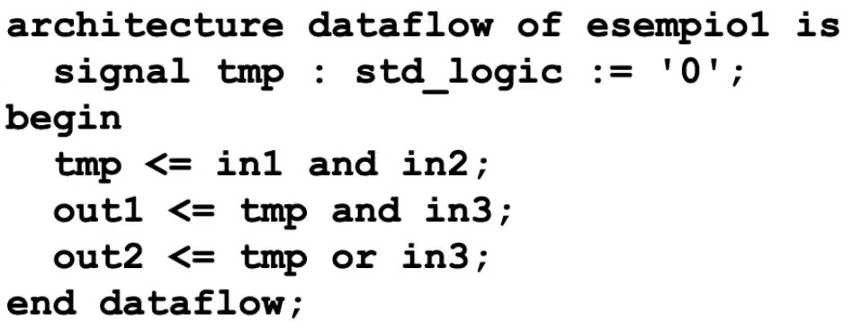
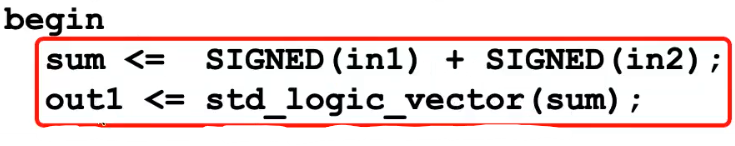
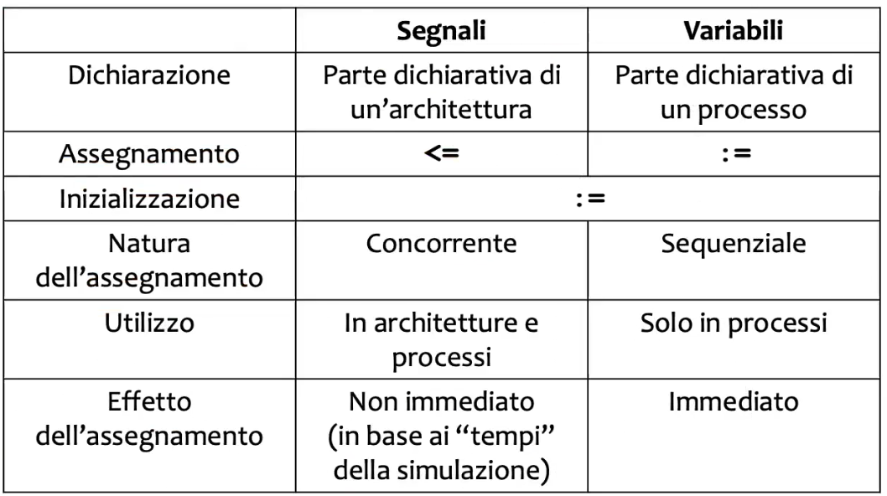
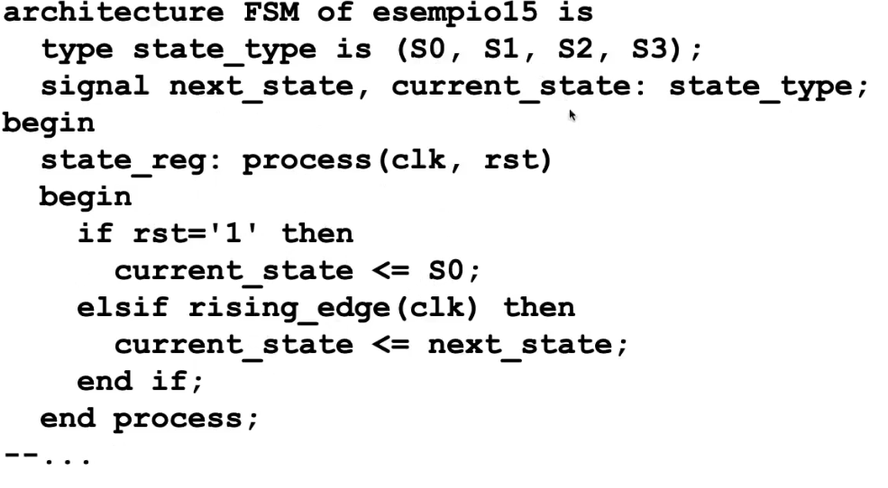

# VHDL

VHDL = Very High Speed Integrate, definito negli anni 80 dal Dipartimento di Difesa degli USA. Linguaggio per descrizione dell'hardware. 

> Perché non con C? 

Cambia la logica: lavoriamo su bit e altri tipi di dato. Usiamo concetti di "don't care" e abbiamo bisogno di concorrenza. 

> Con VHDL non programmiamo, ma piú propriamente 'specifichiamo'. 

## Appunti random

Il VHDL é Case Insensitive, e i commenti vengono specificati con ```- -``` (si estendono fino per solo una riga). 
Specifica dell'interfaccia del componente (entity porte d'ingresso e porte uscita) : 

````vhdl
out1 : out std_logic;
in1, in2, in3 : in std_logic;
````

*indentazione, spazi e a capi non servono*

Il tipo di dato ```std_logic``` é il piú utilizzato per rappresentare i valori logici, i quali vengono indicati tra i singoli apici . 
Il valore X é usato in casi come ad esempio quando due reti pilotano una stessa linea con valori discordanti . Di conseguenza il risultato non sará deterministico. 
La keyword Architecture é usata per le entity: 

- dataflow 
- strutturale 
- comportamentale 

Possiamo usare un mix delle 3 rappresentazioni per descrivere l'architettura. 


Da notare l'assegnamento ```<=``` : le porte "_out_" stanno a sinistra dell'assegnamento. Viceversa le porte _In_ stanno sempre a destra del assegnamento. Possiamo poi utilizzare altri tipi di dati, ad esempio 'signal' :



Sintassi per definire un multiplexer. Stiamo facendo cioé un assegnamento condizionale. 

 

Ma abbiamo anche un assegnamento selettivo. 


Ci serve anche eseguire operazioni aritmetiche come ad esempio la somma (con overflow). 
Si converte ```std_logic_vector``` a ```unsigned``` o ```unsigned``` cosí da avere tutte le operazioni aritmetiche.




 

Possiamo poi definire delle 'variabili' inserendo nella nostra entity il blocco di codice: 

````vhdl
generic(){
N : integer := 5 
}
````
Dove 5  in questo caso é il valore di default. Una entity che ho definito precedentemente la posso definire come component. Cosí che poi posso utilizzare i component come se fossero oggetti. In questo modo posso costruire gerarchicamente strutture piú complesse partendo da tante entity. Al momento di istanziare il component devo specificare i parametri (altrimenti seguiranno il default value) e 'mappare' i segnali alle interfacce. 

### Process

Creiamo poi il costrutto 'process'  che ci permette di astrarci un po' di più descrivendo il comportamente algoritmico più che la struttura a livello schematico. Descriviamo infatti variabili.
Le variabili sono una astrazione che può corrispondere a una singola o addirittura più linee, ma noi non ci preoccupiamo. La consideriamo come una black box che mi mantiene in memoria uno stato. Il corpo del process viene eseguito sequenzialmente, a differenza di tutte le altri parti di codice che sono concorrenziali. Però **nei process** i segnali vengono tutti aggiornati al termine del process. Bisogna partizionare i segnali in ingresso e in uscita, infatti essi o vengono letti o vengono scritti all'interno del process, non entrambi. Le variabili invece sono lette/scritte all'interno del processo infinite volte, e ha validità solo all'interno del processo. 



Flip-flop di tipo D:

````VHDL
    begin              
    State: process(i_clk, i_rst)
    begin
        if i_rst='1' then
          currentState <= RESET;
        elsif rising_edge(i_clk) then
          currentState <= nextState;
        end if;
     end process;
````

con ```rising_edge(clk)``` possiamo compattere le righe che controllano che il clock sia 1 e che sia appena cambiato.



Specifica interna di una FSM.

```VHDL
entity project_reti_logiche is
port (
		i_clk: in std_logic;
		i_rst: in std_logic;
		i_start: in std_logic;
		i_data: in std_logic_vector(7 downto 0);
		o_address : out std_logic_vector(15 downto 0);
		o_done: out std_logic;
		o_en: out std_logic;
		o_we: out std_logic;
		o_data: out std_logic_vector (7 downto 0)
);
end project_reti_logiche;
``` 

 - i_clk è il segnale di CLOCK al quale il modulo si sincronizza.
- i_rst è il segnale di RESET che inizializza la macchina 
- i_start è il segnale START descritto nella specifica.
- i_data è il segnale he arriva dalla memoria in seguito ad una richiesta di lettura, necessario per leggere i bytes.
- o_address è il segnale di uscita con cui si specifica a quale indirizzo della memoria accedere. 
- o_done è il segnale DONE descritto nella specifica.
- o_en è il segnale di ENABLE della memoria
- o_we è il segnale di WRITE ENABLE:
	- 1 per scrivere 
	- 0 per leggere
- o_data è il segnale di uscita dal componente verso la memoria, necessario per salvare i bytes.


## VHDL Simulazione

Creiaimo segnali. Istanziamo il componente e poi generiamo le nostre forme d'onda. Adesso specifico anche il tempo, posso specificare ad esempio di 'aspettare' del tempo. 


## Extra 

Tool per align e format VHDL: [Vhdl Beatify](https://g2384.github.io/VHDLFormatter)
