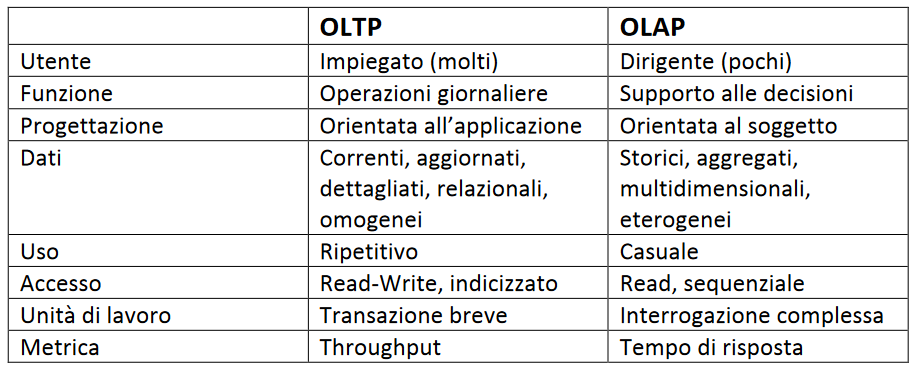
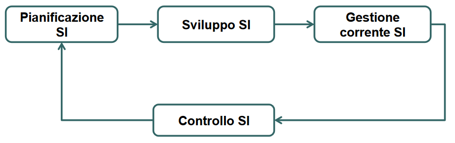

# Dati, informazioni e progettazione del SI 

## Piramide DIKW
Dato: valore dettagliato di un evento.
Informazione: un dato a cui si associa una certa importanza/contesto
Conoscenza: giudizio dell'informazione 
Saggezza: conoscenza++ 

## Modelli per rappresentazione SI

Esistono vari modelli per rappresentare l’intero sistema informativo.

### La Piramide di Anthony

Il modello di Anthony (la piramide riportata qua sopra) è un modello gerarchico organizzativo diviso in livelli:

- strategico 
- tattico
- operazionale

Ovviamente devono esserci scambi d'informazione, sia verticali che orizzontali. 
Tale modello però non consente di avere una visione globale sull'intera organizzazione. 

### La catena del valore di Porter

Altro metodo di segmentazione e rappresentazione del SI è la **catena del valore di Porter**. 
Modello che permette di descrivere la struttura di una organizzazione come un insieme di processi, divisi in 5 primari e 4 di supporto. 
Si adatta però solo a grandi organizzazioni che vendono bene e non offrono servizi. 

### Risorsa
**Risorsa** è tutto ciò con cui un’organizzazione opera, sia materiale che digitale, per  raggiungere i suoi obiettivi.
Si possono classificare in: 

- Esterne 
- Interne 
- Struttura
- Gestione 

### Varie classificazioni SI:
Spesso i sistemi informativi sono divisi anche in due tipi di attività diverse:

- **Orizzontali**, cioè tutti quei processi che non cambiano i settori diversi (HR, aspetti amministrativi, …)
- **Verticali**, cioè che variano secondo il contesto, solitamente le attività produttive
Un processo è l'insieme delle attività che l'organizzazione svolge per raggiungere il proprio obiettivo (ben definito).

Altra classificazione in 2 categorie:

- **Sistemi operazionali**: svolgono operazioni transazionali semplici, lavoro di ufficio, contabilità. 
- **Sistemi decisionali o informazionali**: fanno da supporto delle attività decisionali e strategiche aziendali, utilizzando i dati. 

## OLAP e OLTP

In un SI possiamo avere sistemi:

- **OLAP (Online Analytical Processing)**: ha come metrica il **response time** .  Operazioni non strutturate, complesse che operano su tanti dati aggregati. Non è importante rispettare la proprietà ACID in quanto le operazioni solo di sola lettura e casuali. 
- **OLTP (Online Transaction Processing)**: orientate alle transazioni. Tante transazioni, tanti utenti. La metrica di valutazione é il **throughput** .  

## Progettazione SI
### Framework di Zachmann
Il framework di Zachman è uno strumento efficace per descrivere il sistema informativo dell’organizzazione nel suo complesso. 
Esso è organizzato in:

- **Righe**: definiscono i diversi punti di vista che possono interessare diversi stakeholder *(coloro che hanno interesse al sistema considerato perché ad esempio ne sono proprietari o fruitori, finanziatori o utenti)*. 
- **Colonne**: definiscono gli aspetti da analizzare.

Nel framework di Zachman non c'è alcun ordinamento tra le colonne, e ciascuna di esse (dall’alto verso il basso) mostra tutti i passaggi a partire dal business per arrivare all’effettiva realizzazione del sistema.  

Le celle del framework di Zachman create dall’intersezione tra righe e colonne definiscono le **Viste** . 

## Progettazione e gestione SI 

C'è l’esigenza di progettare e gestire in modo strutturato un sistema informa-  
tivo nel suo funzionamento e nella sua evoluzione. 
Identifichiamo 4 fasi:

- **Pianificazione**: fase in cui si delineano le linee guida strategiche, il ruolo delle componenti organizzative e le istruzioni operative per la realizzazione. A sua volta diviso in:
	
	- Pianificazione strategica: in questa fase si identificano gli obiettivi che richiedono interventi di natura informatica.  
	- Studio di fattibilità: una volta appurato il bisogno di un intervento di natura informatica, si identificano le alternative progettuali.
- **Sviluppo**: raccolta e analisi dei requisiti e sviluppo del software e definizione dell’architettura hardware.  
- **Gestione corrente**: interventi di routine eseguiti per il mantenimento del sistema.  
- **Controllo**: operazioni effettuate in modo periodico per valutare l’adeguatezza del sistema informativo.