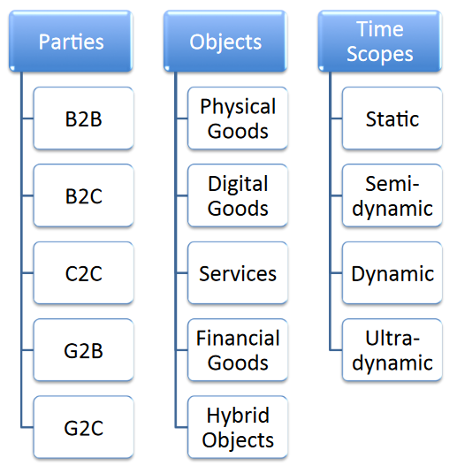
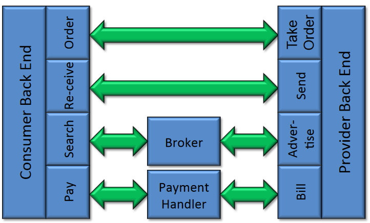
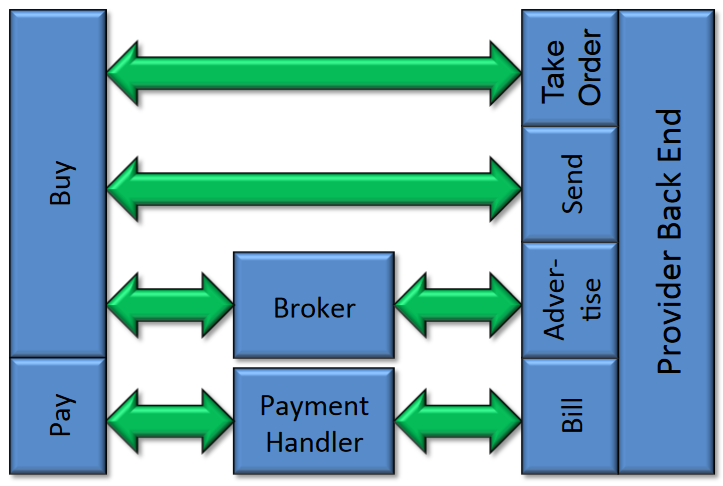
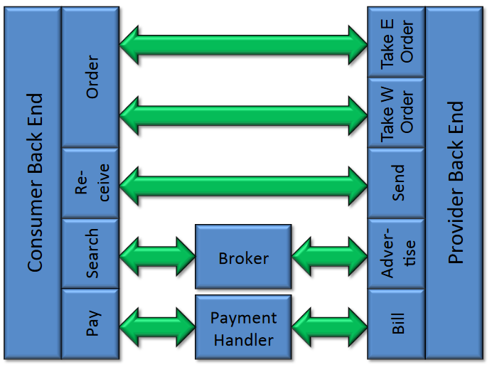
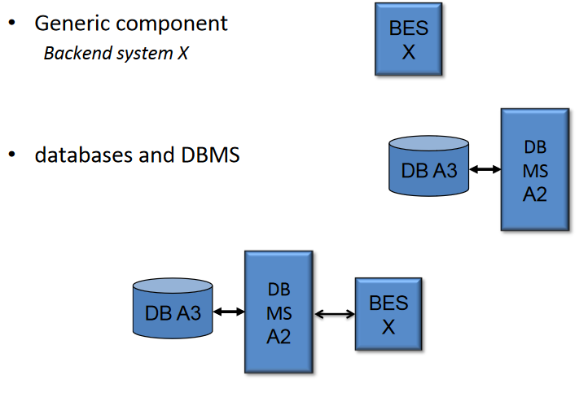

# Approccio architetturale ai SI

## BOAT

La progettazione di un SI prevede quattro fasi quali la pianificazione, lo sviluppo, la gestione corrente e controllo.
Per progettare la Enterprise Architecture (modello dell'organizzazione con varie prospettive che permette di fornire una panoramica sui propri processi, sistemi, tecnologie e strutture) possiamo usare l'approccio boat. 
Business, Organization, Architecture and Technology. 
Perché l'approccio Boat? L'approccio boat ci permette di analizzare il SI da tutti e 4 i punti di vista. Un SI viene progettato partendo dalla prospettiva Business, per poi (iterativamente) passare alle altre (B-O-A-T-B-O-A ...).

### Prospettiva di Business

Il business puó essere quindi il punto di partenza per la progettazione del SI ma anche punto di partenza per la sua modifica (requirement pull), in alternativa a quando si modifica a causa di una spinta tecnologica (technology push). 
I partecipanti in uno scenario di Business possono essere:

- Business 
- Government 
- Citizen/Consumer

Abbiamo quindi tutti i vari casi di interazione tra i partecipanti .. B2B, B2G, B2C , ... 
Gli oggetti dell'interazione possono essere:

- prodotti fisici 
- prodotti digitali 
- prodotti finanziari 
- servizi 
- prodotti ibridi

L'orizzonte temporale di tali interazioni possono essere: 

- statico = stabile nel tempo, solitamente regolata da un contratto
- semidinamico = stabile con possibili cambiamenti 
- dinamico = rapporto limitato ai singoli ordini 
- ultradinamico = la relazione puó variare persino all'interno di un singolo ordine

#### Business Driver
I Business Driver sono quelli che **motivano** effettivamente il progetto del SI o una sua modifica.
I business Driver possono essere divisi in 2: 
Efficacia: definita come $$\frac{Output \space Effettivo}{Output \space Atteso}$$
Nella valutazione dell'efficacia inotre definiamo due qualitá : 

- Reach: l'estensione dell'efficacia in termini di estensione es:(temporale/geografica/multicanale)
- Richness: la qualitá e ricchezza della comunicazione, cioé la frequenza, il dettaglio e la tipologia di dati. es:(frequenza, interattività)

Efficienza: definita come $$\frac{Output Effettivo}{Input}$$

### Prospettiva organizzativa
Per modellizzare l'organizzazione si procede per livelli, affinando sempre di piú il dettaglio.
Al *livello 0* si vede l'intero mercato come una blackbox. 
Al *livello 1* si distinguono i 3 attori della situa organizzativa: 

- consumatore
- intermediario 
- fornitore
Al *livello 2* si specificano ulteriormente i vari intermediari. 
Al *livello 3* mostra anche gli aspetti intraorganizzativi, che si dividono in 2 categorie:

- front-end : tutte le componenti dell'organizzazione nel quale sono presenti interazioni con entitá esterne 
- back-end : tutte le componenti chiave all'interno dell'organizzazione che non interagicoscono con partecipanti esterni ma solo con altre componenti interne.
Al *livello 4* vengono modellizzate le singole componenti interne dell'organizzazione evidenziando anche le interazioni con i partecipanti esterni e intermediari. 

-  Esempio B2B a lv. 4

{width=50%}

- Esempio B2C a lv. 4 

{width=50%}

- Esempio B2B a lv. 4 multicanale: 

{width=50%}

## Prospettiva architetturale
La prospettiva di architettura ha diversi livelli di aggregazione: 

- **Architettura market-level** descrive la struttura dei sistemi a livello dei vari partecipanti, descrivendo le interazioni e i messaggi scambiati tra di essi. La possiamo vedere come una estensione della prospettiva O-4 (la quale modella le interazioni fra organizzazioni) in quanto specifica le  interazioni tra i sistemi di tali organizzazioni. Si tratta di una estensione, e nonostante spesso c'é una corrispondenza tra i moduli delle due prospettive può non esserci. Per specificare quali moduli sono comuni utilizziamo una  matrice.
- **Architettura party-level** descrive la singola organizzazione rappresentando le interfacce verso il mondo esterno, il quale é trasparente in questo livello di astrazione. Si tratta quindi di una visione intra-organizzativa nel quale descriviamo interfacce BE/BE, FE/FE. Specifichiamo anche i vari componenti tra cui i DB con annessi DBMS, e tutti i messaggi scambiati tra i componenti FE e BE (restano ancora visibili quelli scambiati con gli altri partecipanti);
- architettura system-level non ci interessa.  

## Prospettiva tecnologica
Dividiamo la parte tecnologica del livello tecnologico del Boat in:

- livello applicativo 
- livello di piattaforma
- livello di architettura fisica